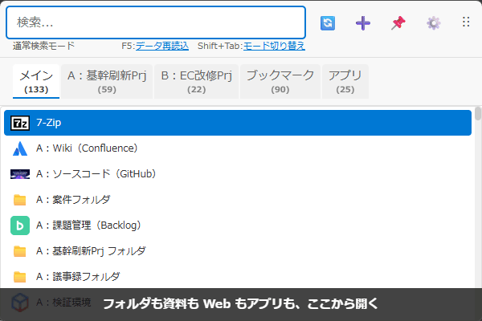

<p align="center">
  
</p>

<h1 align="center">QuickDashLauncher</h1>

**使うものだけを。タブで整理できる登録型ランチャー**

候補に出るのは、自分で登録したフォルダ・ファイル・URL・アプリだけ。「仕事」「個人」「A社」のように自由にタブで分けて、名前の一部で開く

<p align="center">
  <a href="https://github.com/masaodev/quick-dash-launcher/releases"></a>
  <a href="LICENSE"></a>
  <a href="https://github.com/masaodev/quick-dash-launcher/releases"></a>
</p>

<p align="center">
  <a href="#インストール">インストール</a> ·
  <a href="#使い方の流れ">使い方</a> ·
  <a href="docs/README.md">ドキュメント</a> ·
  <a href="https://github.com/masaodev/quick-dash-launcher/releases">リリース</a>
</p>

<p align="center">
  
</p>

<!-- メインデモ GIF は `npm run docs:demo-gif` で撮り直す（デモデータ＝tests/demo-gif/demo-data.ts と tests/e2e/templates/demo/） -->

## 特徴

- **全部ここから開ける**
  - アプリ、フォルダ、ファイル、Web ページに加えて、Teams のチャットのようなリンクも同じ画面から開けます。
  - 保存しておいた定型文や画像も、ここから呼び出してクリップボードに戻せます。
- **登録して、タブで整理できる**
  - ドラッグ＆ドロップで 1 件ずつ登録するほか、スタートメニューのアプリやブラウザのブックマークもまとめて取り込めます。
  - タブは「仕事」「個人」「A社」のように自由に分けられ、名前は「A社 議事録」のように自分で付けます。
  - 候補に出るのは登録したものだけなので、一覧が散らかりません。
- **フォルダを丸ごと取り込める**
  - フォルダを指定すると、中のファイルがまとめて候補に並びます。サブフォルダの中まで取り込むこともできます。
  - 「Excel だけ（`*.xlsx`）」「旧版フォルダは除く（`旧*`）」のように、入れるものと入れないものをワイルドカードで決められます。
  - 後からファイルが増えても、登録し直す必要はありません。
- **打ちかけで候補が出て、すぐ開ける**
  - 名前の一部を打つと、1 文字ごとに候補が絞り込まれます。先頭から打たなくても当たり、「基本設計 画面」のようにスペースで区切ればさらに絞れます。
  - 目当てを選んで Enter で開きます。
  - 今のタブに無いものも、一致した件数がほかのタブに出るので、Tab キーで移れます。

無料のオープンソース（MIT）です。winget ですぐに試せます（ほかの入れ方は[インストール](#インストール)）。

```powershell
winget install masaodev.quick-dash-launcher
```

---

## なぜ登録型なのか

PowerToys Run のような多くのランチャーは、インストール済みのアプリやファイルを自動で全部読み込みます。そのため、使わないものまで候補に並び、目当てを探す手間が残ります。QuickDashLauncher は、作者がこのノイズを嫌って作り始めたランチャーで、使うものを自分で選んで登録する「登録型」をとっています。登録したものだけが候補に出るので、数文字で目当てにたどり着けます。

とはいえ、1 件ずつ登録するのは手間です。そのため、まとめて登録する手段も用意しています。フォルダを指定すれば中のファイルがまとめて候補に並び（[フォルダ取込](#2-フォルダを丸ごと取り込む)）、スタートメニューのアプリやブラウザのブックマークも一覧から選んで取り込めます。

| 観点 | 検索型（PowerToys Run など） | QuickDashLauncher |
| --- | --- | --- |
| 候補に出るもの | インストール済みのもの全部 | 自分で登録したものだけ |
| 登録の手間 | なし（自動で入る） | フォルダ・アプリ・ブックマークはまとめて取り込める |
| 整理のしかた | なし | タブで自由に分ける |
| 名前 | アプリ名やファイル名のまま | 自分で付ける |
| フォルダの中身 | 出ない | 取り込めば候補に出る |

### こんな人におすすめ

- いくつもの仕事を並行して進めていて、フォルダ・資料・Web の管理画面を開くたびに探している
- 共有フォルダの深い階層を毎回たどっている
- Teams のチャットやよく使う Web ページを、アプリやブックマークを開いて探している
- 使わないアプリやファイルが候補に出てくるのを避けたい

---

## 使い方の流れ

初回起動の画面で、ランチャーを呼び出すホットキー（初期値は Alt+Space）を決めます。あとは、使うものを登録して、タブに分けていきます。

### 1. 登録して名前を付ける

ファイル・フォルダ・URL をランチャーの画面にドラッグ＆ドロップするか、画面上部の ➕ から登録画面を開きます。名前は「基幹刷新 共有フォルダ」のように、自分が探すときに打つ言葉で付けます。保存すると、すぐに候補に出ます。

<!-- GIF 2（登録して名前を付ける）をここに置く。未作成（Issue #228） -->

スタートメニューのアプリやブラウザのブックマークは、➕ のメニューからまとめて取り込めます。

### 2. フォルダを丸ごと取り込む

登録画面で種別を「フォルダ取込」にすると、フォルダの中のファイルがそれぞれ候補に並びます。入れるもの（例: `*.xlsx`）と除くもの（例: `旧*`）、サブフォルダをどこまでたどるかを決められます。フォルダの中身は読み込むたびに反映されるので、ファイルが増えても登録し直す必要はありません。

<!-- GIF 3（フォルダ取込とフィルター）をここに置く。未作成（Issue #228） -->

### 3. タブで分ける

設定画面（タスクトレイのアイコンを右クリック →「設定...」）の「📑 タブ管理」で「複数タブを表示」をオンにすると、データファイルごとにタブを作れます。「仕事」「個人」「A社」「B社」のように、分け方は自由です。検索は今のタブの中だけを絞り込みます。ほかのタブで当たった件数はタブに表示されるので、Tab キーで移れます。

開くときは、ホットキーで呼び出して名前の一部を打ち、Enter です。Shift+Enter で親フォルダを開きます。ほかのキー操作は[キーボードショートカット](docs/features/keyboard-shortcuts.md)を参照してください。

---

## ほかにできること

登録画面の種別を変えると、ファイルや URL を開く以外の使い方もできます。種別ごとの説明は[アイテムの種別](docs/features/item-categories.md)にまとめています。

| 機能 | できること |
| --- | --- |
| [グループ](docs/features/group-launch.md) | 登録済みのアイテムをまとめて一度に開く |
| ウィンドウ操作 | すでに開いているウィンドウを探して、前面に出したり位置・サイズを変えたりする |
| ウィンドウ配置 | 複数のウィンドウの位置・サイズを記録しておき、まとめて並べ直す |
| クリップボード | テキストや画像を保存しておき、選ぶとクリップボードに戻す |
| [ブックマークの取り込み](docs/features/bookmark-import.md) | ブラウザのブックマークを取り込む。自動で取り込み直す設定もできる |

---

## インストール

Windows 10 以降で動きます。

### winget

```powershell
winget install masaodev.quick-dash-launcher
```

更新は `winget upgrade masaodev.quick-dash-launcher`。winget には正式版だけを公開しています（ベータ版は Releases のプレリリースから入手できます）。

### インストーラー版・ポータブル版

[Releases](https://github.com/masaodev/quick-dash-launcher/releases) からダウンロードします。

- インストーラー版: `QuickDashLauncher.Setup.x.x.x.exe` を実行します。インストールが終わると起動します。
- ポータブル版: `QuickDashLauncher.x.x.x.exe` を好きなフォルダに置いて実行します（インストール不要）。

インストーラー版・ポータブル版は署名していないため、初回の実行時に Windows SmartScreen の警告が出ることがあります。そのときは「詳細情報」→「実行」で起動できます。

うまく動かないときは[困ったとき](docs/features/troubleshooting.md)を参照してください。

---

## バグ報告・開発への参加

バグ報告と機能の要望は [GitHub Issues](https://github.com/masaodev/quick-dash-launcher/issues) へお願いします。プルリクエストも歓迎します。

ソースからビルドするには、Node.js に加えて、ネイティブモジュールのコンパイルに Visual Studio Build Tools（C++）と Python が必要です。詳しくは[開発ガイド](docs/setup/development.md)を、設計やテストは [docs](docs/README.md) を参照してください。

```bash
git clone https://github.com/masaodev/quick-dash-launcher.git
cd quick-dash-launcher
npm install
npm run dev          # 開発モード起動
npm run test:unit    # 単体テスト
```

---

## ライセンス

[MIT ライセンス](./LICENSE)で公開しています。
