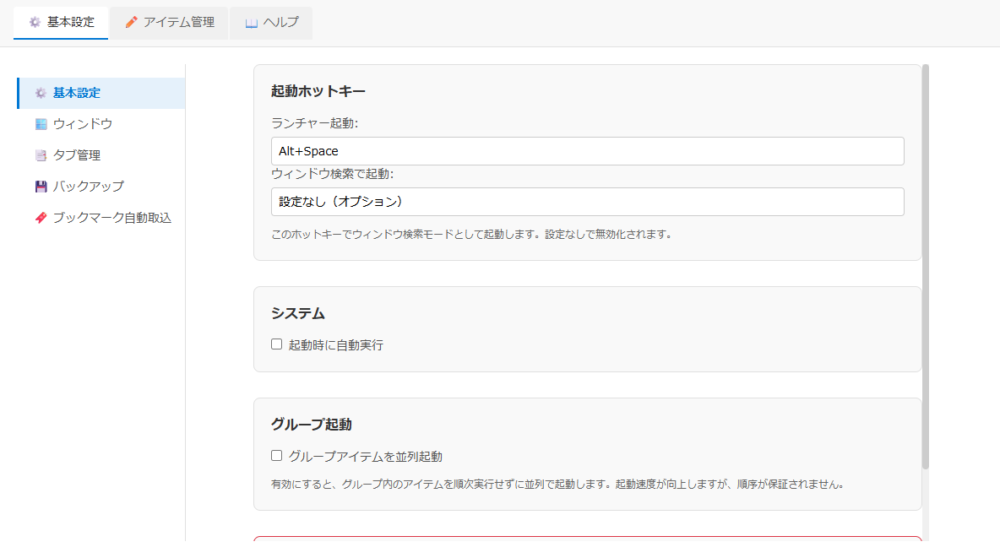
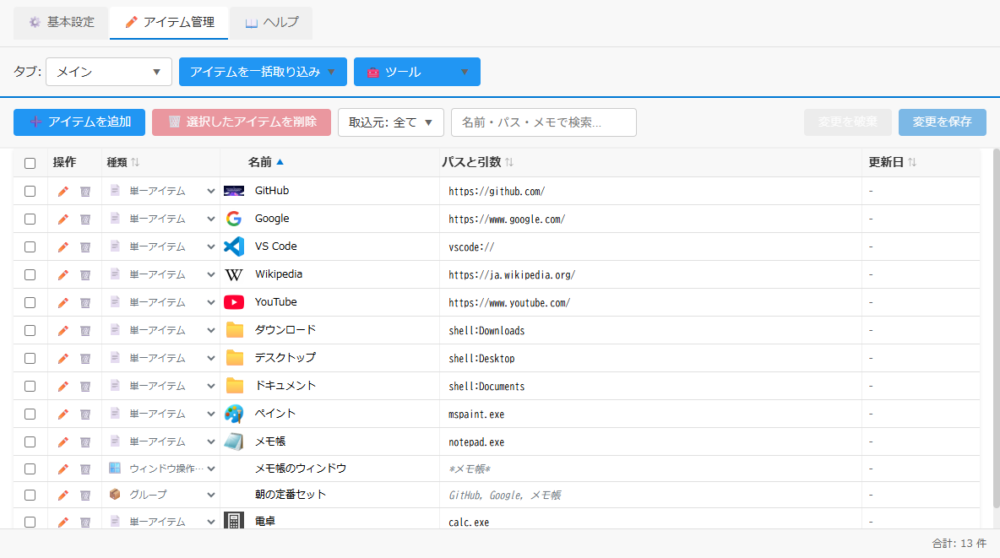
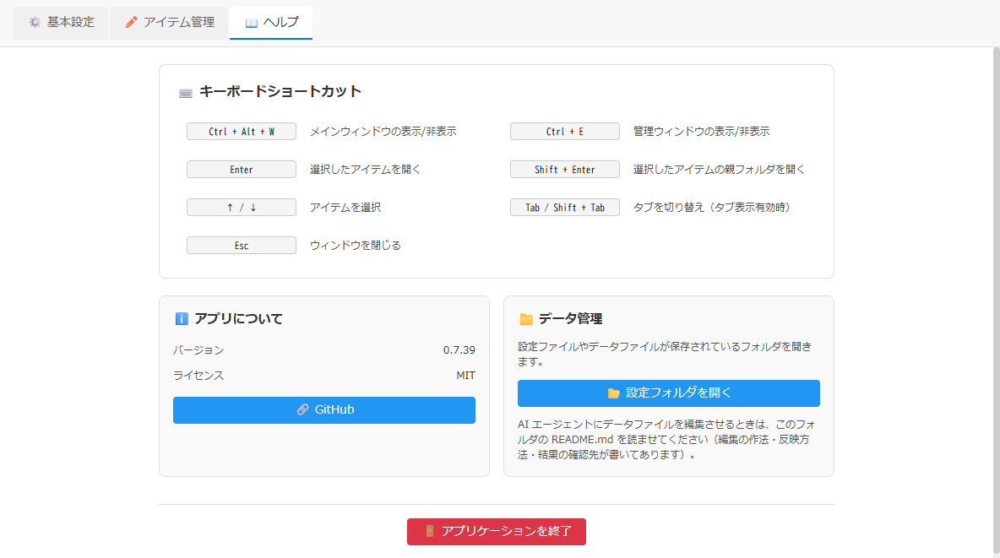

# 管理ウィンドウ仕様書

## 関連ドキュメント

- [画面一覧](./README.md) - 全画面構成の概要
- [メインウィンドウ仕様書](./main-window.md) - メイン画面の詳細な仕様
- [初回設定画面](./first-launch-setup.md) - 起動ホットキーが未設定のときに出る画面
- [ホットキー入力](./hotkey-input.md) - ホットキー入力欄の録画・確定・検証
- [設定ファイル形式](../architecture/file-formats/settings-format.md) - 設定項目のキー・型・既定値
- [データファイル形式](../architecture/file-formats/data-format.md) - アイテム管理で編集するデータの形式

## 1. 概要

管理ウィンドウは、QuickDashLauncherの設定変更とデータ編集を行う管理画面です。「基本設定」「アイテム管理」「ヘルプ」の3つのタブで構成され、アプリケーションの動作をカスタマイズできます。

**キーボードショートカット**:

- Ctrl+E: メインウィンドウから管理ウィンドウを開く/閉じる（トグル）
- Ctrl+S: 変更を保存（アイテム管理タブ）
- Delete: 選択したアイテムを削除（アイテム管理タブ。確認ダイアログあり。入力欄の中では文字の削除として扱う）

### 主要機能

- **基本設定タブ**: ホットキー、ウィンドウサイズ、ウィンドウ表示位置、自動起動、バックアップ設定、ワークスペースウィンドウ設定、タブ表示設定
- **アイテム管理タブ**: data.jsonの直接編集、アイテムの追加・削除・重複削除、ブックマークインポート
- **ヘルプタブ**: ファイル管理、システム情報表示、ショートカット一覧
- **設定の即座反映**: すべての設定変更が自動保存され、メインウィンドウに即座に反映される
- **リアルタイムバリデーション**: ホットキーの有効性をリアルタイムチェック

### 画面イメージ

**基本設定タブ**

**アイテム管理タブ**

**ヘルプタブ**

## 2. 基本情報

| 項目                 | 内容                                                                   |
| -------------------- | ---------------------------------------------------------------------- |
| **ファイル名**       | `src/renderer/AdminApp.tsx`                                            |
| **コンポーネント名** | `AdminApp`                                                             |
| **表示条件**         | Ctrl+E、設定メニューから「⚙️ 基本設定」または「✏️ アイテム管理」を選択 |
| **画面タイプ**       | ウィンドウ                                                             |
| **親画面**           | メインウィンドウ                                                       |

## 3. 画面項目一覧

| エリア           | 項目名                                                           | 内容・説明                                                                                                                                                                 | 表示条件                                                              | 機能詳細                                            |
| ---------------- | ---------------------------------------------------------------- | -------------------------------------------------------------------------------------------------------------------------------------------------------------------------- | --------------------------------------------------------------------- | --------------------------------------------------- |
| **ヘッダー**     | タブボタン（⚙️ 基本設定）                                        | 基本設定タブへの切り替え                                                                                                                                                   | 常時表示                                                              | [5.1](#51-タブボタンをクリック)                     |
| **ヘッダー**     | タブボタン（✏️ アイテム管理）                                    | アイテム管理タブへの切り替え                                                                                                                                               | 常時表示                                                              | [5.1](#51-タブボタンをクリック)                     |
| **ヘッダー**     | タブボタン（📖 ヘルプ）                                          | ヘルプタブへの切り替え                                                                                                                                                     | 常時表示                                                              | [5.1](#51-タブボタンをクリック)                     |
| **基本設定**     | ホットキー入力欄                                                 | ランチャー起動ホットキーの設定                                                                                                                                             | 基本設定タブ                                                          | [5.2](#52-ホットキー入力欄でキー押下)               |
| **基本設定**     | ウィンドウ検索の起動ホットキー入力欄                             | ウィンドウ検索で起動のホットキー設定                                                                                                                                       | 基本設定タブ                                                          | [5.2](#52-ホットキー入力欄でキー押下)               |
| **基本設定**     | ウィンドウサイズ設定                                             | メイン画面と管理画面のサイズ設定                                                                                                                                           | 基本設定タブ                                                          | [5.3](#53-ウィンドウサイズを変更)                   |
| **基本設定**     | 自動起動チェックボックス                                         | 起動時に自動実行の設定                                                                                                                                                     | 基本設定タブ                                                          | [5.4](#54-自動起動チェックボックスを変更)           |
| **基本設定**     | バックアップ設定                                                 | バックアップ機能の詳細設定                                                                                                                                                 | 基本設定タブ                                                          | [5.5](#55-バックアップ設定を変更)                   |
| **基本設定**     | スナップショット一覧ボタン                                       | バックアップのスナップショット一覧を開く                                                                                                                                   | 基本設定タブ（💾 バックアップカテゴリ）、バックアップ機能が有効なとき | -                                                   |
| **基本設定**     | ウィンドウ表示位置設定                                           | ウィンドウ表示位置の選択（中央/カーソル位置/固定）                                                                                                                         | 基本設定タブ                                                          | [5.7](#57-ウィンドウ表示位置を変更)                 |
| **基本設定**     | ワークスペース自動表示チェックボックス                           | メイン画面表示時にワークスペースを自動表示                                                                                                                                 | 基本設定タブ                                                          | [5.28](#528-ワークスペースウィンドウ設定を変更)     |
| **基本設定**     | 左メニュー（5カテゴリ）                                          | 「⚙️ 基本設定」「🪟 ウィンドウ」「📑 タブ管理」「💾 バックアップ」「🔖 ブックマーク自動取込」を切り替える                                                                  | 基本設定タブ                                                          | [5.1](#51-タブボタンをクリック)                     |
| **基本設定**     | グループアイテムを並列起動チェックボックス                       | グループ内のアイテムを順次実行せずに並列で起動する                                                                                                                         | 基本設定タブ（⚙️ 基本設定カテゴリ）                                   | -                                                   |
| **基本設定**     | ワークスペース表示位置設定                                       | ワークスペースの表示位置を選択（ディスプレイの左端/右端/固定位置）                                                                                                         | 基本設定タブ                                                          | [5.28](#528-ワークスペースウィンドウ設定を変更)     |
| **基本設定**     | 切り離しウィンドウ連動非表示チェックボックス                     | メインウィンドウ非表示時に切り離しウィンドウも連動して非表示にする                                                                                                         | 基本設定タブ（🪟 ウィンドウカテゴリ）                                 | -                                                   |
| **基本設定**     | 全ての仮想デスクトップに表示チェックボックス                     | ワークスペースウィンドウを全ての仮想デスクトップに表示する                                                                                                                 | 基本設定タブ（🪟 ウィンドウカテゴリ）                                 | -                                                   |
| **基本設定**     | 切り離しウィンドウも全ての仮想デスクトップに表示チェックボックス | 切り離しウィンドウも全ての仮想デスクトップに表示する                                                                                                                       | 基本設定タブ（🪟 ウィンドウカテゴリ）                                 | -                                                   |
| **基本設定**     | ウィンドウ吸着チェックボックス                                   | ワークスペースウィンドウや切り離しウィンドウをモニター端に近づけたとき自動的に吸着する（モニター端へのスナップ）                                                           | 基本設定タブ（🪟 ウィンドウカテゴリ）                                 | -                                                   |
| **基本設定**     | ワークスペースウィンドウ透過度                                   | ワークスペースウィンドウの透過度を設定（0-100%）                                                                                                                           | 基本設定タブ                                                          | [5.28](#528-ワークスペースウィンドウ設定を変更)     |
| **基本設定**     | ワークスペースウィンドウ背景透過                                 | 背景のみを透過するか設定                                                                                                                                                   | 基本設定タブ                                                          | [5.28](#528-ワークスペースウィンドウ設定を変更)     |
| **基本設定**     | タブ表示設定                                                     | 複数タブの表示設定                                                                                                                                                         | 基本設定タブ                                                          | [5.23](#523-タブ表示設定を変更)                     |
| **基本設定**     | タブ管理アコーディオン                                           | タブの追加・削除・タブ名設定・順序変更・変更を保存/変更を破棄（固定フッター）                                                                                              | 基本設定タブ、タブ表示ON時                                            | [5.24](#524-タブ管理操作)                           |
| **基本設定**     | 既定値に戻すボタン                                               | そのカテゴリの項目だけを既定値に戻す                                                                                                                                       | 基本設定・ウィンドウ・バックアップの各カテゴリ末尾                    | [5.6](#56-既定値に戻すボタンをクリック)             |
| **アイテム管理** | タブ選択ドロップダウン                                           | 編集対象のタブを選択                                                                                                                                                       | アイテム管理タブ                                                      | [5.25](#525-タブ選択ドロップダウンを変更)           |
| **アイテム管理** | ファイル選択ドロップダウン                                       | 編集対象のファイルを選択（複数ファイルタブの場合のみ表示）                                                                                                                 | アイテム管理タブ、複数ファイルタブ選択時                              | [5.26](#526-ファイル選択ドロップダウンを変更)       |
| **アイテム管理** | 検索入力欄                                                       | 行の内容を検索してフィルタリング                                                                                                                                           | アイテム管理タブ                                                      | [5.9](#59-検索入力欄に文字入力アイテム管理)         |
| **アイテム管理** | 検索クリアボタン（×）                                            | 検索クエリをクリア                                                                                                                                                         | アイテム管理タブ、検索文字入力時                                      | [5.10](#510-検索クリアボタンをクリック)             |
| **アイテム管理** | 取込元フィルタ（取込元: 全て ▼）                                 | 自動取込ルールで一覧を絞り込む（全て / 自動取込のみ / 手動登録のみ / ルール名）                                                                                            | アイテム管理タブ                                                      | -                                                   |
| **アイテム管理** | アイテムを一括取り込み ▼ メニュー                                | 「ブラウザのブックマークを追加」「インストール済みアプリを追加」「ブックマーク自動取込の設定…」を選ぶ                                                                      | アイテム管理タブ                                                      | [5.11](#511-ブックマークインポートボタンをクリック) |
| **アイテム管理** | 変更を保存ボタン                                                 | データファイルへの書き込み                                                                                                                                                 | アイテム管理タブ、変更あり時                                          | [5.12](#512-変更を保存ボタンをクリック)             |
| **アイテム管理** | ➕ アイテムを追加ボタン                                          | 新規アイテムを先頭に追加                                                                                                                                                   | アイテム管理タブ                                                      | [5.13](#513-アイテムを追加ボタンをクリック)         |
| **アイテム管理** | 🗑️ 選択したアイテムを削除ボタン                                  | 選択中のアイテムを削除                                                                                                                                                     | アイテム管理タブ、選択時                                              | [5.14](#514-選択したアイテムを削除ボタンをクリック) |
| **アイテム管理** | 🧰 ツールメニュー                                                | 一覧全体への補助機能。「🔍 リンク切れを確認」「☐ リンク切れのみ表示」「🧹 重複を削除」                                                                                     | アイテム管理タブ（ヘッダー）                                          | [5.15](#515-ツールメニュー)                         |
| **アイテム管理** | 変更を破棄ボタン                                                 | 未保存の変更（追加・削除・編集）をすべて捨てる                                                                                                                             | アイテム管理タブ、変更あり時                                          | [5.12](#512-変更を保存ボタンをクリック)             |
| **アイテム管理** | 行一覧テーブル                                                   | データファイルの全行を表示・編集（アイコン表示を含む）                                                                                                                     | アイテム管理タブ                                                      | [5.16](#516-行の内容を直接編集)                     |
| **アイテム管理** | 行選択チェックボックス                                           | 各行の選択状態を管理                                                                                                                                                       | アイテム管理タブ                                                      | [5.17](#517-行選択チェックボックスをクリック)       |
| **アイテム管理** | 右クリックメニュー                                               | 行を右クリックで表示（複製・詳細編集・削除）                                                                                                                               | アイテム管理タブ、行選択時                                            | [5.29](#529-右クリックメニューを表示)               |
| **アイテム管理** | ✏️ 編集ボタン                                                    | 登録・編集フォームで詳細編集                                                                                                                                               | アイテム管理タブ                                                      | [5.18](#518-編集ボタンをクリック)                   |
| **アイテム管理** | ステータスバー                                                   | 選択件数、合計件数、入力不備の件数、リンク切れの件数、未保存の変更件数の表示                                                                                               | アイテム管理タブ                                                      | -                                                   |
| **ヘルプ**       | 📂 設定フォルダを開くボタン                                      | 設定フォルダをエクスプローラーで開く                                                                                                                                       | ヘルプタブ                                                            | [5.19](#519-設定フォルダを開くボタンをクリック)     |
| **ヘルプ**       | アプリケーション情報                                             | バージョン、ライセンス情報を表示                                                                                                                                           | ヘルプタブ                                                            | -                                                   |
| **ヘルプ**       | 🔗 GitHubボタン                                                  | GitHubリポジトリを開く                                                                                                                                                     | ヘルプタブ                                                            | [5.22](#522-githubリポジトリボタンをクリック)       |
| **ヘルプ**       | ショートカット一覧                                               | 利用可能なキーボードショートカット。起動ホットキー・ウィンドウ検索のホットキーは設定の値を表示（未設定の起動ホットキーは「（未設定）」、ウィンドウ検索は設定したときだけ） | ヘルプタブ                                                            | -                                                   |
| **ヘルプ**       | 🚪 アプリケーションを終了ボタン                                  | アプリケーションを終了                                                                                                                                                     | ヘルプタブ                                                            | [5.21](#521-アプリケーションを終了ボタンをクリック) |

## 4. アクション一覧

| No   | アクション名                               | トリガー                        | 主な処理内容                                                     | 詳細                                                |
| ---- | ------------------------------------------ | ------------------------------- | ---------------------------------------------------------------- | --------------------------------------------------- |
| 5.1  | タブボタンをクリック                       | タブボタンクリック              | タブ切り替え（アイテム管理の未保存の変更は保持される）           | [詳細](#51-タブボタンをクリック)                    |
| 5.2  | ホットキー入力欄でキー押下                 | ホットキー入力欄でキー押下      | ホットキーの設定とバリデーション                                 | [詳細](#52-ホットキー入力欄でキー押下)              |
| 5.3  | ウィンドウサイズを変更                     | 数値入力欄に入力                | ウィンドウサイズの変更                                           | [詳細](#53-ウィンドウサイズを変更)                  |
| 5.4  | 自動起動チェックボックスを変更             | チェックボックスクリック        | 自動起動設定の変更（即座反映）                                   | [詳細](#54-自動起動チェックボックスを変更)          |
| 5.5  | バックアップ設定を変更                     | チェックボックス・数値入力      | バックアップ設定の変更（即座反映）                               | [詳細](#55-バックアップ設定を変更)                  |
| 5.6  | 既定値に戻すボタンをクリック               | ボタンクリック                  | カテゴリの項目を既定値に戻す（即座反映）                         | [詳細](#56-既定値に戻すボタンをクリック)            |
| 5.7  | ウィンドウ表示位置を変更                   | ラジオボタン選択                | ウィンドウ表示位置の変更（即座反映）                             | [詳細](#57-ウィンドウ表示位置を変更)                |
| 5.9  | 検索入力欄に文字入力（アイテム管理）       | テキスト入力                    | 行のフィルタリング                                               | [詳細](#59-検索入力欄に文字入力アイテム管理)        |
| 5.10 | 検索クリアボタンをクリック                 | クリアボタン（×）クリック       | 検索クエリをクリア                                               | [詳細](#510-検索クリアボタンをクリック)             |
| 5.11 | 「アイテムを一括取り込み ▼」メニューを選ぶ | メニュー項目クリック            | ブックマーク取込画面などを開く                                   | [詳細](#511-ブックマークインポートボタンをクリック) |
| 5.12 | 変更を保存ボタンをクリック                 | 保存ボタンクリック / Ctrl+S     | データファイルに書き込み                                         | [詳細](#512-変更を保存ボタンをクリック)             |
| 5.13 | アイテムを追加ボタンをクリック             | ボタンクリック                  | 新規アイテムを先頭に追加                                         | [詳細](#513-アイテムを追加ボタンをクリック)         |
| 5.14 | 選択したアイテムを削除ボタンをクリック     | ボタンクリック / Deleteキー     | 確認後、選択中のアイテムを削除                                   | [詳細](#514-選択したアイテムを削除ボタンをクリック) |
| 5.15 | ツールメニュー                             | ヘッダーの「🧰 ツール ▼」       | リンク切れの確認・絞り込み、重複の削除                           | [詳細](#515-ツールメニュー)                         |
| 5.16 | 行の内容を直接編集                         | テーブルセル編集                | 行の内容を変更                                                   | [詳細](#516-行の内容を直接編集)                     |
| 5.17 | 行選択チェックボックスをクリック           | チェックボックスクリック        | 行の選択状態を変更                                               | [詳細](#517-行選択チェックボックスをクリック)       |
| 5.18 | 編集ボタンをクリック                       | ✏️ボタンクリック                | 登録・編集フォームで詳細編集                                     | [詳細](#518-編集ボタンをクリック)                   |
| 5.19 | 設定フォルダを開くボタンをクリック         | ボタンクリック                  | エクスプローラーで設定フォルダを開く                             | [詳細](#519-設定フォルダを開くボタンをクリック)     |
| 5.21 | アプリケーションを終了ボタンをクリック     | ボタンクリック                  | アプリケーションを終了                                           | [詳細](#521-アプリケーションを終了ボタンをクリック) |
| 5.22 | GitHubリポジトリボタンをクリック           | ボタンクリック                  | ブラウザでGitHubリポジトリを開く                                 | [詳細](#522-githubリポジトリボタンをクリック)       |
| 5.23 | タブ表示設定を変更                         | チェックボックスクリック        | タブ表示のON/OFFを切り替え                                       | [詳細](#523-タブ表示設定を変更)                     |
| 5.24 | タブ管理操作                               | ボタンクリック・テキスト入力    | タブの追加・削除・タブ名設定・順序変更                           | [詳細](#524-タブ管理操作)                           |
| 5.25 | タブ選択ドロップダウンを変更               | ドロップダウン選択              | 編集対象のタブを切り替え                                         | [詳細](#525-タブ選択ドロップダウンを変更)           |
| 5.26 | ファイル選択ドロップダウンを変更           | ドロップダウン選択              | 編集対象のファイルを切り替え（複数ファイルタブの場合のみ）       | [詳細](#526-ファイル選択ドロップダウンを変更)       |
| 5.27 | ウィンドウを閉じる操作                     | ウィンドウ閉じるボタン / Ctrl+E | 未保存変更の確認後、ウィンドウを閉じる                           | [詳細](#527-ウィンドウを閉じる操作)                 |
| 5.28 | ワークスペースウィンドウ設定を変更         | スライダー・チェックボックス    | ワークスペースウィンドウの透過度と背景透過設定の変更（即座反映） | [詳細](#528-ワークスペースウィンドウ設定を変更)     |
| 5.29 | 右クリックメニューを表示                   | テーブル行を右クリック          | 行の複製・詳細編集・削除のメニューを表示                         | [詳細](#529-右クリックメニューを表示)               |

## 5. 機能詳細

### 5.1. タブボタンをクリック

#### アクション

- ヘッダーのタブボタン（⚙️ 基本設定、✏️ アイテム管理、📖 ヘルプ）をクリック

#### 処理フロー

1. タブを切り替え、選択されたタブのコンテンツを表示
2. **アイテム管理タブの未保存の変更は管理ウィンドウ全体で保持される**ため、他のタブを見て戻っても消えない。
   未保存の変更がある間は、タブボタンに「✏️ アイテム管理 *」と印が付く
3. **タブ管理（基本設定タブ内）**は別管理で、未保存の変更があるままカテゴリを移動しようとすると
   「タブ管理に未保存の変更があります。変更を破棄してカテゴリを切り替えますか？」の確認（タイトル「未保存の変更」、確認ボタン「カテゴリを切り替える」）が出る

#### タブ内容

- **⚙️ 基本設定**: 設定項目を表示する（変更はその場で保存・反映）
- **✏️ アイテム管理**: データファイルの行一覧を表示する（「変更を保存」で確定）
- **📖 ヘルプ**: ファイル管理・アプリケーション情報・ショートカット一覧を表示する

#### 注意

- 基本設定タブのほとんどの項目は即座保存されますが、タブ管理セクションのみ画面下の固定フッターの「変更を保存」「変更を破棄」ボタンによる明示的な確定が必要です
- **タブ管理の未保存変更**: タブ管理で変更後に他のカテゴリに移動しようとすると、未保存変更の警告ダイアログが表示されます

### 5.2. ホットキー入力欄でキー押下

#### アクション

- ホットキー入力欄をクリックして、キーを押下

#### 処理フロー

1. ユーザーがキーを押下（例：Ctrl+Alt+Q）
2. 入力欄が押されたキーの組み合わせを読み取る
3. リアルタイムでバリデーションを実行：
   - 修飾キー（Ctrl、Alt、Shift）が含まれているか
   - 有効なキーの組み合わせか
4. バリデーション結果を表示：
   - 有効な場合：入力欄に表示
   - 無効な場合：エラーメッセージを表示
5. **即座保存**: バリデーション成功時、設定が自動的に保存され、全ウィンドウに設定変更が通知される

#### バリデーション条件

- 最低1つの修飾キー（Ctrl、Alt、Shift）が必要
- 単体のキーのみは不可
- Electronがサポートするキー組み合わせであること

#### 表示例

- **有効**: `Ctrl+Alt+Q`、`Ctrl+Shift+L`、`Alt+F1`
- **無効**: `Q`（修飾キーなし）、`Ctrl+Ctrl`（無効な組み合わせ）

入力欄の録画・確定・検証の細かい挙動は [ホットキー入力](./hotkey-input.md) を参照。

#### ウィンドウ検索の起動ホットキー

- 任意の設定。このホットキーで呼び出すと、最初からウィンドウ検索モードで開く
- 起動ホットキーとは別に設定する。入力欄を「×」でクリアすると、この機能は無効になる

#### うまくいかないとき

- **ホットキーが動作しない**: 他のアプリと競合している → 別のキー組み合わせに変える。管理者権限が要る場合がある → 管理者として実行する。設定が壊れている → 各カテゴリ末尾の「既定値に戻す」で戻す（[5.6](#56-既定値に戻すボタンをクリック)）

### 5.3. ウィンドウサイズを変更

#### アクション

- ウィンドウサイズの数値入力欄に値を入力

#### 処理フロー

1. 入力値を取得
2. 範囲チェック：
   - メイン画面の幅: 400-2000px
   - メイン画面の高さ: 300-1200px
   - 管理画面の幅: 800-2000px
   - 管理画面の高さ: 600-1200px
3. **即座保存**: 設定が自動的に保存され、全ウィンドウに設定変更が通知される

#### 設定項目

- 「ウィンドウサイズ」セクションで、メイン画面と管理画面のそれぞれ「幅」「高さ」（px）を入力する
- 既定値は [設定ファイルの形式](../architecture/file-formats/settings-format.md#33-ウィンドウサイズ設定) を参照

### 5.4. 自動起動チェックボックスを変更

#### アクション

- 「起動時に自動実行」チェックボックスをクリック

#### 処理フロー

1. チェック状態を反転
2. **即座保存**: 設定が自動的に保存され、メインウィンドウに反映される
3. システム登録処理を実行（Windowsログイン時の自動起動を設定/解除）

#### 動作

- **有効**: Windowsログイン時にアプリケーションが自動起動
  - スタートアップフォルダーにショートカットが作られる
- **無効**: 手動で起動する必要がある
  - スタートアップフォルダーのショートカットが削除される

#### システム登録の詳細

- **登録先**: スタートアップフォルダー（`%APPDATA%\Microsoft\Windows\Start Menu\Programs\Startup`）の `QuickDashLauncher.lnk`
- **ショートカットのターゲット**: ポータブル版では起動した元の exe、インストーラー版では実行中の exe（ポータブル版は起動時に一時フォルダへ自己展開して実行されるため、実行中の exe を指すと一時フォルダになってしまう）
- **再作成**: アプリを起動するたびにショートカットを作り直すので、exe の移動やバージョン更新（ファイル名の変更）の後も、次に起動したときにパスが直る
- **開発環境**: パッケージ化されていないため、設定は保存されますが実際の登録はスキップされます

#### 確認方法

- Windowsのタスクマネージャー → スタートアップタブで登録状態を確認できます
- 設定が正しく反映されているか確認する際に便利です

#### うまくいかないとき

- 二重に起動する: 一度無効にしてから、もう一度有効にする
- ポータブル版で exe を移動・リネーム（バージョン更新）した: 新しい exe を一度手で起動すると、ショートカットのターゲットが更新される

### 5.5. バックアップ設定を変更

#### アクション

- バックアップ関連のチェックボックス、または数値入力欄を変更

#### 処理フロー

1. 変更された項目の値を取得
2. **即座保存**: 設定が自動的に保存され、全ウィンドウに設定変更が通知される

#### 設定項目

- **バックアップ機能を有効にする**: バックアップ機能全体のON/OFF
- **バックアップ保存件数**: 3〜50 件
- **クリップボードデータもバックアップに含める**: 説明文「クリップボードデータは容量が大きくなる可能性があります。」が付く

既定値は [設定ファイルの形式](../architecture/file-formats/settings-format.md#35-バックアップ設定) を参照。

#### 表示条件

- 「バックアップ機能を有効にする」がOFFの場合、他のバックアップ設定は非表示

#### 保存されるもの

- 設定フォルダの `backup/<タイムスタンプ>/` に、データファイル・設定ファイルなどをまとめてスナップショットとして保存する。復元は「スナップショット一覧」から選ぶ
- 対象のファイルと作るタイミングは [ファイル形式一覧 - バックアップ](../architecture/file-formats/README.md#バックアップ) を参照

### 5.6. 既定値に戻すボタンをクリック

#### アクション

- 基本設定・ウィンドウ・バックアップの各カテゴリの末尾にある「〈カテゴリ名〉を既定値に戻す」ボタンをクリック

#### 処理フロー

1. 確認ダイアログを表示：「「〈カテゴリ名〉」の項目を既定値に戻しますか？」
2. 「既定値に戻す」を選んだ場合：
   - そのカテゴリの項目だけを既定値に戻す
   - 副作用のある設定（自動起動・ワークスペースの透過度と位置・全デスクトップ表示・スナップ）を適用し直す
   - 全ウィンドウに設定変更を通知し、設定画面と管理ウィンドウの状態を戻した後の値に更新する
3. キャンセルの場合：処理を中止

#### 戻す範囲

| カテゴリ     | 戻す項目                                                     | 戻さない項目                                                                                           |
| ------------ | ------------------------------------------------------------ | ------------------------------------------------------------------------------------------------------ |
| 基本設定     | 起動時に自動実行、グループ並列起動                           | ホットキー（ランチャー起動・ウィンドウ検索）。既定値が空で、空に戻すと次回起動が初回起動扱いになるため |
| ウィンドウ   | ウィンドウサイズ、表示位置、ワークスペースウィンドウの各項目 | —                                                                                                      |
| バックアップ | バックアップの有効・保存件数・クリップボードを含める         | —                                                                                                      |

タブ管理とブックマーク自動取込には置かない（タブ構成と自動取込ルールはそれぞれのカテゴリで管理し、既定値に戻す操作の対象にしない）。

#### エラーハンドリング

- リセット失敗時：「設定のリセットに失敗しました。」というアラートを表示

#### 注意

- 以前は画面下の固定フッターに「リセット」があり、全設定（タブ構成・ホットキー・自動取込ルールを含む）を消していた。範囲が見えないうえ、ホットキーが空になって次回起動が初回起動扱いになるため、カテゴリ単位に改めた。
- 即座に反映され、「保存」ボタンは不要。

### 5.7. ウィンドウ表示位置を変更

#### アクション

- ウィンドウ表示位置のラジオボタンを選択

#### 処理フロー

1. 選択した表示位置モードを取得
2. **即座保存**: 設定が自動的に保存され、メインウィンドウに反映される

#### 選択肢

| 選択肢                   | 説明                                                                             |
| ------------------------ | -------------------------------------------------------------------------------- |
| **画面中央（固定）**     | 常にプライマリモニターの中央にウィンドウを表示します                             |
| **画面中央（自動切替）** | マウスカーソルがあるモニターの中央にウィンドウを表示します（マルチモニター推奨） |
| **カーソル付近**         | マウスカーソルの近くにウィンドウを表示します（検索入力がしやすい位置）           |
| **固定位置（手動設定）** | ウィンドウを移動した位置を記憶して、次回も同じ位置に表示します                   |

#### 注意

- 既定値は [設定ファイルの形式](../architecture/file-formats/settings-format.md#37-ウィンドウ表示位置設定) を参照
- 「画面中央（自動切替）」は、マルチモニター環境で作業中のモニターにウィンドウを表示したい場合に便利です
- 「固定位置（手動設定）」では、ウィンドウを手動で移動した後の位置が記憶されます。画面外に出てしまったときは、システムトレイメニューの「画面中央に表示」で戻せます

### 5.9. 検索入力欄に文字入力（アイテム管理）

#### アクション

- アイテム管理タブの検索入力欄に文字を入力

#### 処理フロー

1. 入力値を取得
2. 入力値をスペースで分割してキーワード配列を作成
3. 各行の内容をキーワードでフィルタリング：
   - すべてのキーワードが含まれる行のみ表示
   - 大文字小文字を区別しない
4. フィルタリング結果を表示
5. 非表示になった行の選択状態をクリア

#### 検索例

- 入力: `chrome google` → "chrome" AND "google"を含む行のみ表示
- 入力: `data.json` → "data.json"を含む行のみ表示

### 5.10. 検索クリアボタンをクリック

#### アクション

- 検索入力欄の「×」ボタンをクリック

#### 処理フロー

1. 検索クエリをクリア
2. すべての行を表示

#### 表示条件

- 検索文字が入力されている時のみ「×」ボタンを表示

### 5.11. ブックマークインポートボタンをクリック

#### アクション

- 「アイテムを一括取り込み ▼」メニューから項目を選ぶ
  - 「ブラウザのブックマークを追加」: 下記の処理フロー
  - 「インストール済みアプリを追加」: アプリの取込画面を開く
  - 「ブックマーク自動取込の設定…」: 基本設定タブの「🔖 ブックマーク自動取込」を開く

#### 処理フロー（ブラウザのブックマークを追加）

1. 取込画面（設定のルール編集と同じ画面を、取込用の表示で開く）を開く。取込先の初期値は選択中のデータファイル
2. ユーザーが取込元（Chrome / Edge / HTML ファイル）と条件（フォルダ・パターン・表示名）を決める。プレビューは常時更新
3. 「今回だけ取り込む」: 絞り込んだブックマークを新規行として追加（先頭に追加、行番号を振り直し、未保存の変更として扱う）し、画面を閉じる。自動取込ルールとの紐づけは付かない
4. 「ルールとして保存」: 設定にルールを追加してすぐ実行する（データファイルへ直接書く。未保存の変更があれば外部変更の取り込みで載せ直す）

#### 関連ドキュメント

- [ブックマーク取込画面仕様書](./bookmark-import-modal.md)
- [ブックマークの取り込み](../features/bookmark-import.md)

### 5.12. 変更を保存ボタンをクリック

#### アクション

- 「変更を保存」ボタンをクリック、またはCtrl+Sキーを押下
- セルの入力中にCtrl+Sを押した場合は、入力欄を確定してから保存に進む

#### 処理フロー

1. 未保存の変更（追加・削除・編集）が無ければ何もしない
2. 保存確認ダイアログを表示：
   - メッセージ: 「変更を保存しますか？」
   - 名前やパスが空など入力に不備があるアイテムがあれば、その件数を併記する（保存は妨げない）
   - 確認ボタン: 「保存」
3. 保存内容を作る：
   - 内容が変わったアイテムにだけ更新日時を付け直す
   - ファイル別に行番号（ファイル内の位置）を振り直す
4. データファイルに書き込む：
   - 読み込み時（または前回保存時）のハッシュと突き合わせ、外部で変わっていれば拒否する（楽観ロック）
   - 内容が変わったファイルだけを書く。書き込みに失敗したらエラーにする
   - 一覧から消えたクリップボードアイテムの実データも削除する
   - 保存後の全ファイルのハッシュを返し、次回の保存に使う
5. 保存が成功したときだけ編集状態を確定し、「変更を保存しました」を表示する
6. 実際に書いたファイルがあれば、全ウィンドウにデータ変更を通知する

#### 保存に失敗したとき

- **外部変更との競合**: 「データファイルが QDL の外で変更されていた（または他の画面で編集された）ため…」の
  警告を出し、最新の内容を読み込み直す。**未保存の変更は捨てず、新しい内容の上に載せ直す**（5.16 の「外部変更の取り込み」）。
  内容を確認してもう一度保存する
- **読み込みに失敗している状態**: 保存を拒否する（読めなかったファイルを空で上書きしないため）
- **その他の失敗**: エラーダイアログを出し、編集状態は未保存のまま残す

#### 表示条件

- 未保存の変更がある場合のみ有効

#### 変更を破棄ボタン

- 未保存の変更がある場合のみ有効
- 確認「未保存の変更をすべて捨てて、ファイルの内容に戻しますか？」の後、追加・削除・編集をすべて元に戻す

### 5.13. アイテムを追加ボタンをクリック

#### アクション

- 「➕ アイテムを追加」ボタンをクリック

#### 処理フロー

1. 検索・取込元フィルタを外す（追加した行が隠れないように）
2. 単一アイテム（名前・パスが空）を作る。id はこの時点で採番する
3. 現在選択中のデータファイルの先頭に追加し、行番号を振り直す。一覧でも先頭に表示され、名前セルがすぐ編集状態になる
4. パスが空の間は、パス列に「(パスなし)」と表示し、ステータスバーの「入力不備」に数える
5. 名前を入れて Enter（または Tab）を押すと、同じ行のパスセルの編集に進む。並べ替えは編集中に適用されないので行は動かない
6. 種類を変えるには「種類」列のプルダウン。ウィンドウ操作・クリップボード・ウィンドウ配置を選ぶと、その種別で詳細編集が開く

### 5.14. 選択したアイテムを削除ボタンをクリック

#### アクション

- 「🗑️ 選択したアイテムを削除」ボタンをクリック、またはDeleteキーを押下
- Deleteキーは、検索欄やセルの入力中には文字の削除として扱い、アイテムは削除しない

#### 処理フロー

1. **表示中の**選択アイテムを取得（検索・フィルタで見えていないアイテムは対象にしない）
2. 確認ダイアログを表示：1 件なら「「{名前}」を削除しますか？」、2〜3 件なら「「{名前}」、「{名前}」 の {N} 件を削除しますか？」、4 件以上なら「{N} 件のアイテムを削除しますか？」（確認ボタンは「削除」）
3. OKの場合：一覧から除き、行番号を振り直し、選択を解除する。未保存の変更として扱う
4. キャンセルの場合：処理を中止

#### 表示条件

- 表示中のアイテムが選択されている場合のみ有効。ボタンには件数を表示（例：「選択したアイテムを削除 (3)」）
- 行の 🗑️ ボタン、右クリックメニューの「削除」も同じ確認を経る

### 5.15. ツールメニュー

ヘッダーの「🧰 ツール ▼」に、一覧全体に対する補助機能をまとめる。ふだんの編集で使わないものを下段のツールバーから外し、ツールバーは「追加・削除・絞り込み・検索・保存」だけにしている。

#### 🔍 リンク切れを確認

1. 表示中のデータファイルの単一アイテム・フォルダ取込のうち、ローカルパスを持つものをまとめて確認する。
   確認しないパス: URL、カスタム URI（`ms-todo:` など）、`shell:` で始まるもの、区切り文字を含まない裸のコマンド名（`notepad.exe` など。PATH から解決されるため）
2. **押したときだけ確認する**（自動では確認しない）。ネットワークパスは応答に時間がかかることがあるため
3. 環境変数（`%APPDATA%` など）を展開してから、パスにアクセスできるかを確かめる。1 パスごとに 3 秒の時間切れを設け、同時 8 件までで並行する。時間内に応答が無いパスは「応答なし」（リンク切れとは数えない）
4. 結果をトーストで知らせる（例:「12 件を確認し、リンク切れが 2 件ありました、応答なし 1 件…」）。パスが実在しないアイテムはパス列の先頭に「⚠ 見つかりません」の印、ステータスバーに「リンク切れ: N 件」
5. 結果は読み込み・保存で捨てる。セルでパスを直したアイテムは印が消える（直した結果は次の確認で反映）

#### ☐ リンク切れのみ表示

- 「リンク切れを確認」を実行した後だけ選べる。選ぶとパスが見つからなかったアイテムだけを表示し、もう一度選ぶと戻る

#### 🧹 重複を削除

#### 処理フロー

1. **現在選択中のデータファイルのみ**を対象に、種類と表示テキスト（名前・パスなど）が同じアイテムを探す
2. 重複が無ければ「重複するアイテムはありません」と表示して終了
3. 重複があれば確認ダイアログを表示：「{ファイル名} に、種類・名前・パスが同じアイテムが {N} 件あります。先にある 1 件を残して削除しますか？（保存で確定）」
4. OKの場合：ファイル内で後にある重複を除き、未保存の変更として扱う（保存するまでファイルは変わらない）

#### 注意

- 並び順の整列は行わない。メイン画面は常に表示名の昇順で表示するため、ファイル内の並びを変えても見た目は変わらない
- 他のデータファイルには影響しない

### 5.16. 行の内容を直接編集

#### テーブル構造

アイテム管理タブの行一覧テーブルは、以下のカラム構成で表示されます：

| カラム                   | 説明                                                                                                                                                                                                                                                                                                         |
| ------------------------ | ------------------------------------------------------------------------------------------------------------------------------------------------------------------------------------------------------------------------------------------------------------------------------------------------------------ |
| **選択チェックボックス** | 行の選択状態を管理（ヘッダーで全選択/解除可能）                                                                                                                                                                                                                                                              |
| **操作**                 | ✏️ 詳細編集ボタン（すべての項目を編集）、🗑️ 削除ボタン。見つけやすいよう先頭に置く                                                                                                                                                                                                                           |
| **種類**                 | プルダウンで 6 種類から選ぶ。単一アイテム・フォルダ取込・グループはその場で切り替わる（id・メモは引き継ぎ、名前・パスは持てる範囲で残す）。ウィンドウ操作・クリップボード・ウィンドウ配置（旧称ウィンドウレイアウト）は必須データが要るので、選ぶとその種別で詳細編集が開く                                  |
| **アイコン**             | メインウィンドウと同じアイコン表示（単一アイテムのみ）                                                                                                                                                                                                                                                       |
| **名前**                 | 表示名（クリックして編集可能。フォルダ取込は名前を持たないため「-」）                                                                                                                                                                                                                                        |
| **パスと引数**           | パスと引数の組み合わせ（単一アイテム・フォルダ取込はパスをクリックして編集可能。グループ・ウィンドウ操作・クリップボード・レイアウトは ✏️ の詳細編集から。ダブルクリックでも開く）。1 行に収めて省略し、全文はツールチップに出す。「リンク切れを確認」で見つからなかったパスは先頭に「⚠ 見つかりません」の印 |
| **更新日**               | 最後に保存した日時                                                                                                                                                                                                                                                                                           |

#### アイコン列の表示

**単一アイテムのアイコン表示:**

- メインウィンドウと同じアイコン表示機能を使用
- ファビコン、自動取得アイコン、カスタムアイコンの順で表示
- 取得済みのアイコンをまとめて読み込んで表示する
- フォルダアイテムは📁絵文字で表示

**アイコン表示の対象:**

- **単一アイテムのみ**: 種類が単一アイテムの行でアイコンを表示
- **その他のタイプ**: フォルダ取込、グループ、ウィンドウ操作、クリップボード、ウィンドウ配置はアイコンなし

**アイコンの種類:**

1. **カスタムアイコン**: ユーザーが設定した画像ファイル（最優先）
2. **自動取得アイコン**: アプリケーション実行ファイルから抽出したアイコン
3. **ファビコン**: WebサイトURLの場合、自動取得されたファビコン
4. **フォルダアイコン**: フォルダパスの場合、📁絵文字

#### アクション

- 行一覧テーブルのセルを編集

#### 処理フロー

1. セルの内容を編集し、Enter またはフォーカス移動で確定する。名前セルで Enter / Tab を押すと同じ行のパスセルの編集に進む
2. アイテムの id をキーに作業中の一覧を差し替え、表示テキストと検証結果を作り直す
   （行番号は使わない。行の追加・削除で行番号がずれても、編集は元のアイテムに付いたまま）
3. ディスクの内容との差分から未保存の変更を求める。編集して元に戻せば未保存扱いにならない
4. 未保存の変更があるアイテムは行の左端に印が付く

#### リンク切れ（パスが実在しない）の表示

- 「🧰 ツール ▼ リンク切れを確認」を実行したときだけ確認し、見つからなかったパスに「⚠ 見つかりません」の印を付ける（5.15）

#### 並べ替えの適用タイミング

- 見出し（種類・名前・パスと引数・更新日）のクリックで asc → desc → 解除（ファイル順）と切り替わる。初期値は名前の昇順（メイン画面と同じ）
- 並べ替えは**見出しをクリックしたときと、読み込み・保存でディスクの内容を採用したときにだけ**適用する。編集中は行の位置を固定し、追加した行は先頭に置く（名前を入力した瞬間に行が飛ばないようにするため）
- 検索・フィルタで絞り込んでも順は変わらない

#### 編集可能な項目

- 名前（表示名を持つ種類）
- パス（単一アイテム・フォルダ取込）

#### 外部変更の取り込み

編集中にデータファイルが外部（利用者の AI や他の画面）で変わって再読込されたとき、未保存の変更は新しい内容の上に載せ直す：

- 自分が触っていないアイテムは新しい内容を採用する
- 自分が変更したアイテムは、外部が変えていなければ自分の版を残す
- 双方が変えたアイテム、外部で削除されたアイテムは外部を採用し、取り消した変更の名前をトーストで知らせる
- 自分が追加したアイテムはそのファイルの先頭に残す

### 5.17. 行選択チェックボックスをクリック

#### アクション

- 各行のチェックボックスをクリック、またはヘッダーの全選択チェックボックスをクリック

#### 処理フロー

**個別行のチェックボックス:**

1. チェック状態を取得
2. アイテムの id を選択集合に追加/削除（行番号がずれても選択は同じアイテムを指す）
3. 選択件数を更新

**ヘッダーの全選択チェックボックス:**

1. チェック状態を取得
2. チェックON時：表示中のすべての行を選択
3. チェックOFF時：すべての選択を解除
4. 選択行数を更新

#### 表示

- ステータスバーに選択件数を表示（例：「3 件を選択中」）。検索・フィルタで見えなくなったアイテムの選択は外れる

### 5.18. 編集ボタンをクリック

#### アクション

- 行の「✏️ 編集」ボタンをクリック

#### 処理フロー

1. 編集対象の行を取得
2. 登録・編集フォームを独立した子ウィンドウで開く（管理ウィンドウが親。閉じるまで管理画面は操作できない。v0.7.39 以降。それまでは管理ウィンドウの中のモーダル）
3. 設定からタブ情報を読み込み、保存先選択肢を構築
4. 行の内容を編集用フォーマットに変換してフォームに渡す
5. ユーザーがフォームで編集（保存先タブの変更も可能）
6. 「更新」時：
   - 子ウィンドウはファイルに保存せず、フォームの内容を管理画面へ返して閉じる
   - 管理画面が編集内容を行データに変換し、編集済み行として記録（未保存の変更。「変更を保存」で確定）
7. 「キャンセル」・Escape・ウィンドウを閉じた場合は何も変わらない

#### 保存先タブ・ファイルの変更

保存先を変えて更新すると、そのアイテムは選んだデータファイルへ移る（トーストで移動先を知らせる）。移動は保存ボタンをクリックするまで確定されない。

#### 引き継がれる項目

- メモだけを変えた場合も変更として記録される
- 自動取込で登録されたアイテムの、自動取込ルールとの紐づけは詳細編集後も残る

#### 編集用フォーマットへの変換

- **アイテム行**: 名前、パス、引数、カスタムアイコンに分割
- **フォルダ取込**: フォルダパスとオプションに分割
- **グループ**: グループ名と含まれるアイテムに分割

### 5.19. 設定フォルダを開くボタンをクリック

#### アクション

- 「📂 設定フォルダを開く」ボタンをクリック

#### 処理フロー

1. エクスプローラーで設定フォルダを開く

#### 対象フォルダ

- 設定フォルダ。既定は `%APPDATA%\quick-dash-launcher\config\` で、環境変数 `QUICK_DASH_CONFIG_DIR` で別の場所に変えられる（[ファイル形式一覧 - 設定フォルダの場所](../architecture/file-formats/README.md#設定フォルダの場所)。システムフォルダは指定できない。既存のデータは自動では移らないので、手でコピーする）

#### 補足

- ボタンの下に「AI エージェントにデータファイルを編集させるときは、このフォルダの README.md を読ませてください」という案内を表示する。`README.md` は起動時に生成される作業指示（[ファイル形式一覧の「AI・手動編集」](../architecture/file-formats/README.md#ai手動編集)）

#### うまくいかないとき

- **設定が保存されない**: 設定フォルダへの書き込み権限とディスクの空き容量を確かめる
- **環境変数で指定したフォルダが使われない**: 環境変数が正しく設定されているか確かめ、アプリを再起動する。フォルダの書き込み権限も確かめる

### 5.21. アプリケーションを終了ボタンをクリック

#### アクション

- 「🚪 アプリケーションを終了」ボタンをクリック

#### 処理フロー

1. 確認ダイアログを表示：「アプリケーションを終了しますか？」
2. OKの場合：アプリケーションを終了
3. キャンセルの場合：処理を中止

### 5.22. GitHubリポジトリボタンをクリック

#### アクション

- 「🔗 GitHub」ボタンをクリック

#### 処理フロー

1. デフォルトブラウザでGitHubリポジトリページを開く

#### 対象URL

- `https://github.com/masaodev/quick-dash-launcher`

#### 表示条件

- アプリケーション情報の読み込みが完了するまでボタンは無効化

### 5.23. タブ表示設定を変更

#### アクション

- 「複数タブを表示」チェックボックスをクリック

#### 処理フロー

1. チェックボックスの状態を切り替え
2. **即座保存**: 設定が自動的に保存され、メインウィンドウに反映される
3. チェックON時：タブ管理（アコーディオン）が表示される
4. チェックOFF時：タブ管理（アコーディオン）が非表示になる

#### 設定の反映

- 設定が即座に保存され、メインウィンドウがある場合は自動的に反映される
- メインウィンドウにタブバーが表示/非表示される

#### 画面の構成

- チェックボックスのラベルは「複数タブを表示」。説明文「有効にすると、メイン画面でタブを切り替えて異なるデータファイルを表示できます。」が付く
- セクション名は「タブ管理」。タブはアコーディオン形式で一覧し、保存/破棄のボタンは画面下の固定フッターに置く

### 5.24. タブ管理操作

#### アクション

タブ管理アコーディオンでの各種操作

#### UI概要（アコーディオン形式）

- **折りたたみ表示**: デフォルトでタブは折りたたまれており、タブ名とファイル数（📄1）のみが表示される
- **展開ボタン**: ▶マークをクリックするとタブが展開され、▼マークで折りたたむことができる
- **タブ名表示**: 折りたたみ時は「タブ名:」ラベル付きでタブ名が表示され、クリックでも展開可能
- **展開時**: タブ名入力欄、データファイル一覧（各ファイルのラベルと物理名）、ファイル追加機能が表示される
- **変更を保存/変更を破棄**: 変更は「変更を保存」をクリックするまで確定されず、未保存の変更がある場合はインジケーター（未保存の変更があります）が表示される。ボタンとインジケーターは画面下の固定フッターにあり、タブを展開して一覧が長くなっても隠れない（「複数タブを表示」が OFF のときは出ない）
- **カテゴリ切り替え警告**: 未保存の変更がある状態で他のカテゴリに移動しようとすると確認ダイアログが表示される

#### 操作種別

##### ➕ 新規タブを追加ボタンをクリック

1. 次のファイル番号を自動決定（例: data2.json, data3.json...）
2. 新しいタブ（タブ名はデフォルト名、例:「サブ1」）が一覧の末尾に追加され、展開表示される
3. データファイル（data2.json等）の作成は予約されるだけで、この時点ではディスクに作られない
4. 「変更を保存」を押したときに、データファイルが作成され、タブ構成が保存される
5. 保存せずに「変更を破棄」すると、追加したタブは消える
6. 作成に失敗した場合：「タブ設定の保存に失敗しました。」をアラート表示

##### タブ名を入力・変更

1. タブを展開してタブ名入力欄にテキストを入力
2. 入力内容は即座に状態に反映される
3. 未保存の変更として記録される

**注意**: アコーディオン形式では、タブ名の変更も保存ボタンをクリックするまで確定されません。

##### デフォルトタブ名

タブ名が未設定の場合、わかりやすいデフォルト名が表示されます：

- `data.json` → 「メイン」
- `data2.json` → 「サブ1」
- `data3.json` → 「サブ2」
- `data4.json` → 「サブ3」（以降同様）

アイテム管理画面の「タブ:」ドロップダウンでも、これらのデフォルトタブ名が表示されます（ファイル名は省略）

##### 🗑️削除ボタンをクリック

1. data.jsonを含むタブの場合：アラート表示「data.jsonを含むタブは削除できません。」
2. その他のタブの場合：
   - 確認ダイアログ（タイトル「タブ削除の確認」、危険操作の配色、確認ボタン「削除」）を表示：「タブ「{タブ名}」を削除しますか？\n\n⚠️ 保存ボタンを押すと、このタブに含まれるデータファイル（{ファイル名の一覧}）は\nディスクから完全に削除されます。」
   - OKの場合：
     - 一覧からタブを除く（未保存の変更として記録）
     - タブに含まれるデータファイルのうち、他のタブで使われていないものの削除を予約する（この時点ではディスクのファイルは残っている）
   - 「変更を保存」を押したときに、予約したデータファイルがディスクから削除され、タブ構成が保存される
   - 「変更を破棄」すると、削除したタブは元に戻る
   - 失敗時：「タブ設定の保存に失敗しました。」をアラート表示

##### タブ展開時のデータファイル管理

タブを展開すると、タブ内のデータファイル一覧が表示されます。

**データファイル一覧の表示:**

- **📄アイコン**: 各ファイルに📄アイコンが表示される
- **「データファイル:」ラベル**: 各ファイルのラベル入力欄に表示される
- **ファイルラベル入力欄**: データファイルに任意の名前（ラベル）を設定可能
  - プレースホルダー: 「{タブ名}用データファイル」形式のデフォルトラベル
  - 入力変更は即座に状態に反映される（保存ボタンで確定）
  - ラベルはグローバルで、全てのタブで共通
- **物理ファイル名**: ファイル名の下に物理ファイル名が表示される（例: data.json）
- **削除ボタン**: 各ファイルに削除ボタンあり（data.jsonは「既定」バッジで削除不可、最低1ファイル必要）

**データファイル追加:**

- **既存ファイル追加**: ドロップダウンから他のタブに含まれていないファイルを選択して追加
- **新規ファイル作成**: ボタンをクリックして新しいデータファイルを作成してタブに追加
- 追加されたファイルには自動的にデフォルトラベルが設定される

##### データファイル削除

1. **data.jsonの場合**:
   - 他のタブにもdata.jsonが存在する場合: 削除ボタンが表示され、タブから削除可能
   - 他のタブにdata.jsonが存在しない場合: アラート表示「data.jsonは最低1つのタブに含まれている必要があります」（削除不可）
2. **最後の1ファイルの場合**: 削除ボタンは無効化され、「タブには最低1つのデータファイルが必要です」とツールチップ表示
3. **その他のファイルの場合**:
   - **他のタブでも使用されている場合**:
     - 確認ダイアログ表示:
       - タイトル: 「タブから削除」
       - メッセージ: 「{ファイル名} をこのタブから削除しますか？\n\n他のタブでも使用されているため、ファイル自体は削除されません。」
     - OKの場合: タブからファイルを削除（物理ファイルは残る）
   - **他のタブで使用されていない場合**:
     - 確認ダイアログ表示:
       - タイトル: 「データファイル削除の確認」（危険操作の配色）
       - メッセージ: 「{ファイル名} を削除しますか？\n\n⚠️ 保存ボタンを押すと、データファイルはディスクから完全に削除されます。」
     - OKの場合: タブからファイルを削除し、保存ボタン押下時に物理ファイルも削除
   - いずれの場合も削除予定のファイルが未保存変更として記録される

##### 保存/キャンセルボタン

**保存ボタン:**

1. 未保存の変更がある場合のみ有効化
2. クリックすると以下の処理を順次実行：
   - 削除予定のファイルを物理削除
   - 作成予定のファイルを物理作成
   - タブ構成とデータファイルの名前（ラベル）を設定ファイルに保存
3. 保存成功時: 成功メッセージを表示し、未保存インジケーターをクリア
4. 保存失敗時: エラーメッセージを表示

**キャンセルボタン:**

1. 未保存の変更がある場合のみ有効化
2. クリックすると確認ダイアログ表示：「未保存の変更を破棄しますか？」
3. OKの場合：
   - 保存済み状態に戻す
   - 保留中のファイル操作をクリア
   - 「変更を破棄しました。」メッセージを表示

#### アコーディオン構成

**タブヘッダー（折りたたみ時）:**

- **展開ボタン（▶/▼）**: タブの展開/折りたたみをトグル
- **「タブ名:」ラベル**: 常に表示
- **タブ名**: クリック可能で、クリックで展開（折りたたみ時）/入力欄（展開時）
- **ファイル数アイコン**: 📄{N} 形式で表示（折りたたみ時のみ）
- **▲▼ボタン**: タブの順序変更（最上位/最下位では無効化）
- **🗑️削除ボタン**: タブの削除（data.jsonを含むタブでは非表示）

**タブコンテンツ（展開時）:**

- **タブ名入力欄**: プレースホルダーは「メイン」「サブ1」等のデフォルトタブ名
- **データファイル一覧**: 上記「タブ展開時のデータファイル管理」参照
- **データファイル追加セクション**: ドロップダウン（既存ファイル）とボタン（新規作成）

#### 表示条件

- タブ表示がONの場合のみ表示される
- タブ表示がOFFの場合は非表示

#### 重要な仕様変更

タブ表示は設定ファイル（settings.json）のタブ情報をベースに動作します：

- **自動作成**: タブ情報に登録されているが物理ファイルが存在しない場合は、自動的にファイルを作成
- **削除時の挙動**: ファイル削除時は、物理ファイルとタブ情報の両方から削除
- **順序管理**: タブ情報の順序がそのままタブ表示順序

### 5.25. タブ選択ドロップダウンを変更

#### アクション

- アイテム管理タブのヘッダーにある「タブ:」ドロップダウンを変更

#### 処理フロー

1. ドロップダウンから編集したいタブを選択
2. 選択中のファイルがそのタブに無ければ、タブの最初のファイルを選択する
3. 選択したファイルの内容をテーブルに表示
4. 未保存の変更はファイルをまたいで保持され、保存時にまとめて書き込まれる（確認ダイアログは出ない）

#### 利用可能なタブ

- 設定に登録されているタブのみが選択肢に表示されます

#### 初期選択

- アイテム管理タブを開いた際は、最初のタブが初期選択される

#### ドロップダウン表示

- **ラベル**: 「タブ:」
- **表示形式**: タブ名を表示
  - **カスタムタブ名が設定されている場合**: タブ名のみ表示（例: `仕事用`、`プライベート`）
  - **カスタムタブ名がない場合**: デフォルトタブ名を表示（例: `メイン`、`サブ1`、`サブ2`）
- **表示例**:
  - data.json（タブ名「仕事用」設定時） → `仕事用`
  - data2.json（タブ名「プライベート」設定時） → `プライベート`
  - data3.json（タブ名未設定時） → `サブ2`（デフォルトタブ名）

#### UI構成

- **単一ファイルタブの場合**: タブ選択ドロップダウンのみ表示
- **複数ファイルタブの場合**: タブ選択 + ファイル選択の2段階ドロップダウンを表示

### 5.26. ファイル選択ドロップダウンを変更

#### アクション

- アイテム管理タブのヘッダーにある「データファイル:」ドロップダウンを変更（複数ファイルタブの場合のみ表示）

#### 処理フロー

1. ドロップダウンから編集したいファイルを選択
2. 選択したファイルの内容をテーブルに表示
3. 未保存の変更はファイルをまたいで保持され、保存時にまとめて書き込まれる（確認ダイアログは出ない）

#### 表示条件

- 現在選択されているタブが複数のファイルを持つ場合のみ表示されます
- 単一ファイルのタブの場合は、このドロップダウンは表示されません

#### ドロップダウン表示

- **ラベル**: 「データファイル:」
- **選択肢**: 現在のタブに属する全てのファイル
  - **データファイル名が設定されている場合**: データファイル名を表示（例: 「開発用」）
  - **データファイル名が未設定の場合**: 物理ファイル名を表示（例: 「data2.json」）
  - ツールチップには物理ファイル名が表示される

#### 自動選択

- タブ変更時に、そのタブの最初のファイルが自動的に選択されます

### 5.27. ウィンドウを閉じる操作

#### アクション

- ウィンドウの閉じるボタン（×）をクリック、またはCtrl+Eキーを押下

#### 処理フロー

- **×（閉じるボタン）の場合**:
  1. アイテム管理に未保存の変更があるかチェック
  2. 未保存の変更がある場合：確認ダイアログ「アイテム管理に未保存の変更があります。変更を破棄してウィンドウを閉じますか？」（続けて「保存する場合はキャンセルして「変更を保存」を押してください。」）を表示
     - 「破棄して閉じる」の場合：変更を破棄してウィンドウを隠す
     - キャンセルの場合：処理を中止
  3. 未保存の変更がない場合：ウィンドウを隠す
- **Ctrl+E の場合**: 確認なしでウィンドウを隠す（再表示すれば編集状態は残っている）

#### 管理ウィンドウを閉じる方法

**ウィンドウ右上の閉じるボタン（×）:**

- すべてのタブで使用可能
- アイテム管理に未保存変更がある場合は確認ダイアログが表示される

**Ctrl+Eキー:**

- メインウィンドウから管理ウィンドウを開く/閉じるトグル操作
- 確認ダイアログは表示されず、そのまま隠れる

メインウィンドウの設定メニュー（⚙）に管理ウィンドウを閉じる項目は無い。

#### Escapeキーについて

**重要**: 管理ウィンドウでは、Escapeキーでウィンドウを閉じる機能は**無効化されています**。Escape はセル編集の取り消しや確認ダイアログを閉じるのに使います。

**理由:**

- アイテム管理中の誤操作防止
- 編集作業中に誤ってEscapeキーを押してウィンドウが閉じるのを防ぐ
- テキスト編集中のキャンセル操作との混同を防ぐ

**代替方法:**

- 上記の2つの方法（閉じるボタン、Ctrl+E）のいずれかを使用してください

#### 未保存変更の扱い

**確認ダイアログの条件:**

- ウィンドウの × ボタン: アイテム管理に未保存の変更がある場合に「アイテム管理に未保存の変更があります。変更を破棄してウィンドウを閉じますか？」を表示する
- Ctrl+E: 確認なしで隠す。編集状態はウィンドウを再表示すれば残っている
  （ただし非表示のまま 5 分たつとウィンドウが破棄され、未保存の変更は失われる）
- 基本設定タブとヘルプタブでは、すべての変更が自動保存されるため確認ダイアログは表示されない

**確認ダイアログの動作:**

- 「破棄して閉じる」を選択：未保存の変更を破棄してウィンドウを閉じる
- キャンセルを選択：ウィンドウを閉じずに編集を継続する（保存するには「変更を保存」）

### 5.28. ワークスペースウィンドウ設定を変更

#### アクション

- ワークスペースの自動表示チェックボックスをクリック
- ワークスペースの表示位置ラジオボタンを選択
- ワークスペースウィンドウの透過度スライダーを変更、または背景透過チェックボックスをクリック

#### 処理フロー

1. 変更された項目の値を取得
2. **即座保存**: 設定が自動的に保存され、ワークスペースウィンドウに即座に反映される

#### 設定項目

**メイン画面表示時にワークスペースを自動表示:**

- チェックボックスで有効/無効を切り替え
- 有効時: メイン画面を開いたときにワークスペースが非表示なら自動で表示
- 無効時: 手動で表示

**表示位置:**

- ラジオボタンで以下の2モードから選択
- **ディスプレイの端に配置（デフォルト）**: 選択したディスプレイの左端または右端にワークスペースを固定配置
  - ディスプレイ選択ドロップダウンで対象ディスプレイを指定
  - 「左端」「右端」の切り替えはラジオボタンで選択
- **固定位置（手動設定）**: ワークスペースを移動した位置を記憶して、次回も同じ位置に表示

**透過度:**

- スライダーで0-100%を設定
- 0%: 完全透明
- 100%: 完全不透明
- ワークスペースウィンドウ全体の透過度を制御

**背景のみを透過（アイテムやグループは通常表示）:**

- チェックボックスで有効/無効を切り替え
- 有効時: 背景のみが透過され、アイテムやグループは通常通り表示される
- 無効時: ウィンドウ全体が透過度設定に従って透過される

各項目の既定値は [設定ファイルの形式](../architecture/file-formats/settings-format.md#38-ワークスペース設定) を参照。

### 5.29. 右クリックメニューを表示

#### アクション

- アイテム管理タブのテーブル行を右クリック

#### 処理フロー

1. 右クリックした行が選択されていない場合は、その行だけをメニューの対象にする（選択状態は変えない）。選択されている場合は、選択中の全行が対象
2. 右クリック位置にコンテキストメニューを表示
3. メニュー項目：
   - **📋 複製**: 選択した行を複製（選択行の直後に挿入）
   - **✏️ 詳細編集**: 登録・編集フォームで詳細編集（単一行選択時のみ表示）
   - **🗑️ 削除**: 選択した行を削除

#### 複製処理の詳細

1. 選択した行をコピー
2. 新しい行番号を割り当て（ファイル内で連番）
3. 選択した行のうちファイル内で最後の行の直後に、複製をまとめて挿入する（複製には新しい id を振る）
4. 未保存変更フラグをセット
5. 保存ボタンで変更を確定

#### メニュー表示内容

- **単一行選択時**:
  - 📋 複製
  - ✏️ 詳細編集
  - 🗑️ 削除
- **複数行選択時**:
  - 📋 複製 (N行)
  - 🗑️ 削除 (N行)

#### メニューを閉じる操作

- Escapeキー
- メニュー外をクリック
- メニュー項目を選択

---

## 6. キーボード操作

| キー     | 動作                                                                                        |
| -------- | ------------------------------------------------------------------------------------------- |
| `Ctrl+S` | アイテム管理タブの変更を保存                                                                |
| `Delete` | 選択した行を削除（確認ダイアログあり。入力欄の中では文字の削除）                            |
| `Enter`  | セル編集を確定。名前セルでは同じ行のパスセルの編集に進む                                    |
| `Tab`    | 名前セルでは同じ行のパスセルの編集に進む                                                    |
| `Escape` | セル編集を取り消す。管理ウィンドウそのものは閉じない（[5.27](#527-ウィンドウを閉じる操作)） |
