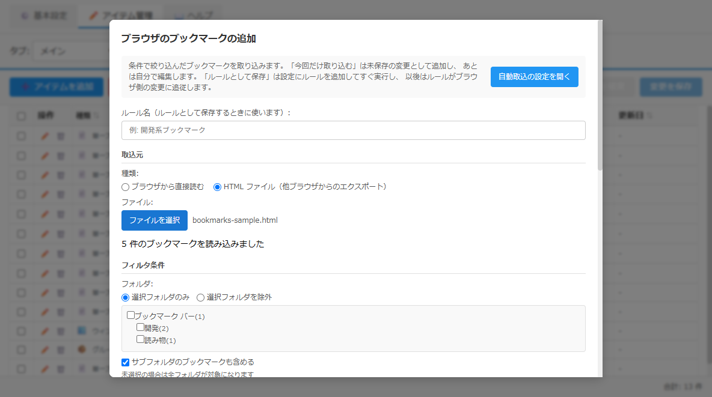

# ブックマーク取込画面（ルール編集と共通）仕様書

## 関連ドキュメント

- [ブックマークの取り込み](../features/bookmark-import.md) - 「今回だけ取り込む」と「ルールとして保存」の使い分け
- [管理ウィンドウ](./admin-window.md) - 開き元（アイテム管理タブ・設定タブ）
- [IPC の設計](../architecture/ipc-channels.md) - ブックマークの読み込み、ルールの保存・実行

## 1. 概要

ブラウザのブックマークをランチャーのアイテムにする画面です。アイテム管理から開いたとき（取込モード）と、設定「ブックマーク自動取込」から開いたとき（ルールモード）で同じフォームを使い、フッターだけが違います（v0.7.38 で手動取込モーダルを統合）。

- **取込モード**（アイテム管理 › アイテムを一括取り込み › ブラウザのブックマークを追加、メインウィンドウの ➕ › 🔖 ブラウザのブックマークを追加、設定 › ブックマーク自動取込の「手動で取り込む」。メインウィンドウの ➕ と設定からは、管理ウィンドウのアイテム管理タブでこの画面を開く）: 条件で絞り込んだブックマークを「今回だけ取り込む」（未保存の変更として追加）か、「ルールとして保存」（設定にルールを追加してすぐ実行）する。取込元に HTML ファイルも選べる
- **ルールモード**（設定 › ブックマーク自動取込 › + ルールを追加／編集）: ルールを「保存」する（実行はしない）

ブックマークは取込元を決めた時点でフォルダ付きの一覧を 1 回読み込み、絞り込みと表示名の生成は画面側で行います（自動取込の実行と同じ処理）。条件を変えるたびにプレビューが更新されます。

**キーボードショートカット**: Escape キーで閉じます（入力内容は破棄されます）。

### 画面イメージ

## 2. 基本情報

| 項目                 | 内容                                                                                                                                                                                                                  |
| -------------------- | --------------------------------------------------------------------------------------------------------------------------------------------------------------------------------------------------------------------- |
| **ファイル名**       | `src/renderer/components/BookmarkAutoImportRuleModal.tsx`                                                                                                                                                             |
| **コンポーネント名** | `BookmarkAutoImportRuleModal`（取込モードとルールモードは開き元が切り替える）                                                                                                                                         |
| **絞り込みの処理**   | `src/common/utils/bookmarkRuleFilter.ts`（自動取込の実行と共通）                                                                                                                                                      |
| **スタイル**         | `src/renderer/styles/components/BookmarkAutoImport.css`（重複警告は `BookmarkImport.css` を共用）                                                                                                                     |
| **表示条件**         | 取込モード: アイテム管理の一括取込メニュー、メインウィンドウの ➕ の「🔖 ブラウザのブックマークを追加」、設定の「手動で取り込む」（アイテム管理タブへ切り替えて開く）／ルールモード: 設定の「+ ルールを追加」「編集」 |
| **モーダルタイプ**   | オーバーレイ型モーダル（管理ウィンドウ内）                                                                                                                                                                            |
| **親画面**           | AdminItemManagerView（取込モード）、BookmarkAutoImportSettings（ルールモード）                                                                                                                                        |

## 3. 画面項目一覧

| エリア           | 項目名                         | 内容・説明                                                                                                                                                                                                                                          | 表示条件                         | 機能詳細                                                 |
| ---------------- | ------------------------------ | --------------------------------------------------------------------------------------------------------------------------------------------------------------------------------------------------------------------------------------------------- | -------------------------------- | -------------------------------------------------------- |
| **ヘッダー**     | タイトル                       | 取込モード「ブラウザのブックマークの追加」／ルールモード「ブックマーク自動取込 - 新規ルール作成／ルールを編集」                                                                                                                                     | 常時表示                         | -                                                        |
| **案内**         | 使い分けの説明                 | 「今回だけ取り込む」と「ルールとして保存」の違い                                                                                                                                                                                                    | 取込モード                       | [ブックマークの取り込み](../features/bookmark-import.md) |
| **案内**         | 自動取込の設定を開くボタン     | 画面を閉じて設定「ブックマーク自動取込」を開く                                                                                                                                                                                                      | 取込モード                       | [4.8](#48-自動取込の設定を開く)                          |
| **フォーム**     | ルール名                       | 取込モードでは「ルールとして保存」のときだけ必須                                                                                                                                                                                                    | 常時表示                         | [4.6](#46-ルールとして保存保存)                          |
| **取込元**       | 種類                           | 「ブラウザから直接読む」「HTML ファイル（他ブラウザからのエクスポート）」                                                                                                                                                                           | 取込モード                       | [4.1](#41-取込元を選ぶ)                                  |
| **取込元**       | ブラウザ                       | インストール済みの Chrome / Edge から選ぶ。見つからないときは「インストール済みブラウザが見つかりません」                                                                                                                                           | 種類がブラウザ                   | [4.1](#41-取込元を選ぶ)                                  |
| **取込元**       | プロファイル                   | 選んだブラウザのプロファイル                                                                                                                                                                                                                        | 種類がブラウザ                   | [4.1](#41-取込元を選ぶ)                                  |
| **取込元**       | ファイルを選択                 | HTML ファイルの選択ダイアログ。選んだファイル名を表示（選ぶ前は「未選択」）                                                                                                                                                                         | 種類が HTML                      | [4.1](#41-取込元を選ぶ)                                  |
| **取込元**       | 読み込み状況                   | 「N 件のブックマークを読み込みました」／読み込み中は「ブックマークを読み込み中...」／失敗時は「読み込みに失敗: 〈理由〉」                                                                                                                           | 常時表示                         | -                                                        |
| **フィルタ条件** | フォルダツリー                 | 読み込んだ一覧から組み立てたフォルダ（直下の件数つき）。チェックで選ぶ。「選択フォルダのみ」「選択フォルダを除外」の切り替えと「サブフォルダのブックマークも含める」。下に「未選択の場合は全フォルダが対象になります」、選択中は「Nフォルダ選択中」 | ブックマークにフォルダがあるとき | [4.2](#42-条件で絞り込む)                                |
| **フィルタ条件** | URL パターン・名前パターン     | 正規表現（大文字小文字を区別しない）。読めない正規表現は赤字で知らせ、その条件は無視する                                                                                                                                                            | 常時表示                         | [4.2](#42-条件で絞り込む)                                |
| **インポート先** | データファイル                 | 取込先。取込モードの初期値はアイテム管理で選んでいるデータファイル                                                                                                                                                                                  | 常時表示                         | -                                                        |
| **表示名の設定** | 接頭辞・接尾辞・フォルダ名付与 | 表示名の生成規則。プレビューにも反映される                                                                                                                                                                                                          | 常時表示                         | [4.3](#43-表示名を整える)                                |
| **プレビュー**   | マッチ件数と一覧               | 「マッチ: N件 / M件」（M は読み込んだ全体件数）と先頭 50 件（表示名変換済み）。超えた分は「...他 N件」。一致 0 件のときは「条件に一致するブックマークはありません」、取込元を選ぶ前は「取込元を選ぶとブックマークが読み込まれます」                 | 常時表示                         | [4.4](#44-プレビュー)                                    |
| **重複警告**     | 重複時の処理                   | 「取込先に同じ URL が N件あります（「今回だけ取り込む」のときの扱い）」と、「重複時の処理:」の選択肢「スキップ（重複アイテムはインポートしない）」「上書き（既存アイテムを新しい情報で更新）」（今回だけ取り込むときの扱い）                        | 取込モードで重複があるとき       | [4.5](#45-今回だけ取り込む)                              |
| **フッター**     | キャンセル                     | 閉じる                                                                                                                                                                                                                                              | 常時表示                         | -                                                        |
| **フッター**     | 今回だけ取り込む (N件)         | 絞り込んだ分を未保存の変更として追加。0 件、または保存中は無効                                                                                                                                                                                      | 取込モード                       | [4.5](#45-今回だけ取り込む)                              |
| **フッター**     | ルールとして保存               | 設定にルールを追加してすぐ実行。ルール名が空、または取込元が HTML のときは無効（理由をツールチップに出す）。保存中は「保存中...」と表示して無効                                                                                                     | 取込モード                       | [4.6](#46-ルールとして保存保存)                          |
| **フッター**     | 保存                           | ルールを保存（実行はしない）。ルール名が空なら無効。保存中は「保存中...」と表示して無効                                                                                                                                                             | ルールモード                     | [4.6](#46-ルールとして保存保存)                          |

## 4. 機能詳細

### 4.1. 取込元を選ぶ

- 開いた直後にインストール済みブラウザを検出し、最初のブラウザの最初のプロファイルを選ぶ。
- ブラウザ・プロファイルが決まるとフォルダ付きの一覧を読む。画面に全プロファイルの選択肢はなく、プロファイルが空のときは検出後に最初のプロファイルを自動で選ぶ。
- 種類を HTML にして「ファイルを選択」で選ぶと、Netscape 形式（ブラウザのエクスポート形式）のフォルダの入れ子からフォルダを復元して、ブラウザから読んだときと同じ形で読む。
- 取込元を変えるとフォルダの選択はクリアされる（フォルダの集合が変わるため）。

### 4.2. 条件で絞り込む

- フォルダツリーは読み込んだ一覧から組み立てる。ブックマークを直接含まない中間フォルダも出す。
- フォルダ未選択なら全フォルダが対象。「サブフォルダも含める」をオンにすると、選んだフォルダの下の階層も対象になる。
- URL・名前パターンは正規表現で、大文字小文字を区別しない。読めない正規表現は無視し、説明文を赤字にする。

### 4.3. 表示名を整える

- 表示名は、フォルダ名付与（直近の親／フルパス／ルート除外パス）→ 接頭辞 → 接尾辞の順。自動取込の実行時と同じ結果になる。

### 4.4. プレビュー

- 条件・表示名の設定が変わるたびに再計算する。件数は「マッチ: N件 / M件」（M は読み込んだ全体件数。読み込み前は「マッチ: N件」のみ）。一覧は先頭 50 件で、残りは「...他 N件」。一致 0 件のときは「条件に一致するブックマークはありません」。
- 取込元を選ぶ前は「取込元を選ぶとブックマークが読み込まれます」。

### 4.5. 今回だけ取り込む

- 絞り込み・表示名変換済みの一覧を、アイテム管理の編集中の内容に追加する（未保存の変更として入り、「変更を保存」で確定）。自動取込の印は付かない。
- 取込先のデータファイルに同じ URL があれば「重複時の処理」が出る。スキップは重複分を入れない。上書きは既存の ID と自動取込の印を引き継いで内容を置き換える。
- 取り込んだ後、画面を閉じてトースト「N 件を〈取込先〉に追加しました（保存で確定）」を出す。

### 4.6. ルールとして保存／保存

- 取込モード: ルールを設定に追加し、続けてそのルールを実行する。結果はトーストで知らせる（手動分との重複があれば警告）。取込元が HTML のときは保存できない（ルールは Chrome / Edge から直接読むため）。
- ルールモード: ルールを保存するだけ。実行は設定画面の「実行」「今すぐ全ルール実行」か起動時。

### 4.7. 閉じる

- キャンセル・Escape・オーバーレイのクリックで閉じる。入力内容は破棄される。

### 4.8. 自動取込の設定を開く

- 取込モードの案内にあるボタン。画面を閉じて、設定タブの「ブックマーク自動取込」カテゴリを開く（既存ルールの確認用）。

## 5. 以前との違い（v0.7.37 まで）

- 手動取込は専用の画面（フラット一覧をチェックで選ぶ）で、自動取込のルール編集とは別の画面だった。v0.7.38 で 1 画面に統合し、フラット一覧・検索・「表示中を選択」は廃止。
- 手動取込にあった「自動取込への案内バー」は、同じ画面で「ルールとして保存」できるようになったため、既存ルールを見るためのボタンだけ残した。
