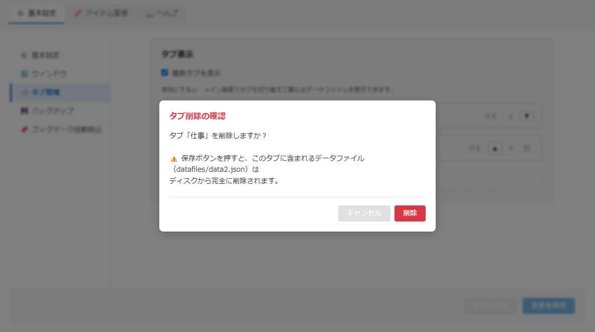
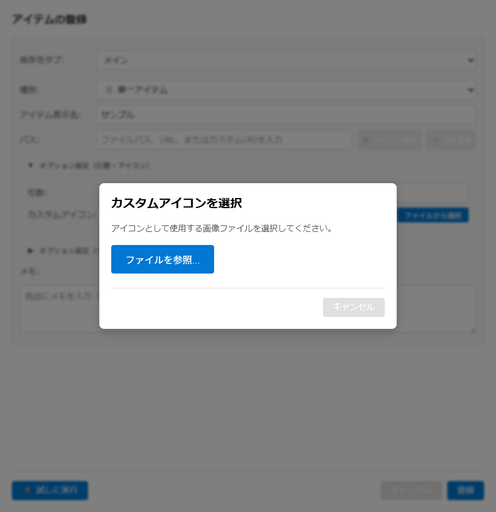

# 共通ダイアログ仕様書

## 関連ドキュメント

- [画面一覧](./README.md) - 全画面構成の概要
- [メインウィンドウ](./main-window.md) - メイン画面の詳細仕様
- [管理ウィンドウ](./admin-window.md) - 管理画面の詳細仕様

## 1. 概要

本ドキュメントでは、アプリケーション全体で使用される共通ダイアログコンポーネントの仕様を定義します。

### 対象コンポーネント

| コンポーネント   | 用途             | 主な使用シーン                                                                         |
| ---------------- | ---------------- | -------------------------------------------------------------------------------------- |
| AlertDialog      | 通知・警告の表示 | エラー通知、成功メッセージ、警告表示                                                   |
| ConfirmDialog    | ユーザーへの確認 | 削除確認、操作確認、破棄確認、ワークスペースのグループ削除・アーカイブの確認ウィンドウ |
| FilePickerDialog | ファイル選択     | カスタムアイコン選択                                                                   |

### 共通仕様

**キーボードショートカット:**

- Escapeキー: ダイアログを閉じる（全ダイアログ共通）
- Enterキー: 確定操作（AlertDialog: OK、ConfirmDialog: 確認）

**オーバーレイ動作:**

- オーバーレイ領域クリックでダイアログを閉じる（ConfirmDialog を独立ウィンドウとして表示した場合を除く）
- ダイアログ本体のクリックは伝播しない（閉じない）

---

## 2. AlertDialog

### 基本情報

| 項目                       | 内容                                                                                                                         |
| -------------------------- | ---------------------------------------------------------------------------------------------------------------------------- |
| **ファイル名**             | `src/renderer/components/AlertDialog.tsx`                                                                                    |
| **コンポーネント名**       | `AlertDialog`                                                                                                                |
| **スタイル**               | `src/renderer/styles/components/AlertDialog.css`                                                                             |
| **用途**                   | ユーザーへの通知、警告、エラー、成功メッセージの表示                                                                         |
| **呼び出し元で変わる挙動** | メッセージ、種類（お知らせ・エラー・警告・成功。指定がなければお知らせ）、タイトル（指定がなければ種類ごとの既定のタイトル） |

### 種類別の表示

| 種類     | アイコン | 既定のタイトル | 用途                   |
| -------- | -------- | -------------- | ---------------------- |
| お知らせ | ℹ️       | 「お知らせ」   | 一般的な情報通知       |
| エラー   | ❌       | 「エラー」     | エラー発生時の通知     |
| 警告     | ⚠️       | 「警告」       | 注意が必要な操作の警告 |
| 成功     | ✅       | 「成功」       | 操作成功時の通知       |

### 画面項目一覧

| エリア       | 項目名     | 内容・説明                                                   | 表示条件 |
| ------------ | ---------- | ------------------------------------------------------------ | -------- |
| **ヘッダー** | アイコン   | 種類に応じたアイコン                                         | 常時表示 |
| **ヘッダー** | タイトル   | 呼び出し元が指定したタイトル、または種類ごとの既定のタイトル | 常時表示 |
| **本文**     | メッセージ | 通知内容のテキスト                                           | 常時表示 |
| **フッター** | OKボタン   | ダイアログを閉じる                                           | 常時表示 |

### キーボード操作

| キー   | 動作                                 |
| ------ | ------------------------------------ |
| Escape | ダイアログを閉じる                   |
| Enter  | OKボタンを押す（ダイアログを閉じる） |

### テスト用データ属性

| 属性                                   | 対象要素       |
| -------------------------------------- | -------------- |
| `data-testid="alert-dialog-overlay"`   | オーバーレイ   |
| `data-testid="alert-dialog"`           | ダイアログ本体 |
| `data-testid="alert-dialog-ok-button"` | OKボタン       |

---

## 3. ConfirmDialog

### 基本情報

| 項目                       | 内容                                                                                                                                                                                                                                                                                   |
| -------------------------- | -------------------------------------------------------------------------------------------------------------------------------------------------------------------------------------------------------------------------------------------------------------------------------------- |
| **ファイル名**             | `src/renderer/components/ConfirmDialog.tsx`                                                                                                                                                                                                                                            |
| **コンポーネント名**       | `ConfirmDialog`                                                                                                                                                                                                                                                                        |
| **スタイル**               | `src/renderer/styles/components/ConfirmDialog.css`                                                                                                                                                                                                                                     |
| **用途**                   | 重要な操作の前にユーザーへの確認を求める                                                                                                                                                                                                                                               |
| **呼び出し元で変わる挙動** | メッセージ、タイトル（指定がなければ「確認」）、確認ボタンの文言（指定がなければ「OK」）、キャンセルボタンの文言（指定がなければ「キャンセル」）、危険な操作として強調するか、チェックボックスを付けるか（付けるときはラベルと初期のチェック状態）、独立した確認ウィンドウとして出すか |

### 画面イメージ

### 画面項目一覧

| エリア       | 項目名           | 内容・説明                         | 表示条件                                 |
| ------------ | ---------------- | ---------------------------------- | ---------------------------------------- |
| **ヘッダー** | タイトル         | 確認ダイアログのタイトル           | 常時表示                                 |
| **本文**     | メッセージ       | 確認内容のテキスト                 | 常時表示                                 |
| **本文**     | チェックボックス | ユーザーに追加の確認や選択肢を提供 | 呼び出し元がチェックボックスを付けた場合 |
| **フッター** | キャンセルボタン | ダイアログを閉じて操作をキャンセル | 常時表示                                 |
| **フッター** | 確認ボタン       | 操作を確定して実行                 | 常時表示                                 |

### 危険な操作の表示

呼び出し元が危険な操作として指定すると、確認ボタンが赤色系で強調される。削除など、元に戻せない操作の確認に使う。

### 独立した確認ウィンドウとして出す場合

呼び出し元によっては、ダイアログを独立した確認ウィンドウの中身として出す（ワークスペースのグループ削除・アーカイブの確認など）。このときはオーバーレイを出さずにウィンドウいっぱいに広げ、ダイアログの外側をクリックしても閉じない。

### キーボード操作

| キー   | 動作                                           |
| ------ | ---------------------------------------------- |
| Escape | キャンセル（キャンセルボタンを押したのと同じ） |
| Enter  | 確認（確認ボタンを押したのと同じ）             |

### テスト用データ属性

| 属性                                          | 対象要素                       |
| --------------------------------------------- | ------------------------------ |
| `data-testid="confirm-dialog-overlay"`        | オーバーレイ                   |
| `data-testid="confirm-dialog"`                | ダイアログ本体                 |
| `data-testid="confirm-dialog-checkbox"`       | チェックボックス（付けた場合） |
| `data-testid="confirm-dialog-cancel-button"`  | キャンセルボタン               |
| `data-testid="confirm-dialog-confirm-button"` | 確認ボタン                     |

---

## 4. FilePickerDialog

### 基本情報

| 項目                       | 内容                                                                                                         |
| -------------------------- | ------------------------------------------------------------------------------------------------------------ |
| **ファイル名**             | `src/renderer/components/FilePickerDialog.tsx`                                                               |
| **コンポーネント名**       | `FilePickerDialog`                                                                                           |
| **スタイル**               | `src/renderer/styles/components/FilePickerDialog.css`                                                        |
| **用途**                   | OS のファイル選択ダイアログを開き、選んだファイルを呼び出し元へ渡す                                          |
| **呼び出し元で変わる挙動** | タイトル（指定がなければ「ファイルを選択」）、説明文（指定したときだけ表示）、選べるファイルの種類（次の表） |

### 画面イメージ

### ファイルの種類別の動作

| ファイルの種類 | 対象ファイル                                                                                 |
| -------------- | -------------------------------------------------------------------------------------------- |
| HTML           | HTMLファイル (*.html, *.htm)（現在は使用箇所なし）                                           |
| 画像           | 画像ファイル (*.png, *.jpg, *.ico等)。現在の呼び出し元（カスタムアイコンの選択）はすべてこれ |
| 指定なし       | 現在未実装（参照ボタンを押しても何も開かない）                                               |

### 画面項目一覧

| エリア       | 項目名               | 内容・説明                       | 表示条件                         |
| ------------ | -------------------- | -------------------------------- | -------------------------------- |
| **ヘッダー** | タイトル             | ダイアログのタイトル             | 常時表示                         |
| **本文**     | 説明テキスト         | ファイル選択の説明               | 呼び出し元が説明文を指定した場合 |
| **本文**     | ファイルを参照ボタン | OSのファイル選択ダイアログを開く | 常時表示                         |
| **フッター** | キャンセルボタン     | ダイアログを閉じる               | 常時表示                         |

### 処理フロー

1. 「ファイルを参照...」ボタンをクリック
2. ファイルの種類に応じたOSネイティブのファイル選択ダイアログが表示
3. ユーザーがファイルを選択
4. 選択されたファイルのパスを呼び出し元へ渡す
5. ダイアログを閉じる

OSのファイル選択ダイアログでキャンセルした場合は、ファイル選択ダイアログは開いたままになります。

### キーボード操作

| キー   | 動作               |
| ------ | ------------------ |
| Escape | ダイアログを閉じる |

### テスト用データ属性

| 属性                                       | 対象要素             |
| ------------------------------------------ | -------------------- |
| `data-testid="file-picker-dialog-overlay"` | オーバーレイ         |
| `data-testid="file-picker-dialog"`         | ダイアログ本体       |
| `data-testid="file-picker-browse-button"`  | ファイルを参照ボタン |
| `data-testid="file-picker-cancel-button"`  | キャンセルボタン     |

---

## 5. エラーハンドリング

### FilePickerDialog

- ファイル選択でエラーが発生した場合、コンソールにエラーを出力
- ダイアログは閉じずに維持（ユーザーが再試行可能）

### AlertDialog / ConfirmDialog

- 表示時のエラーは発生しない設計
- コールバック内でのエラーは呼び出し元で処理

---

## 6. アクセシビリティ

### フォーカス管理

- ダイアログ自体はフォーカス制御（フォーカスの移動、Tabキーの循環）を行わない

### キーボード操作のサポート

- すべてのダイアログでEscapeキーによるキャンセルをサポート
- AlertDialogとConfirmDialogでEnterキーによる確定をサポート

### スクリーンリーダー対応

- 適切なHTML構造（h2タグでタイトル、pタグでメッセージ）
- ボタンには明確なテキストラベルを使用
