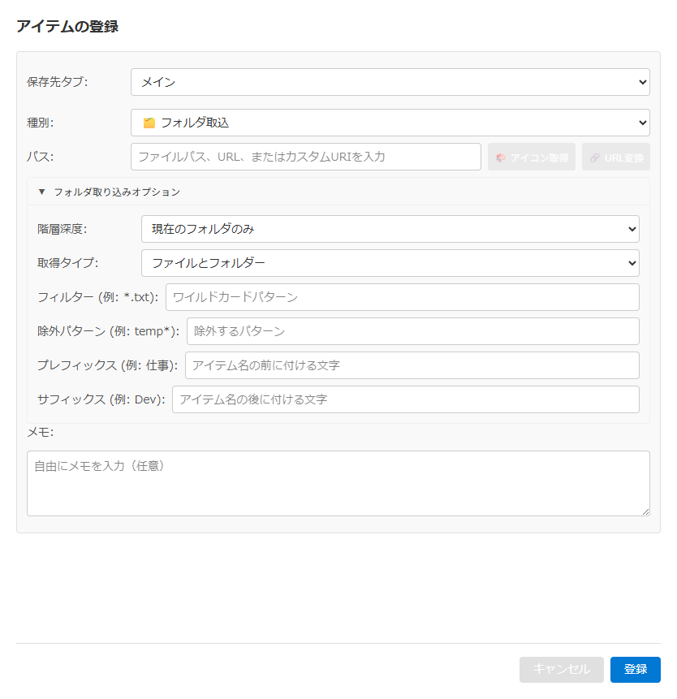

# フォルダ取込オプションエディタ仕様書

## 関連ドキュメント

- [画面一覧](./README.md) - 全画面構成の概要
- [アイテム登録・編集モーダル](./register-modal.md) - 親モーダル
- [フォルダ取込](./register-modal.md#56-フォルダ取込オプションを設定) - フォルダ取込機能の詳細

## 1. 概要

フォルダ取込オプションエディタは、フォルダ取込アイテムの詳細設定を行うためのフォームです。アイテム登録・編集モーダルで種別「🗂️ フォルダ取込」を選び、折りたたみ欄「フォルダ取り込みオプション」を開いたときに表示されます（欄は最初は閉じています）。

### 主要機能

- **階層深度設定**: サブディレクトリをどこまで探索するかを指定
- **取得タイプ設定**: ファイルのみ、フォルダーのみ、両方を選択
- **フィルター設定**: ワイルドカードでファイル名をフィルタリング
- **除外パターン設定**: 特定のパターンを除外
- **表示名カスタマイズ**: プレフィックス、サフィックスを追加

### 画面イメージ

## 2. 基本情報

| 項目 | 内容 |
| --- | --- |
| **ファイル名** | `src/renderer/components/DirOptionsEditor.tsx` |
| **コンポーネント名** | `DirOptionsEditor` |
| **表示条件** | アイテム登録・編集モーダルで種別「🗂️ フォルダ取込」を選び、折りたたみ欄「フォルダ取り込みオプション」を開いたとき（最初は閉じている） |
| **コンポーネントタイプ** | インラインフォーム |
| **親画面** | RegisterModal |

## 3. 画面項目一覧

| 項目名 | ラベル表記 | 入力タイプ | デフォルト | 説明 | 機能詳細 |
| --- | --- | --- | --- | --- | --- |
| 階層深度 | 階層深度: | ドロップダウン | 現在のフォルダのみ | サブディレクトリの探索深度 | [4.1](#41-階層深度を変更) |
| 取得タイプ | 取得タイプ: | ドロップダウン | ファイルとフォルダー | 取得するアイテムの種類 | [4.2](#42-取得タイプを変更) |
| フィルター | フィルター (例: *.txt): | テキスト入力 | なし | ファイル名のフィルターパターン | [4.3](#43-フィルターを入力) |
| 除外パターン | 除外パターン (例: temp*): | テキスト入力 | なし | 除外するファイル名パターン | [4.4](#44-除外パターンを入力) |
| プレフィックス | プレフィックス (例: 仕事): | テキスト入力 | なし | アイテム名の前に付ける文字列 | [4.5](#45-プレフィックスを入力) |
| サフィックス | サフィックス (例: Dev): | テキスト入力 | なし | アイテム名の後に付ける文字列 | [4.6](#46-サフィックスを入力) |

## 4. 機能詳細

### 4.1. 階層深度を変更

#### アクション

- 階層深度ドロップダウンで選択肢を変更

#### 選択肢

| 表示 | 説明 |
| --- | --- |
| 現在のフォルダのみ | 指定フォルダ直下のみ |
| 1階層下まで | サブフォルダー1階層まで |
| 2階層下まで | サブフォルダー2階層まで |
| 3階層下まで | サブフォルダー3階層まで |
| 無制限 | 全てのサブフォルダー |

#### 処理フロー

1. 階層深度の設定を選んだ値に更新

### 4.2. 取得タイプを変更

#### アクション

- 取得タイプドロップダウンで選択肢を変更

#### 選択肢

| 表示 | 説明 |
| --- | --- |
| ファイルのみ | ファイルのみを取得 |
| フォルダーのみ | フォルダーのみを取得 |
| ファイルとフォルダー | 両方を取得 |

#### 処理フロー

1. 取得タイプの設定を選んだ値に更新

### 4.3. フィルターを入力

#### アクション

- フィルター入力欄にテキストを入力

#### 入力形式

- ワイルドカードパターン（例: `*.txt`, `*.exe`, `readme*`）

#### 判定のしかた

- ファイル名・フォルダ名（パスを含まない名前）に対して照合する。大文字小文字は区別する
- 一致しないファイルは一覧に出ない
- 一致しないフォルダは一覧に出ないが、その中の探索は階層深度の範囲で続く（中にある一致するファイルは一覧に出る）

#### プレースホルダー

- 「ワイルドカードパターン」

#### 処理フロー

1. 入力値を取得
2. 空文字の場合は設定なしとして扱う
3. フィルター設定を更新

#### 使用例

- `*.txt` - テキストファイルのみ
- `*.exe` - 実行ファイルのみ
- `doc*` - docで始まるファイル

### 4.4. 除外パターンを入力

#### アクション

- 除外パターン入力欄にテキストを入力

#### 入力形式

- ワイルドカードパターン（例: `temp*`, `*.bak`, `~*`）

#### 判定のしかた

- ファイル名・フォルダ名（パスを含まない名前）に対して照合する。大文字小文字は区別する
- ファイルにもフォルダにも効く。一致したフォルダは一覧に出ず、その中も探索しない
- フィルターより先に判定する（両方に一致するものは除外される）

#### プレースホルダー

- 「除外するパターン」

#### 処理フロー

1. 入力値を取得
2. 空文字の場合は設定なしとして扱う
3. 除外パターン設定を更新

#### 使用例

- `temp*` - tempで始まるファイルを除外
- `*.bak` - バックアップファイルを除外
- `~*` - 一時ファイルを除外

### 4.5. プレフィックスを入力

#### アクション

- プレフィックス入力欄にテキストを入力

#### 説明

- 展開されるアイテムの表示名の前に付ける文字列

#### プレースホルダー

- 「アイテム名の前に付ける文字」

#### 処理フロー

1. 入力値を取得
2. 空文字の場合は設定なしとして扱う
3. プレフィックス設定を更新

#### 使用例

区切りの「: 」は自動で付きます。入力するのは文字列だけです。

- `仕事` → 「仕事: ファイル名」として表示
- `[重要]` → 「[重要]: ファイル名」として表示

### 4.6. サフィックスを入力

#### アクション

- サフィックス入力欄にテキストを入力

#### 説明

- 展開されるアイテムの表示名の後に付ける文字列

#### プレースホルダー

- 「アイテム名の後に付ける文字」

#### 処理フロー

1. 入力値を取得
2. 空文字の場合は設定なしとして扱う
3. サフィックス設定を更新

#### 使用例

前の半角スペースと括弧は自動で付きます。入力するのは文字列だけです。

- `Dev` → 「ファイル名 (Dev)」として表示
- `開発用` → 「ファイル名 (開発用)」として表示

## 5. 表示条件

フォルダ取込の設定値がないときは何も表示しません。種別をフォルダ取込に切り替えたとき、設定値がなければ既定値（現在のフォルダのみ、ファイルとフォルダー）が入ります。

保存されるデータの項目と既定値は [スキャンオプション](../architecture/file-formats/data-format.md#322-スキャンオプションjsondiroptions) を参照してください。
