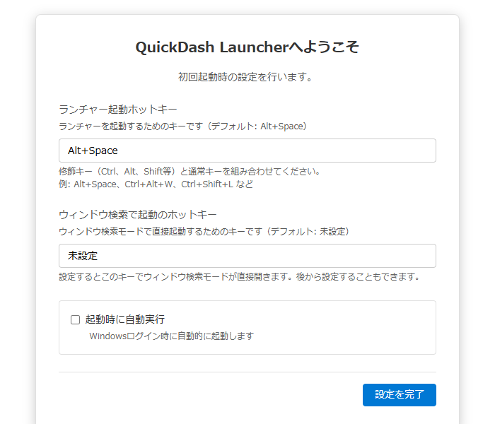

# 初回設定画面仕様書

## 関連ドキュメント

- [画面一覧](./README.md) - 全画面構成の概要
- [メインウィンドウ](./main-window.md) - メイン画面の詳細
- [ホットキー入力](./hotkey-input.md) - ホットキー入力欄の録画・確定・バリデーションの詳細
- [管理ウィンドウ](./admin-window.md) - 初回設定のあとでホットキー・自動起動を変える画面
- [設定ファイル形式](../architecture/file-formats/settings-format.md) - 保存される設定項目

## 1. 概要

初回設定画面は、QuickDashLauncherを初めて起動した際に表示される、各種ホットキーの初期設定画面です。ユーザーが最初にアプリケーションを起動したときにのみ表示され、設定完了後は通常のメインウィンドウが表示されます。

### 主要機能

- **ランチャー起動ホットキー設定**: 起動ホットキーのカスタマイズ（デフォルト: Alt+Space）
- **ウィンドウ検索で起動のホットキー設定**: ウィンドウ検索モード直接起動のホットキー設定（デフォルト: 未設定）
- **自動起動設定**: Windows起動時の自動起動の有効化（デフォルト: 無効）
- **リアルタイムバリデーション**: ホットキー入力時に使用可能かをリアルタイムチェック
- **強制設定**: ESCキー、フォーカス喪失、起動ホットキーのいずれでも隠れず、設定完了が必須

### 画面イメージ

## 2. 基本情報

| 項目 | 内容 |
| --- | --- |
| **ファイル名** | `src/renderer/components/SetupFirstLaunch.tsx` |
| **スタイルファイル** | `src/renderer/styles/components/SetupFirstLaunch.css` |
| **コンポーネント名** | `SetupFirstLaunch` |
| **表示条件** | 設定ファイルの起動ホットキーが空または未設定の場合 |
| **画面タイプ** | メインウィンドウ内の全面表示（初回起動時はウィンドウを700x600で作成） |
| **親コンポーネント** | `App.tsx` |
| **自動表示タイミング** | スプラッシュウィンドウ終了後 |

## 3. 画面項目一覧

| エリア | 項目名 | 内容・説明 | 表示条件 | 機能詳細 |
| --- | --- | --- | --- | --- |
| **ヘッダー** | タイトル | 「QuickDash Launcherへようこそ」 | 常時表示 | - |
| **ヘッダー** | 説明文 | 「初回起動時の設定を行います。」 | 常時表示 | - |
| **メイン** | ランチャー起動ホットキー入力欄 | 見出し「ランチャー起動ホットキー」、説明文「ランチャーを起動するためのキーです（デフォルト: Alt+Space）」。入力欄の初期表示は`Alt+Space` | 常時表示 | [5.1](#51-ランチャー起動ホットキー入力欄への入力) |
| **メイン** | バリデーションエラー（起動ホットキー） | 入力欄の下に赤字で表示するエラーメッセージ | バリデーション失敗時 | [5.1](#51-ランチャー起動ホットキー入力欄への入力) |
| **メイン** | ヒントテキスト（起動ホットキー） | 「修飾キー（Ctrl、Alt、Shift等）と通常キーを組み合わせてください。」と、改行して「例: Alt+Space、Ctrl+Alt+W、Ctrl+Shift+L など」 | 常時表示 | - |
| **メイン** | ウィンドウ検索で起動ホットキー入力欄 | 見出し「ウィンドウ検索で起動のホットキー」、説明文「ウィンドウ検索モードで直接起動するためのキーです（デフォルト: 未設定）」。未入力時のプレースホルダーは「未設定」。キーが入力されている間は右に「クリア」ボタンを表示 | 常時表示 | [5.6](#56-ウィンドウ検索で起動のホットキー入力欄への入力) |
| **メイン** | バリデーションエラー（検索ホットキー） | 入力欄の下に赤字で表示するエラーメッセージ | バリデーション失敗時 | [5.6](#56-ウィンドウ検索で起動のホットキー入力欄への入力) |
| **メイン** | ヒントテキスト（検索ホットキー） | 「設定するとこのキーでウィンドウ検索モードが直接開きます。後から設定することもできます。」 | 常時表示 | - |
| **メイン** | 自動起動チェックボックス | ラベル「起動時に自動実行」（デフォルト: 無効） | 常時表示 | [5.5](#55-自動起動設定の変更) |
| **メイン** | 自動起動ヒント | 「Windowsログイン時に自動的に起動します」 | 常時表示 | - |
| **フッター** | 設定完了ボタン | ラベル「設定を完了」。入力したホットキーで設定を保存。ホットキーが無効な間と保存中は無効 | 常時表示 | [5.2](#52-設定を完了ボタン押下) |

## 4. アクション一覧

| No | アクション名 | トリガー | 主な処理内容 | 詳細 |
| --- | --- | --- | --- | --- |
| 5.1 | ランチャー起動ホットキー入力欄への入力 | キー押下 | ホットキーのリアルタイムバリデーション | [詳細](#51-ランチャー起動ホットキー入力欄への入力) |
| 5.2 | 「設定を完了」ボタン押下 | ボタンクリック | 入力したホットキーで設定完了 | [詳細](#52-設定を完了ボタン押下) |
| 5.3 | 初回起動チェック | アプリケーション起動時 | 初回設定画面の表示判定 | [詳細](#53-初回起動チェック) |
| 5.4 | ESCキー/フォーカス喪失 | キー押下/フォーカス喪失 | 無視（閉じない） | [詳細](#54-escキーフォーカス喪失の無視) |
| 5.5 | 自動起動設定の変更 | チェックボックスクリック | 自動起動の有効/無効を切り替え | [詳細](#55-自動起動設定の変更) |
| 5.6 | ウィンドウ検索で起動のホットキー入力欄への入力 | キー押下 | ホットキーのリアルタイムバリデーション（空許可） | [詳細](#56-ウィンドウ検索で起動のホットキー入力欄への入力) |

## 5. 機能詳細

### 5.1. ランチャー起動ホットキー入力欄への入力

#### アクション

- ランチャー起動ホットキー入力欄をクリックし、キー組み合わせを入力

#### 処理フロー

1. 入力欄をクリックすると録画を開始し、欄に「キーを押してください...」を表示（右に「録画中...」と「キャンセル」ボタンを表示）
2. 録画中に押したキーを「Ctrl + Alt + Q」の形で表示し、修飾キーと通常キーがそろった状態でキーを離した時点でホットキー（例: `Ctrl+Alt+Q`）として確定して録画を終了（「キャンセル」ボタンを押す、またはフォーカスが外れると録画をやめ、元の値のまま）
3. 確定したホットキーのバリデーションを実行:
   - 空チェック
   - 形式チェック（使えるキー名の組み合わせか）
   - 修飾キーの有無チェック
4. バリデーション結果を表示:
   - 有効な場合: エラー表示なし、「設定を完了」ボタン有効化
   - 無効な場合: エラーメッセージ表示、「設定を完了」ボタン無効化

入力欄は管理ウィンドウの基本設定タブと共通の部品で、録画の開始・確定・キャンセルの細かい挙動は [ホットキー入力](./hotkey-input.md) を参照。

#### バリデーション詳細

形は「修飾キー 1 つ以上 + 通常キーちょうど 1 つ」。空のとき、修飾キーがないとき、通常キーがない・2 つ以上あるとき、知らないキー名のときは、入力欄の下に理由を表示する。チェックと文言の一覧は [ホットキー入力 - バリデーション](./hotkey-input.md#44-バリデーション) を参照。

**有効なキーパターン**:

- 修飾キー: `Ctrl`, `Alt`, `Shift`, `CmdOrCtrl`, `Command`, `Cmd`
- 通常キー: `A-Z`, `0-9`, `Space`, `Enter`, `Tab`, `Escape`, `Delete`, `Backspace`, `F1-F12`

#### バリデーション例

- **成功**: `Ctrl+Alt+Q` → 「設定を完了」ボタンが有効
- **未確定**: `Q`のみ → 修飾キーと通常キーがそろうまで確定しないため、入力欄は元の値のまま

#### デフォルト値

- 初期表示: `Alt+Space`（保存先の項目と設定ファイル上の既定値は[設定ファイル形式](../architecture/file-formats/settings-format.md#32-ホットキー設定)）

### 5.2. 「設定を完了」ボタン押下

#### アクション

- 「設定を完了」ボタンをクリック

#### 処理フロー

1. 両ホットキーのバリデーション状態を確認（起動ホットキーと検索ホットキーの両方）
2. いずれかのバリデーション失敗時は処理を中止
3. バリデーション成功時:
   - 入力されたホットキー、ウィンドウ検索ホットキー、自動起動設定を設定ファイルに保存
   - 起動ホットキーを即座に登録（ウィンドウ検索で起動のホットキーが入力されていれば、それも登録）
   - データファイルタブを既定の1つ（名前「メイン」）で初期化
   - 自動起動設定を適用（スタートアップフォルダへのショートカット作成/削除）
   - 初回起動モードを終了
4. 初回設定画面を非表示
5. メインウィンドウに遷移

#### バリデーションチェック

- バリデーション失敗時はボタンが無効化されるため、通常は実行されない
- 起動ホットキーとウィンドウ検索ホットキーの両方が有効なときだけボタンが有効化される

#### エラーハンドリング

- 設定保存失敗時: アラート「設定の保存に失敗しました。」

### 5.3. 初回起動チェック

#### アクション

- アプリケーション起動時に自動判定

#### 処理フロー

1. スプラッシュウィンドウを表示
2. 設定ファイルから起動ホットキーを読み込む
3. ホットキーが空または未設定の場合:
   - 初回起動モードを有効化
   - スプラッシュウィンドウ終了後、初回設定画面を表示
4. ホットキーに値がある場合:
   - 通常モードで起動
   - メインウィンドウを表示

#### 表示判定

- **初回起動**: ホットキーが空または未設定 → 初回設定画面
- **2回目以降**: ホットキーに値がある → メインウィンドウ
- 初回設定画面をもう一度出したいときは、設定ファイルの起動ホットキーを空にして再起動する（項目は [設定ファイルの形式](../architecture/file-formats/settings-format.md#32-ホットキー設定)）

### 5.4. ESCキー/フォーカス喪失の無視

#### アクション

- ESCキーまたは起動ホットキーを押下、またはウィンドウからフォーカスが外れる

#### 処理フロー

1. メインプロセスで初回起動モードが有効かチェック
2. 初回起動モードの場合:
   - ESCキーによるウィンドウの非表示を無視
   - フォーカス喪失によるウィンドウの非表示を無視
   - 起動ホットキーによるウィンドウの非表示を無視
3. 通常モードの場合:
   - 通常通りウィンドウを非表示

#### 目的

- ユーザーが初回設定を完了するまで、誤ってウィンドウを閉じないようにする
- 設定完了を強制することで、アプリケーションの正常な動作を保証

### 5.5. 自動起動設定の変更

#### アクション

- 自動起動チェックボックスをクリック

#### 処理フロー

1. チェックボックスの状態を切り替え（チェック/未チェック）
2. 選択状態は画面内で保持し、この時点では保存しない
3. 完了ボタン押下時に設定ファイルに反映

#### デフォルト値

- 初期表示: 無効（未チェック）

#### 設定の反映

- 完了ボタン押下時に設定ファイルへ保存（保存先の項目は[設定ファイル形式](../architecture/file-formats/settings-format.md#34-自動起動設定)）
- 有効ならWindowsのスタートアップフォルダにショートカットを作成し、無効なら削除
- 設定タブでいつでも変更可能

#### 注意事項

- 自動起動を有効にすると、Windowsログイン時にアプリが自動的に起動します
- 無効にしたい場合は、設定タブから変更できます

### 5.6. ウィンドウ検索で起動のホットキー入力欄への入力

#### アクション

- ウィンドウ検索で起動のホットキー入力欄をクリックし、キー組み合わせを入力（またはクリアボタンで削除）

#### 処理フロー

1. 入力欄でキー入力を受け付け（空でもよい、「クリア」ボタンで消せる）
2. リアルタイムでホットキー文字列を生成（例: `Ctrl+Alt+S`）
3. バリデーションを実行:
   - 空文字列の場合は有効（設定しないことが可能）
   - 入力がある場合は形式チェック・修飾キー有無チェック
4. バリデーション結果を表示:
   - 有効（または空）: エラー表示なし
   - 無効: エラーメッセージ表示、「設定を完了」ボタン無効化

#### デフォルト値

- 初期表示: 空（未設定）

#### 特徴

- 空でもよい: 設定しなくてもよい
- 「クリア」ボタン: 入力をリセット可能（キーが入力されていて録画中でないときに表示）
- 設定すると、このホットキーでウィンドウ検索モードが直接開く
- 初回設定後、設定画面からいつでも変更可能

#### 設定の反映

- 完了ボタン押下時に設定ファイルへ保存（保存先の項目は[設定ファイル形式](../architecture/file-formats/settings-format.md#310-追加ホットキー設定)）
- 空のまま完了した場合は、ウィンドウ検索で起動のホットキーは使えない
