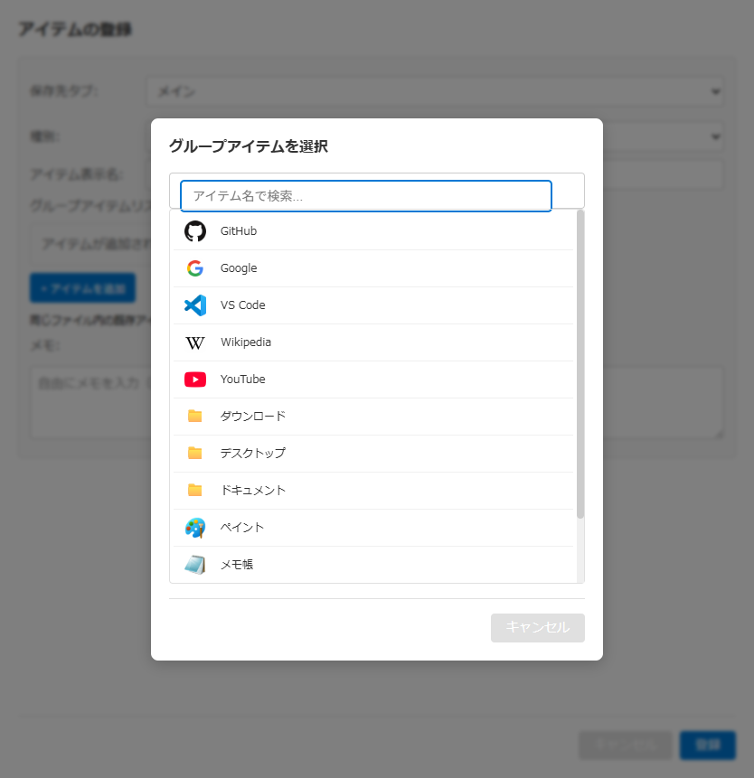

# グループアイテム選択モーダル仕様書

## 関連ドキュメント

- [画面一覧](./README.md) - 全画面構成の概要
- [アイテム登録・編集モーダル](./register-modal.md) - 親モーダル
- [ワークスペースウィンドウ](./workspace-window.md) - ワークスペースアイテム編集の呼び出し元
- [グループ起動](../features/group-launch.md) - グループ機能の詳細

## 1. 概要

グループアイテム選択モーダルは、グループアイテムに追加するメンバーを選択するためのモーダルダイアログです。アイテム登録・編集モーダルでは同じデータファイル内の既存アイテムから、ワークスペースアイテム編集では全データファイルのアイテムから選択できます。

**キーボードショートカット**: Escapeキーでモーダルを閉じることができます。

### 主要機能

- **アイテム一覧表示**: 対象ファイル内の選択可能なアイテムを一覧表示
- **検索フィルタリング**: アイテム名でリアルタイム検索
- **除外表示**: 既に追加済みのアイテムを選択不可として表示
- **アイコン表示**: 各アイテムのアイコンを表示

### 画面イメージ

## 2. 基本情報

| 項目 | 内容 |
| --- | --- |
| **ファイル名** | `src/renderer/components/GroupItemSelectorModal.tsx` |
| **コンポーネント名** | `GroupItemSelectorModal` |
| **表示条件** | アイテム登録・編集モーダルでグループアイテムの「+ アイテムを追加」ボタンをクリック、またはワークスペースアイテム編集の「+ アイテムを追加」ボタンをクリック |
| **画面タイプ** | オーバーレイ型モーダル |
| **親画面** | アイテム登録・編集モーダル、ワークスペースアイテム編集モーダル |

## 3. 画面項目一覧

| エリア | 項目名 | 内容・説明 | 表示条件 | 機能詳細 |
| --- | --- | --- | --- | --- |
| **ヘッダー** | タイトル | 「グループアイテムを選択」 | 常時表示 | - |
| **検索** | 検索入力欄 | アイテム名で検索 | 常時表示 | [5.1](#51-検索入力欄に文字入力) |
| **リスト** | アイテム一覧 | 選択可能なアイテムのリスト | 常時表示 | [5.2](#52-アイテムをクリック) |
| **リスト** | アイテム行（通常） | 選択可能なアイテム | 未追加のアイテム | [5.2](#52-アイテムをクリック) |
| **リスト** | アイテム行（除外） | 選択不可のアイテム | 追加済みのアイテム | - |
| **リスト** | アイコン | アイテムのアイコンまたはデフォルト絵文字 | 各アイテム | - |
| **リスト** | アイテム名 | アイテムの表示名 | 各アイテム | - |
| **リスト** | 追加済みラベル | 「追加済み」の表示 | 追加済みのアイテム | - |
| **リスト** | 空リストメッセージ | 「このファイルにはアイテムがありません」または「検索結果がありません」 | アイテムが0件の場合 | - |
| **フッター** | キャンセルボタン | モーダルを閉じる | 常時表示 | [5.3](#53-キャンセルボタンをクリック) |

## 4. アクション一覧

| No | アクション名 | トリガー | 主な処理内容 | 詳細 |
| --- | --- | --- | --- | --- |
| 5.1 | 検索入力欄に文字入力 | テキスト入力 | アイテムのフィルタリング | [詳細](#51-検索入力欄に文字入力) |
| 5.2 | アイテムをクリック | 行クリック | アイテムを選択して閉じる | [詳細](#52-アイテムをクリック) |
| 5.3 | キャンセルボタンをクリック | ボタンクリック | モーダルを閉じる | [詳細](#53-キャンセルボタンをクリック) |

## 5. 機能詳細

### 5.1. 検索入力欄に文字入力

#### アクション

- 検索入力欄にテキストを入力

#### 処理フロー

1. 入力値を取得
2. 入力値が空の場合、全アイテムを表示
3. 入力値がある場合、アイテム名で部分一致フィルタリング
4. フィルタリング結果を表示

#### フィルタリングロジック

- アイテム名に検索文字列が含まれるかをチェック
- 大文字小文字を区別しない

#### プレースホルダー

- 「アイテム名で検索...」

### 5.2. アイテムをクリック

#### アクション

- アイテム一覧の行をクリック

#### 実行条件

- アイテムが追加済み（呼び出し元のグループにすでに入っている）でないこと
- 追加済みかどうかは表示名で判定する。同じ表示名のアイテムが複数あると、どれも「追加済み」として選べなくなる

#### 処理フロー

1. クリックしたアイテムが選択可能かチェック
2. 選択可能な場合：
   - 選択したアイテム名を返す
   - モーダルを閉じる
3. 選択不可（追加済み）の場合：
   - 何も実行しない

### 5.3. キャンセルボタンをクリック

#### アクション

- 「キャンセル」ボタンをクリック、またはEscapeキーを押下、またはオーバーレイをクリック

#### 処理フロー

1. モーダルを閉じる

## 6. 初期化処理

### モーダルオープン時の処理

1. アイテム一覧を読み込み
2. フォーカスをモーダルに設定
3. 検索ボックスにフォーカス移動

検索文字列は、モーダルを閉じたときにクリアされます。

### アイテム読み込み処理

- データファイルからアイテムを読み込み
- 対象ファイルが指定されていればそのファイルのアイテムだけ、指定がなければ全データファイルのアイテムを対象にする
- グループアイテムは除外
- フォルダ取込から展開されたアイテムは除外
- アイコンを読み込み

### 除外対象

グループに追加できないアイテム:

- グループアイテム
- フォルダ取込から展開されたアイテム
- ウィンドウ情報（内部データ構造）
- 通常アイテムでもウィンドウ操作アイテムでもないもの

**注意**: ウィンドウ操作アイテムはグループに追加できます。

## 7. デフォルトアイコン

アイコンが設定されていないアイテムには、タイプに応じたデフォルト絵文字が表示されます。

| アイテムタイプ | デフォルトアイコン |
| --- | --- |
| URL | 🌐 |
| フォルダ | 📁 |
| アプリ | ⚙️ |
| ファイル | 📄 |
| カスタムURI | 🔗 |
| ウィンドウ操作 | 🪟 |
| その他 | ❓ |

## 8. キーボード操作

| キー | 動作 |
| --- | --- |
| Escape | モーダルを閉じる |
| Tab / Shift+Tab | モーダル内でフォーカストラップ（最後の要素から最初へ、最初の要素から最後へ循環） |
| 入力フィールド内の編集キー | 通常の入力操作として許可 |

### フォーカス管理

- モーダル表示時、検索ボックスに自動フォーカス
- モーダル内のキーイベントは背景に伝播しない
- Tabキーはモーダル内でフォーカストラップが有効（モーダルの外にフォーカスが出ない）

## 9. エラーハンドリング

### アイテム読み込みエラー

- エラー時はコンソールにログ出力
- UIへのエラー表示は現在未実装
