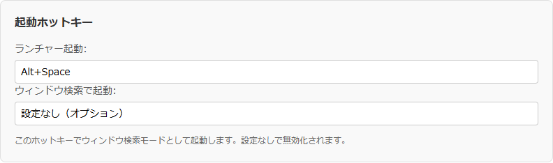
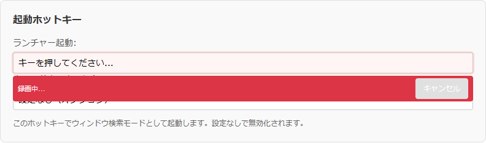

# ホットキー入力コンポーネント仕様書

## 関連ドキュメント

- [画面一覧](./README.md) - 全画面構成の概要
- [管理ウィンドウ](./admin-window.md) - 管理画面の詳細仕様
- [初回起動セットアップ](./first-launch-setup.md) - 初回起動画面の詳細仕様
- [アプリケーション設定](./admin-window.md#7-設定機能の詳細) - 設定機能の詳細

## 1. 概要

ホットキー入力コンポーネント（HotkeyInput）は、起動ホットキーとアイテム検索ホットキー（管理ウィンドウでは「ウィンドウ検索で起動」）の設定に使う専用入力フィールドです。キーボードのキー組み合わせを視覚的に入力でき、リアルタイムでバリデーションを実行します。

### 主要機能

- **キー録画**: クリックして録画モードに入り、押したキーを記録
- **修飾キー対応**: Ctrl、Alt、Shift、CmdOrCtrlの組み合わせ
- **リアルタイムバリデーション**: 入力されたホットキーの有効性をチェック
- **視覚的フィードバック**: 録画中の状態表示

### 画面イメージ

**通常時**



**入力待ち（クリック後）**



## 2. 基本情報

| 項目                       | 内容                                                                                                                                                                       |
| -------------------------- | -------------------------------------------------------------------------------------------------------------------------------------------------------------------------- |
| **ファイル名**             | `src/renderer/components/HotkeyInput.tsx`                                                                                                                                  |
| **コンポーネント名**       | `HotkeyInput`                                                                                                                                                              |
| **スタイル**               | `src/renderer/styles/components/HotkeyInput.css`                                                                                                                           |
| **使用画面**               | 管理ウィンドウ（基本設定タブ）、初回起動セットアップ画面                                                                                                                   |
| **コンポーネントタイプ**   | フォーム入力                                                                                                                                                               |
| **呼び出し元で変わる挙動** | 入力を無効にできる。空のままを有効として扱うか、「クリア」ボタンを出すか、未入力時の案内文を呼び出し元が決める（アイテム検索ホットキー欄は空でもよく、クリアボタンを出す） |

## 3. 画面項目一覧

| 項目名               | 説明                                                                         | 表示条件                                                                                                                     |
| -------------------- | ---------------------------------------------------------------------------- | ---------------------------------------------------------------------------------------------------------------------------- |
| 入力フィールド       | ホットキーの値または入力中のキーを表示                                       | 常時表示                                                                                                                     |
| 録画中インジケーター | 「録画中...」とキャンセルボタン                                              | 録画モード中                                                                                                                 |
| クリアボタン         | 「クリア」。押すとホットキーの値を空にし、バリデーションを有効として通知する | クリアボタンの表示が有効で、値があり、録画中でないとき（管理ウィンドウ・初回起動セットアップのアイテム検索ホットキーで有効） |

## 4. 状態遷移

### 入力モードの状態

| 状態                   | 表示内容                             | 動作               |
| ---------------------- | ------------------------------------ | ------------------ |
| 通常                   | 設定値またはプレースホルダー         | クリックで録画開始 |
| 録画中（キー未入力）   | 「キーを押してください...」          | キー入力待ち       |
| 録画中（キー入力あり） | 入力中のキー表示（例: `Ctrl + Alt`） | キー追加受付中     |

## 5. 機能詳細

### 5.1. 録画モード開始

#### アクション

- 入力フィールドをクリック

#### 処理フロー

1. `disabled`でない場合のみ処理
2. `isRecording`を`true`に設定
3. `currentKeys`をクリア
4. 入力フィールドにフォーカス

### 5.2. キー入力処理

#### 対応キー

| キータイプ         | 対応キー                                     | 正規化                  |
| ------------------ | -------------------------------------------- | ----------------------- |
| 修飾キー           | Control → Ctrl、Meta → CmdOrCtrl、Alt、Shift | あり                    |
| 英数字キー         | A-Z、0-9                                     | 大文字に変換            |
| ファンクションキー | F1-F12                                       | なし                    |
| 特殊キー           | Space、Enter、Tab、Escape、Delete、Backspace | あり（例: ` ` → Space） |

上の表にないキーは無視されます。同じキーを複数回押しても1つとして数えます。

#### 処理フロー（keydown）

1. 録画中でなければ何もしない
2. デフォルト動作とイベント伝播を抑止
3. キーを正規化
4. 修飾キーの場合：`currentKeys`に追加
5. 英数字キーの場合：大文字に変換して追加
6. ファンクションキーの場合：そのまま追加
7. 特殊キーの場合：そのまま追加

#### 処理フロー（keyup）

1. 録画中でなければ何もしない
2. `currentKeys`のサイズが2以上かチェック
3. 修飾キーと非修飾キーの両方があるかチェック
4. 両方ある場合：
   - ホットキー文字列を生成（修飾キー+非修飾キー）
   - `onChange(hotkey)`を呼び出し
   - 録画モードを終了
   - フォーカスを外す

### 5.3. ホットキー確定条件

有効なホットキーとして確定するには:

1. 2つ以上のキーが押されている
2. 少なくとも1つの修飾キーが含まれる
3. 少なくとも1つの非修飾キーが含まれる

#### 有効な例

- `Ctrl+A`
- `Alt+Space`
- `Ctrl+Shift+F1`
- `Ctrl+Alt+Delete`

#### 無効な例

- `A`（修飾キーなし）
- `Ctrl+Shift`（非修飾キーなし）
- `Ctrl`（キーが1つだけ）

### 5.4. バリデーション

#### 処理フロー

1. `value`が変更されると`validateHotkey()`を実行
2. `window.electronAPI.validateHotkey(hotkey)`でバリデーション
3. 結果を`onValidationChange(isValid, reason)`で通知

#### バリデーション結果

| 結果                            | isValid    | reason                             |
| ------------------------------- | ---------- | ---------------------------------- |
| 有効                            | `true`     | `undefined`                        |
| 無効                            | `false`    | 理由の文字列                       |
| エラー                          | `false`    | `'ホットキーの検証に失敗しました'` |
| 値が空（`allowEmpty`が`true`）  | `true`     | `undefined`                        |
| 値が空（`allowEmpty`が`false`） | 通知しない | -                                  |

### 5.5. 録画キャンセル

#### アクション

- 「キャンセル」ボタンをクリック、または入力フィールドからフォーカスを外す

録画中にEscapeやTabを押してもキャンセルにはならず、キーとして記録されます。

#### 処理フロー

1. `isRecording`を`false`に設定
2. `currentKeys`をクリア
3. 録画中インジケーターを非表示

## 6. 表示テキスト

### getDisplayText()の仕様

| 状態                 | 条件                                    | 表示テキスト                     |
| -------------------- | --------------------------------------- | -------------------------------- |
| 録画中・キー入力あり | `isRecording && currentKeys.size > 0`   | 入力中のキー（例: `Ctrl + Alt`） |
| 録画中・キー未入力   | `isRecording && currentKeys.size === 0` | `'キーを押してください...'`      |
| 通常・値あり         | `!isRecording && value`                 | ホットキー値（例: `Alt+Space`）  |
| 通常・値なし         | `!isRecording && !value`                | プレースホルダー                 |

## 7. キー正規化マッピング

```typescript
const keyMap: { [key: string]: string } = {
  Control: 'Ctrl',
  Meta: 'CmdOrCtrl',
  ' ': 'Space',
};
```

## 8. バリデーション

### バリデーション内容

ホットキーの値に対して以下がチェックされます。他のアプリケーションとの競合やシステム予約キーかどうかは確認しません。

| チェック                                                                                                                                          | 無効のときのメッセージ                   |
| ------------------------------------------------------------------------------------------------------------------------------------------------- | ---------------------------------------- |
| 値が空、または文字列でない                                                                                                                        | ホットキーが指定されていません           |
| 形式が「修飾キー + 1つ以上のキー」でない（先頭は修飾キー。続くキーは英数字1文字、Space、Enter、Tab、Escape、Delete、Backspace、F1-F12、修飾キー） | ホットキーの形式が正しくありません       |
| 修飾キーが含まれない                                                                                                                              | 修飾キー（Ctrl、Alt、Shift等）が必要です |

修飾キーの数に上限を設けるチェックはありません。

## 9. アクセシビリティ

- 入力フィールドは`readOnly`属性を持つ（直接タイピング不可）
- フォーカス可能（録画中でないときはTab操作に対応。録画中のTabはキーとして記録される）
- 無効状態では`disabled`属性が設定される
