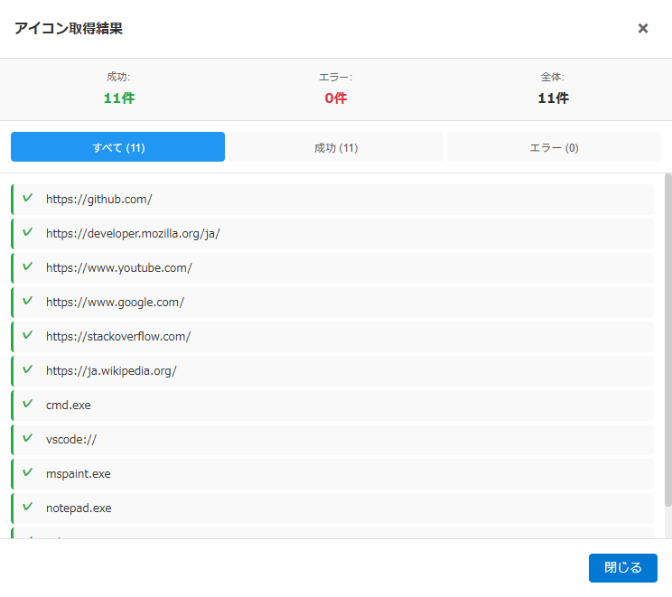

# アイコン取得進捗詳細モーダル仕様書

## 関連ドキュメント

- [画面一覧](./README.md) - 全画面構成の概要
- [メインウィンドウ](./main-window.md) - メイン画面の詳細仕様
- [アイコンシステム](../features/icons.md) - アイコン機能の詳細
- [ウィンドウ制御 - メイン画面の子ウィンドウ](../architecture/window-control.md#メイン画面の子ウィンドウアイテムの登録編集アイコン取得結果) - 子ウィンドウの開き方・モーダルモード

## 1. 概要

アイコン取得進捗詳細モーダル（IconProgressDetailModal）は、アイコン一括取得の結果を詳細に表示する画面です。成功したアイテムとエラーが発生したアイテムを確認できます。

**メインウィンドウの進捗バーの「詳細」から、独立した子ウィンドウ（ウィンドウタイトル「アイコン取得結果」）で開きます**。メインウィンドウのサイズ・位置は変わりません（v0.7.38 以降。以前はメインウィンドウの中のモーダルで、ウィンドウを 800x700 に広げていた）。開いている間、メインウィンドウはモーダルモードになり、フォーカスが外れても隠れません。詳細は [ウィンドウ制御 - メイン画面の子ウィンドウ](../architecture/window-control.md#メイン画面の子ウィンドウアイテムの登録編集アイコン取得結果)。

### 主要機能

- **結果サマリー表示**: 成功件数、エラー件数、全体件数を一目で確認
- **フィルター機能**: すべて/成功/エラーで結果を絞り込み
- **詳細結果リスト**: 各アイテムの処理結果を一覧表示
- **エラーメッセージ表示**: エラー発生時の原因を確認

### 画面イメージ



## 2. 基本情報

| 項目                 | 内容                                                                                                                                                                 |
| -------------------- | -------------------------------------------------------------------------------------------------------------------------------------------------------------------- |
| **ファイル名**       | `src/renderer/components/IconProgressDetailModal.tsx`                                                                                                                |
| **コンポーネント名** | `IconProgressDetailModal`                                                                                                                                            |
| **スタイル**         | `src/renderer/styles/components/IconProgressDetailModal.css`                                                                                                         |
| **表示条件**         | アイコン一括取得の完了後、進捗バーの「詳細」ボタン（完了時で、結果が 1 件以上あるときだけ表示。進捗バーは完了後も自動では閉じず、「×」で閉じるまで「詳細」を押せる） |
| **モーダルタイプ**   | 独立した子ウィンドウ（`src/renderer/components/MainChildPage.tsx` が `asPage` で描画）                                                                               |
| **親画面**           | メインウィンドウ（子ウィンドウの親。開いている間はモーダルモード）                                                                                                   |

## 3. Props

| プロパティ | 型                     | 必須 | 説明                                                                                                                                            |
| ---------- | ---------------------- | :--: | ----------------------------------------------------------------------------------------------------------------------------------------------- |
| `isOpen`   | `boolean`              |  ○   | 表示状態（子ウィンドウでは常に `true`）                                                                                                         |
| `onClose`  | `() => void`           |  ○   | 閉じる時のコールバック（子ウィンドウではウィンドウを閉じる）                                                                                    |
| `results`  | `IconProgressResult[]` |  ○   | アイコン取得結果の配列（開き元の進捗バーが全フェーズの結果をまとめて渡す）                                                                      |
| `asPage`   | `boolean`              |  -   | 子ウィンドウの中身として描く（オーバーレイなしでウィンドウいっぱいに広げ、外側クリックで閉じない）。既定 `false`。子ウィンドウからは常に `true` |

### IconProgressResult型

```typescript
interface IconProgressResult {
  itemName: string; // アイテム名またはURL
  success: boolean; // 成功/失敗
  errorMessage?: string; // エラーメッセージ（失敗時のみ）
  type: 'favicon' | 'icon'; // 処理の種別（ファビコン取得またはアイコン抽出）
}
```

## 4. 画面項目一覧

| エリア         | 項目名                 | 内容・説明                                         | 表示条件                                   | 機能詳細                              |
| -------------- | ---------------------- | -------------------------------------------------- | ------------------------------------------ | ------------------------------------- |
| **ヘッダー**   | タイトル               | 「アイコン取得結果」                               | 常時表示                                   | -                                     |
| **ヘッダー**   | 閉じるボタン（×）      | 子ウィンドウを閉じる                               | 常時表示                                   | [4.1](#41-閉じるボタンをクリック)     |
| **サマリー**   | 成功件数               | 「成功:」＋「N件」（成功したアイテムの件数）       | 常時表示                                   | -                                     |
| **サマリー**   | エラー件数             | 「エラー:」＋「N件」（失敗したアイテムの件数）     | 常時表示                                   | -                                     |
| **サマリー**   | 全体件数               | 「全体:」＋「N件」（処理した全アイテムの件数）     | 常時表示                                   | -                                     |
| **フィルター** | すべてボタン           | 全結果を表示                                       | 常時表示                                   | [4.2](#42-フィルターボタンをクリック) |
| **フィルター** | 成功ボタン             | 成功結果のみ表示                                   | 常時表示                                   | [4.2](#42-フィルターボタンをクリック) |
| **フィルター** | エラーボタン           | エラー結果のみ表示                                 | 常時表示                                   | [4.2](#42-フィルターボタンをクリック) |
| **リスト**     | 結果一覧               | フィルター適用後の結果リスト                       | 常時表示                                   | -                                     |
| **リスト**     | 結果アイテム（成功）   | 成功アイコン（✓）+ アイテム名                      | 成功結果                                   | -                                     |
| **リスト**     | 結果アイテム（エラー） | エラーアイコン（✗）+ アイテム名 + エラーメッセージ | エラー結果                                 | -                                     |
| **リスト**     | 空結果メッセージ       | 「結果がありません」                               | 結果が0件の場合                            | -                                     |
| **フッター**   | 閉じるボタン           | 子ウィンドウを閉じる                               | 常時表示                                   | [4.1](#41-閉じるボタンをクリック)     |
| **その他**     | 読み込み中表示         | 「読み込み中...」                                  | 子ウィンドウが結果を受け取るまで           | -                                     |
| **その他**     | 見つからない表示       | 「表示する内容が見つかりません。」＋閉じるボタン   | 結果を受け取れない場合（開き元が閉じた等） | -                                     |

## 5. アクション一覧

| No  | アクション名               | トリガー                  | 主な処理内容         | 詳細                                   |
| --- | -------------------------- | ------------------------- | -------------------- | -------------------------------------- |
| 4.1 | 閉じるボタンをクリック     | ボタンクリック/Escapeキー | 子ウィンドウを閉じる | [詳細](#41-閉じるボタンをクリック)     |
| 4.2 | フィルターボタンをクリック | フィルターボタンクリック  | 結果のフィルタリング | [詳細](#42-フィルターボタンをクリック) |

## 6. 機能詳細

### 4.1. 閉じるボタンをクリック

#### アクション

- ヘッダーの「×」ボタンかフッターの「閉じる」ボタンをクリック、またはEscapeキーを押下（ウィンドウ枠の閉じるボタンでも閉じる）

#### 処理フロー

1. 子ウィンドウを閉じて破棄する
2. メイン画面の子ウィンドウがすべて閉じたら、メインウィンドウのモーダルモードを解除する（メインウィンドウのサイズ・位置はもともと変えていない）

### 4.2. フィルターボタンをクリック

#### アクション

- 「すべて」「成功」「エラー」のいずれかのフィルターボタンをクリック

#### 処理フロー

1. クリックしたボタンに応じてフィルター状態を更新
2. フィルター適用後の結果を表示

#### フィルターロジック

- 「すべて」: 全結果を表示
- 「成功」: 成功結果のみ表示
- 「エラー」: エラー結果のみ表示

#### ボタン表示

各ボタンには件数が表示されます:

- 「すべて (N)」
- 「成功 (N)」
- 「エラー (N)」

## 7. ウィンドウサイズ

結果は独立した子ウィンドウで表示します。大きさは 760x700 を作業領域で切り詰めたもので、メインウィンドウと同じディスプレイの作業領域の中央に開きます。メインウィンドウのサイズ・位置は変えません（`src/main/utils/mainChildWindowSpec.ts`）。

v0.7.38 より前は、モーダル表示中にメインウィンドウを 800x700 に広げ、閉じると設定値に戻していました。

## 8. スタイル

### 主要なCSSクラス

| クラス名                                   | 説明                                                                                                      |
| ------------------------------------------ | --------------------------------------------------------------------------------------------------------- |
| `.icon-detail-modal`                       | モーダルコンテナ                                                                                          |
| `.main-child-page` / `.main-child-content` | 子ウィンドウとして描くときの外枠と中身（`asPage`。`.modal-overlay` の代わりにウィンドウいっぱいに広げる） |
| `.modal-header`                            | ヘッダーエリア                                                                                            |
| `.modal-close-btn`                         | 閉じるボタン（×）                                                                                         |
| `.modal-summary`                           | サマリー表示エリア                                                                                        |
| `.summary-item`                            | サマリー項目                                                                                              |
| `.summary-item.success`                    | 成功件数                                                                                                  |
| `.summary-item.error`                      | エラー件数                                                                                                |
| `.summary-item.total`                      | 全体件数                                                                                                  |
| `.filter-buttons`                          | フィルターボタンエリア                                                                                    |
| `.filter-btn`                              | フィルターボタン                                                                                          |
| `.filter-btn.active`                       | 選択中のフィルターボタン                                                                                  |
| `.results-list`                            | 結果リストエリア                                                                                          |
| `.result-item`                             | 結果アイテム                                                                                              |
| `.result-item.success`                     | 成功アイテム                                                                                              |
| `.result-item.error`                       | エラーアイテム                                                                                            |
| `.result-icon`                             | 結果アイコン（✓/✗）                                                                                       |
| `.result-content`                          | 結果内容                                                                                                  |
| `.result-name`                             | アイテム名                                                                                                |
| `.result-error`                            | エラーメッセージ                                                                                          |
| `.no-results`                              | 空結果メッセージ                                                                                          |
| `.modal-actions`                           | フッターのアクションエリア（右寄せ、`justify-content: flex-end`）                                         |

### 閉じるボタン（×）のスタイル

```css
.modal-close-btn {
  background: none;
  border: none;
  color: var(--text-muted);
  font-size: 24px;
  font-weight: bold; /* 太字で視認性向上 */
  line-height: 1;
  cursor: pointer;
  padding: var(--spacing-xs);
  border-radius: 50%; /* 丸いボタン */
  width: 32px;
  height: 32px;
  display: flex;
  align-items: center;
  justify-content: center;
  transition: all 0.2s ease;
}

.modal-close-btn:hover {
  background-color: var(--color-gray-600);
  color: var(--color-white);
  transform: scale(1.1); /* ホバー時に拡大 */
}

.modal-close-btn:active {
  background-color: var(--color-gray-700);
  transform: scale(0.95); /* クリック時に縮小 */
}
```

**デザインの特徴:**

- 丸いボタンデザインで他の×ボタンと統一
- ホバー時に背景色が変化してスケールアップ
- クリック時の視覚的フィードバック
- グレー系の色で削除系ボタンと区別

詳細は **[CSSデザインシステム - 閉じる・削除ボタンクラス](../architecture/css-design.md#閉じる削除ボタンクラス)** を参照してください。

### 結果アイテムの表示

#### 成功アイテム

- 左ボーダーが緑色（`border-left: 3px solid var(--color-success)`）
- 背景色はセクション共通背景（`var(--bg-section)`）
- 「✓」アイコン（緑色）
- アイテム名のみ表示

#### エラーアイテム

- 左ボーダーが赤色（`border-left: 3px solid var(--color-danger)`）
- 背景色はセクション共通背景（`var(--bg-section)`）
- 「✗」アイコン（赤色）
- アイテム名とエラーメッセージを表示

### アイテム名の改行対応

アイテム名に改行が含まれる場合、適切に改行して表示されます。

## 9. 使用例

子ウィンドウの中身（`MainChildPage.tsx`）として、開き元から受け取った結果を渡して描きます。

```tsx
<IconProgressDetailModal
  asPage
  isOpen
  onClose={() => window.close()}
  results={[
    { itemName: 'Google', success: true, type: 'favicon' },
    { itemName: 'Twitter', success: true, type: 'favicon' },
    {
      itemName: '無効なURL',
      success: false,
      type: 'favicon',
      errorMessage: 'ファビコンの取得に失敗しました',
    },
  ]}
/>
```

## 10. 関連処理

### アイコン一括取得との連携

アイコン一括取得処理の完了後、このモーダルで結果を確認できます。取得は次のいずれからでも始められ、どれも同じ取得処理が走って同じ進捗バーが出ます。

- メインウィンドウの🔄メニュー
- 画面下部の「アイコン未取得」通知の「取得」ボタン（進捗バーの表示中は通知を隠す）

1. アイコン一括取得を実行
2. 進捗バーが表示され、処理が進行
3. 完了後も進捗バーは自動では閉じない。「詳細」ボタン（完了時で、結果が 1 件以上あるときだけ表示）をクリック。「×」で進捗バーを閉じるまで押せる
4. 結果が独立した子ウィンドウで開く
