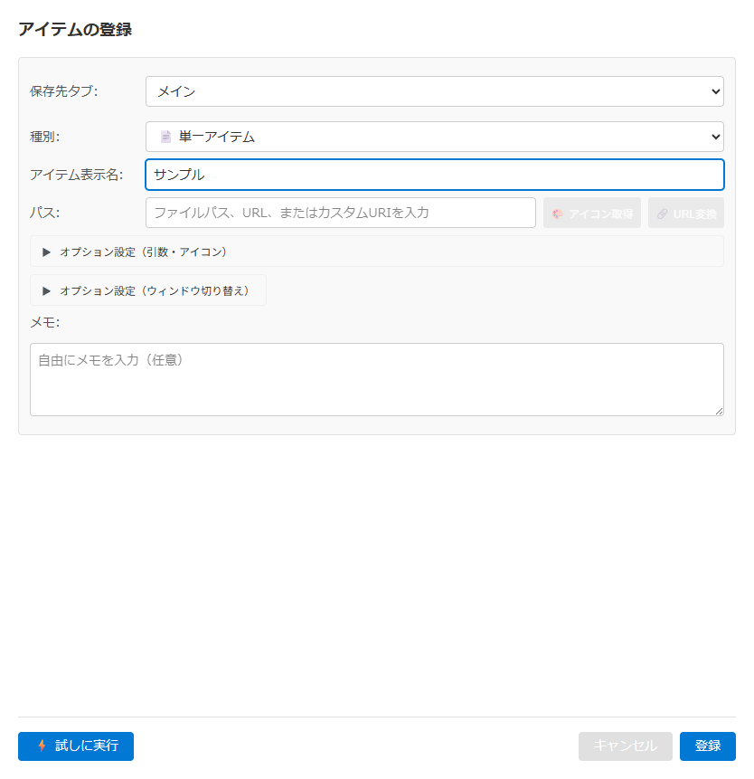

# アイテム登録・編集モーダル仕様書

## 関連ドキュメント

- [画面一覧](./README.md) - 全画面構成の概要
- [メインウィンドウ](./main-window.md) - メイン画面の詳細仕様
- [管理ウィンドウ](./admin-window.md) - 管理画面の詳細仕様
- [グループ起動](../features/group-launch.md) - グループ機能の詳細
- [アイコンシステム](../features/icons.md) - アイコン取得・カスタムアイコンの仕組み

## 1. 概要

アイテム登録・編集モーダルは、ランチャーに新しいアイテムを追加したり、既存アイテムを編集するためのフォームです。単一アイテム、フォルダ取込、グループ、ウィンドウ操作、クリップボード、ウィンドウ配置の6種類を扱うことができます。

**メインウィンドウから開くときは独立した子ウィンドウ**で開き、メインウィンドウのサイズ・位置は変わりません（v0.7.38 以降。以前はウィンドウを 850x1000 に広げて中央へ動かしていた）。保存はこのウィンドウがデータファイルに書き、メインウィンドウはデータの変更を受けて読み直し、トーストを出します。管理ウィンドウ（✏️ 詳細編集など）から開くときも、同じ子ウィンドウを管理ウィンドウを親にして開きます（v0.7.39 以降）。このときは保存せずに内容を管理画面へ返し、管理画面の編集状態（未保存の変更）に反映されます。詳細は [ウィンドウ制御 - メイン画面の子ウィンドウ](../architecture/window-control.md#メイン画面の子ウィンドウアイテムの登録編集アイコン取得結果)。

**キーボードショートカット**: Escapeキーでモーダル（子ウィンドウ）を閉じることができます（編集中の内容は破棄されます）。

### 主要機能

- **アイテム登録**: ファイル、URL、フォルダ、カスタムURIなどを新規登録
- **アイテム編集**: 既存アイテムの名前、パス、引数、保存先を変更
- **種別切り替え**: 単一アイテム、フォルダ取込、グループ、ウィンドウ操作、クリップボード、ウィンドウ配置の6種類を選択
- **クリップボード保存**: 現在のクリップボード内容（テキスト、HTML、RTF、画像）を保存・復元
- **ウィンドウ配置**: 複数ウィンドウの位置・サイズを今のウィンドウから取り込み、まとめて並べ直すアイテムを作成
- **ドラッグ&ドロップ対応**: ファイルやフォルダのドロップで自動登録
- **カスタムアイコン**: アイテムごとにカスタムアイコンを設定可能
- **保存先タブ選択**: 複数タブ環境で保存先を指定

### 画面イメージ

## 2. 基本情報

| 項目                 | 内容                                                                                                                                                                       |
| -------------------- | -------------------------------------------------------------------------------------------------------------------------------------------------------------------------- |
| **ファイル名**       | `src/renderer/components/RegisterModal.tsx`                                                                                                                                |
| **コンポーネント名** | `RegisterModal`                                                                                                                                                            |
| **スタイル**         | `src/renderer/styles/components/RegisterModal.css`                                                                                                                         |
| **表示条件**         | 下記トリガーのいずれか                                                                                                                                                     |
| **画面タイプ**       | メインウィンドウから: 独立した子ウィンドウ（`src/renderer/components/RegisterWindowPage.tsx`） 管理ウィンドウから: 同じ子ウィンドウ（管理ウィンドウが親。v0.7.39 以降） |
| **ウィンドウサイズ** | 850x900 を開き元のディスプレイの作業領域で切り詰めたもの。作業領域の中央に置き、開き元のウィンドウのサイズ・位置は変えない                                                 |
| **親画面**           | メインウィンドウ、管理ウィンドウ（AdminItemManagerView）                                                                                                                   |

### 表示トリガー

| トリガー                                                                                     | モード     | 説明                                             |
| -------------------------------------------------------------------------------------------- | ---------- | ------------------------------------------------ |
| ➕ボタンクリック（メインウィンドウ）                                                         | 登録モード | 空のフォームを表示                               |
| ファイル/フォルダをドラッグ&ドロップ                                                         | 登録モード | ドロップ内容で初期化                             |
| ✏️ボタンクリック（管理ウィンドウ）                                                           | 編集モード | 既存アイテムで初期化                             |
| 管理ウィンドウの種類プルダウンで「ウィンドウ操作」「クリップボード」「ウィンドウ配置」を選ぶ | 編集モード | 選んだ種別で開く（必須データをこの画面で入れる） |
| 右クリックメニュー「✏️ 詳細編集」（管理ウィンドウ。1 行だけ選んでいるとき）                  | 編集モード | 既存アイテムで初期化                             |
| 右クリックメニュー「✏️ 編集」（メインウィンドウのアイテム）                                  | 編集モード | 既存アイテムで初期化                             |

## 3. 画面項目一覧

| エリア               | 項目名                             | 内容・説明                                                                                                                                                                                                                             | 表示条件                                                                                             | 機能詳細                                                                                                                                                                                                                                                                                                                                                                                                           |
| -------------------- | ---------------------------------- | -------------------------------------------------------------------------------------------------------------------------------------------------------------------------------------------------------------------------------------- | ---------------------------------------------------------------------------------------------------- | ------------------------------------------------------------------------------------------------------------------------------------------------------------------------------------------------------------------------------------------------------------------------------------------------------------------------------------------------------------------------------------------------------------------ |
| **ヘッダー**         | タイトル                           | 登録モード:「アイテムの登録」 編集モード:「アイテムの編集」                                                                                                                                                                         | 常時表示                                                                                             | -                                                                                                                                                                                                                                                                                                                                                                                                                  |
| **ヘッダー**         | 自動取込の警告                     | 「このアイテムはブックマーク自動取込で管理されています。編集しても、次回の自動取込実行時に上書きされます。」                                                                                                                           | 編集モードで、ブックマーク自動取込で登録されたアイテム（自動取込ルールに紐づくアイテム）を開いた場合 | -                                                                                                                                                                                                                                                                                                                                                                                                                  |
| **本文**             | 読み込み中表示                     | 「アイテム情報を読み込み中...」。表示している間はフォームの代わりに出る                                                                                                                                                                | アイテム情報の初期化中、またはドロップしたファイルの読み込み中                                       | -                                                                                                                                                                                                                                                                                                                                                                                                                  |
| **アイテムヘッダー** | アイコンプレビュー                 | アイテムのアイコンを表示                                                                                                                                                                                                               | アイコンがある場合                                                                                   | -                                                                                                                                                                                                                                                                                                                                                                                                                  |
| **フォーム**         | 保存先タブドロップダウン           | ラベル「保存先タブ:」。保存先のタブを選択                                                                                                                                                                                              | 常時表示                                                                                             | [5.10](#510-保存先タブを変更)                                                                                                                                                                                                                                                                                                                                                                                      |
| **フォーム**         | 保存先ファイルドロップダウン       | ラベル「保存先ファイル:」。保存先のファイルを選択                                                                                                                                                                                      | タブに複数ファイルがある場合                                                                         | [5.11](#511-保存先ファイルを変更)                                                                                                                                                                                                                                                                                                                                                                                  |
| **フォーム**         | 種別ドロップダウン                 | ラベル「種別:」。📄単一アイテム / 🗂️フォルダ取込 / 📦グループ / 🪟ウィンドウ操作 / 📋クリップボード / 🖥️ウィンドウ配置                                                                                                                 | 常時表示                                                                                             | [5.1](#51-種別を変更)                                                                                                                                                                                                                                                                                                                                                                                              |
| **フォーム**         | 名前入力欄                         | ラベル「アイテム表示名:」。アイテムの表示名を入力                                                                                                                                                                                      | 種別がフォルダ取込以外の場合                                                                         | [5.2](#52-名前を入力)                                                                                                                                                                                                                                                                                                                                                                                              |
| **フォーム**         | パス入力欄                         | ラベル「パス:」。ファイルパス、URL、カスタムURIを入力                                                                                                                                                                                  | 種別が単一アイテムまたはフォルダ取込の場合                                                           | [5.3](#53-パスを入力)                                                                                                                                                                                                                                                                                                                                                                                              |
| **フォーム**         | 🎨 アイコン取得ボタン              | パスからアイコンを取得してプレビューに反映                                                                                                                                                                                             | パス入力欄がある場合（パスが空・フォルダ・取得中は無効）                                             | [5.3.1](#531-アイコン取得ボタンをクリック)                                                                                                                                                                                                                                                                                                                                                                         |
| **フォーム**         | 🔗 URL変換ボタン                   | SharePoint 上の Office ファイルの URL などを別の形式に変換するメニューを開く                                                                                                                                                           | パス入力欄がある場合（パスが空、または URL 以外のときは無効）                                        | クリックでメニューを開閉する。パスに合う変換ルールがあると、ルール名の下に変換候補（ラベル・付ける接頭辞・説明）を並べ、選ぶとその接頭辞を付けた URL にパスを置き換えて閉じる（既存の接頭辞は外す）。合うルールがないときは「このURLに対応する変換ルールが見つかりませんでした」と「SharePoint上のOfficeファイル（Excel、Word、PowerPoint）のURLに対応しています」を表示する。メニューの外側をクリックすると閉じる |
| **フォーム**         | グループアイテムリスト             | ラベル「グループアイテムリスト:」。選択されたアイテム名のチップリスト（ない間は「アイテムが追加されていません」）                                                                                                                      | 種別がグループの場合                                                                                 | [5.8](#58-グループアイテムを管理)                                                                                                                                                                                                                                                                                                                                                                                  |
| **フォーム**         | 「+ アイテムを追加」ボタン         | グループアイテム選択モーダルを開く                                                                                                                                                                                                     | 種別がグループの場合                                                                                 | [5.9](#59-グループアイテムを追加)                                                                                                                                                                                                                                                                                                                                                                                  |
| **フォーム**         | グループの補足文                   | リストとボタンの下に「同じファイル内の既存アイテムから選択してください。グループ実行時に順番に起動されます。」                                                                                                                         | 種別がグループの場合                                                                                 | -                                                                                                                                                                                                                                                                                                                                                                                                                  |
| **フォーム**         | オプション設定（折りたたみ）       | 「▶／▼」で開閉する領域。単一アイテムは「オプション設定（引数・アイコン）」で引数入力欄とカスタムアイコンセクションを、フォルダ取込は「フォルダ取り込みオプション」でフォルダ取込オプションを収める。モーダルを開いた時点では閉じている | 種別が単一アイテムまたはフォルダ取込の場合                                                           | [5.1](#オプション設定の折りたたみ)                                                                                                                                                                                                                                                                                                                                                                                 |
| **フォーム**         | 引数入力欄                         | ラベル「引数:」。コマンドライン引数を入力                                                                                                                                                                                              | 種別が単一アイテムの場合                                                                             | [5.4](#54-引数を入力)                                                                                                                                                                                                                                                                                                                                                                                              |
| **フォーム**         | フォルダ取込オプション             | 階層深度・取得タイプ・フィルターなど                                                                                                                                                                                                   | 種別がフォルダ取込の場合                                                                             | [5.6](#56-フォルダ取込オプションを設定)                                                                                                                                                                                                                                                                                                                                                                            |
| **フォーム**         | ウィンドウ設定セクション           | 折りたたみ「オプション設定（ウィンドウ切り替え）」の中で、ウィンドウの検索条件（タイトル・プロセス名）と前面表示・位置・サイズ・仮想デスクトップを設定                                                                                 | 種別が単一アイテムの場合                                                                             | [5.5](#55-ウィンドウ設定を入力)                                                                                                                                                                                                                                                                                                                                                                                    |
| **フォーム**         | ウィンドウ操作設定セクション       | ウィンドウの検索条件（タイトル・プロセス名）と前面表示・位置・サイズ・仮想デスクトップの設定（常に展開）                                                                                                                               | 種別がウィンドウ操作の場合                                                                           | [5.7](#57-ウィンドウ操作設定を入力)                                                                                                                                                                                                                                                                                                                                                                                |
| **フォーム**         | クリップボード編集                 | 現在のクリップボードの内容（プレビュー・フォーマット・推定サイズ）と「このクリップボードを保存」ボタン、取り込んだデータの情報                                                                                                         | 種別がクリップボードの場合                                                                           | [5.19](#519-クリップボードを取り込む)                                                                                                                                                                                                                                                                                                                                                                              |
| **フォーム**         | 並べるウィンドウ一覧               | 並べるウィンドウ（タイトル・位置・サイズ・起動）の一覧。行ごとに編集・削除・展開                                                                                                                                                       | 種別がウィンドウ配置の場合                                                                           | [5.16](#516-ウィンドウ配置を設定)                                                                                                                                                                                                                                                                                                                                                                                  |
| **フォーム**         | 「+ 今のウィンドウから追加」ボタン | 実行中のウィンドウを選んで一覧に追加する画面を開く                                                                                                                                                                                     | 種別がウィンドウ配置の場合                                                                           | [5.16.1](#5161-今のウィンドウから追加)                                                                                                                                                                                                                                                                                                                                                                             |
| **フォーム**         | カスタムアイコンセクション         | アイコンプレビュー、選択/削除ボタン                                                                                                                                                                                                    | 種別が単一アイテム・クリップボード・ウィンドウ配置の場合（グループのアイコンは 📦 固定）             | [5.12](#512-カスタムアイコンを設定)                                                                                                                                                                                                                                                                                                                                                                                |
| **フォーム**         | メモ入力欄                         | ラベル「メモ:」。アイテムに付ける自由記述のメモ（複数行・任意）。プレースホルダー「自由にメモを入力（任意）」                                                                                                                          | 常時表示                                                                                             | [5.17](#517-メモを入力)                                                                                                                                                                                                                                                                                                                                                                                            |
| **フッター**         | ⚡ 試しに実行ボタン                | 保存せずにアイテムを実行                                                                                                                                                                                                               | グループ・フォルダ取込・クリップボード以外（単一アイテム・ウィンドウ操作・ウィンドウ配置）           | [5.15](#515-試しに実行ボタンをクリック)                                                                                                                                                                                                                                                                                                                                                                            |
| **フッター**         | 削除ボタン                         | 編集中のアイテムを削除する（確認ダイアログあり）                                                                                                                                                                                       | 編集モードで、メインウィンドウから開いた場合（管理ウィンドウから開いた場合は非表示）                 | [5.18](#518-削除ボタンをクリック)                                                                                                                                                                                                                                                                                                                                                                                  |
| **フッター**         | キャンセルボタン                   | モーダルを閉じる                                                                                                                                                                                                                       | 常時表示                                                                                             | [5.13](#513-キャンセルボタンをクリック)                                                                                                                                                                                                                                                                                                                                                                            |
| **フッター**         | 登録/更新ボタン                    | 登録モード:「登録」 編集モード:「更新」                                                                                                                                                                                             | 常時表示                                                                                             | [5.14](#514-登録更新ボタンをクリック)                                                                                                                                                                                                                                                                                                                                                                              |
| **通知**             | トースト通知                       | アイコン取得、クリップボードの取り込み・保存、ドロップしたファイルの読み込みなどの失敗を知らせる                                                                                                                                       | 失敗したとき                                                                                         | [5.3.2](#532-トースト通知)                                                                                                                                                                                                                                                                                                                                                                                         |
| **エラー表示**       | エラーメッセージ                   | バリデーションエラーを各項目下に表示                                                                                                                                                                                                   | エラーがある場合                                                                                     | -                                                                                                                                                                                                                                                                                                                                                                                                                  |
| **オーバーレイ**     | ドロップ表示                       | 「ファイルをドロップして追加」                                                                                                                                                                                                         | 開いている画面の上にファイルやフォルダをドラッグしている間                                           | [5.21](#521-開いた画面にファイルをドロップ)                                                                                                                                                                                                                                                                                                                                                                        |

フォームの項目は上の表の順に並ぶ（保存先タブ・保存先ファイルが先頭）。ただし単一アイテムのカスタムアイコンセクションは、引数入力欄とともにオプション設定の折りたたみの中に表示する。トースト通知はフォームの外に重ねて表示する。

## 4. アクション一覧

| No    | アクション名                   | トリガー                           | 主な処理内容                                               | 詳細                                        |
| ----- | ------------------------------ | ---------------------------------- | ---------------------------------------------------------- | ------------------------------------------- |
| 5.1   | 種別を変更                     | 種別ドロップダウン変更             | フォーム項目の表示切り替え                                 | [詳細](#51-種別を変更)                      |
| 5.2   | 名前を入力                     | テキスト入力                       | アイテム名の更新                                           | [詳細](#52-名前を入力)                      |
| 5.3   | パスを入力                     | テキスト入力                       | パス/URL/URIの更新、フォーカスが外れたときにタイプ自動検出 | [詳細](#53-パスを入力)                      |
| 5.3.1 | アイコン取得ボタンをクリック   | ボタンクリック                     | パスからアイコンを取得してプレビューに反映                 | [詳細](#531-アイコン取得ボタンをクリック)   |
| 5.3.2 | トースト通知                   | アイコン取得失敗時                 | エラーメッセージを画面内に表示                             | [詳細](#532-トースト通知)                   |
| 5.4   | 引数を入力                     | テキスト入力                       | コマンドライン引数の更新                                   | [詳細](#54-引数を入力)                      |
| 5.5   | ウィンドウ設定を入力           | テキスト/数値入力、ボタンクリック  | ウィンドウ制御設定の更新                                   | [詳細](#55-ウィンドウ設定を入力)            |
| 5.6   | フォルダ取込オプションを設定   | オプション変更                     | フォルダ取込オプションの更新                               | [詳細](#56-フォルダ取込オプションを設定)    |
| 5.7   | ウィンドウ操作設定を入力       | テキスト/数値入力、ボタンクリック  | ウィンドウ操作設定の更新                                   | [詳細](#57-ウィンドウ操作設定を入力)        |
| 5.8   | グループアイテムを管理         | 削除ボタンクリック                 | グループメンバーの削除                                     | [詳細](#58-グループアイテムを管理)          |
| 5.9   | グループアイテムを追加         | 追加ボタンクリック                 | 選択モーダルを開く                                         | [詳細](#59-グループアイテムを追加)          |
| 5.10  | 保存先タブを変更               | ドロップダウン変更                 | 保存先タブの更新                                           | [詳細](#510-保存先タブを変更)               |
| 5.11  | 保存先ファイルを変更           | ドロップダウン変更                 | 保存先ファイルの更新                                       | [詳細](#511-保存先ファイルを変更)           |
| 5.12  | カスタムアイコンを設定         | ファイル選択/削除                  | カスタムアイコンの管理                                     | [詳細](#512-カスタムアイコンを設定)         |
| 5.13  | キャンセルボタンをクリック     | ボタンクリック                     | モーダルを閉じる                                           | [詳細](#513-キャンセルボタンをクリック)     |
| 5.14  | 登録/更新ボタンをクリック      | ボタンクリック                     | バリデーションと登録/更新処理                              | [詳細](#514-登録更新ボタンをクリック)       |
| 5.15  | 試しに実行ボタンをクリック     | ボタンクリック                     | 保存せずにアイテムを実行                                   | [詳細](#515-試しに実行ボタンをクリック)     |
| 5.16  | ウィンドウ配置を設定           | 一覧の編集、ボタンクリック         | 並べるウィンドウの追加・編集・削除                         | [詳細](#516-ウィンドウ配置を設定)           |
| 5.17  | メモを入力                     | テキスト入力                       | アイテムのメモの更新                                       | [詳細](#517-メモを入力)                     |
| 5.18  | 削除ボタンをクリック           | ボタンクリック                     | 確認のうえアイテムを削除                                   | [詳細](#518-削除ボタンをクリック)           |
| 5.19  | クリップボードを取り込む       | ボタンクリック                     | 現在のクリップボードを取り込み、登録時に保存               | [詳細](#519-クリップボードを取り込む)       |
| 5.20  | 画面を開く                     | 登録・編集・ドロップ               | 開き方に応じてフォームを初期化                             | [詳細](#520-画面を開く)                     |
| 5.21  | 開いた画面にファイルをドロップ | ドラッグ&ドロップ                  | 先頭のパスでフォームの先頭アイテムを置き換え               | [詳細](#521-開いた画面にファイルをドロップ) |
| 5.22  | ウィンドウ選択モーダル         | 「ウィンドウを選択」ボタンクリック | 実行中のウィンドウからタイトル・プロセス名を取り込む       | [詳細](#522-ウィンドウ選択モーダル)         |

## 5. 機能詳細

### 5.1. 種別を変更

#### アクション

- 種別ドロップダウンで「📄 単一アイテム」「🗂️ フォルダ取込」「📦 グループ」「🪟 ウィンドウ操作」「📋 クリップボード」「🖥️ ウィンドウ配置」のいずれかを選択

#### 処理フロー

1. 選択した種別に応じてフォーム項目を切り替え
2. 種別固有の初期値を設定

#### 種別ごとの表示項目

| 項目                                                                 | 単一アイテム | フォルダ取込 | グループ | ウィンドウ操作 | クリップボード | ウィンドウ配置 |
| -------------------------------------------------------------------- | :----------: | :----------: | :------: | :------------: | :------------: | :------------: |
| 名前                                                                 |      ○       |      -       |    ○     |       ○        |       ○        |       ○        |
| パス                                                                 |      ○       |      ○       |    -     |       -        |       -        |       -        |
| 引数                                                                 |      ○       |      -       |    -     |       -        |       -        |       -        |
| ウィンドウ設定（折りたたみ「オプション設定（ウィンドウ切り替え）」） |      ○       |      -       |    -     |       -        |       -        |       -        |
| ウィンドウ操作設定                                                   |      -       |      -       |    -     |       ○        |       -        |       -        |
| フォルダ取込オプション                                               |      -       |      ○       |    -     |       -        |       -        |       -        |
| グループアイテムリスト                                               |      -       |      -       |    ○     |       -        |       -        |       -        |
| クリップボードキャプチャ                                             |      -       |      -       |    -     |       -        |       ○        |       -        |
| 並べるウィンドウ一覧                                                 |      -       |      -       |    -     |       -        |       -        |       ○        |
| カスタムアイコン                                                     |      ○       |      -       |    -     |       -        |       ○        |       ○        |
| メモ                                                                 |      ○       |      ○       |    ○     |       ○        |       ○        |       ○        |

#### オプション設定の折りたたみ

単一アイテムとフォルダ取込では、補助的な項目を折りたたみ領域にまとめる。見出しの「▶」をクリックすると開き（「▼」になる）、もう一度クリックすると閉じる。モーダルを開いた時点では閉じている。

| 種別         | 見出し                           | 中に入る項目                           |
| ------------ | -------------------------------- | -------------------------------------- |
| 単一アイテム | オプション設定（引数・アイコン） | 引数入力欄、カスタムアイコンセクション |
| フォルダ取込 | フォルダ取り込みオプション       | フォルダ取込オプション                 |

単一アイテムのウィンドウ設定セクションは、この領域とは別の折りたたみ（「オプション設定（ウィンドウ切り替え）」）で表示する（[5.5](#55-ウィンドウ設定を入力)）。

#### 種別変更時の初期化処理

**フォルダ取込に変更時:**

- フォルダ処理モードを「展開」に設定
- フォルダ取込オプションが未設定ならデフォルト値で初期化
- グループ関連の情報をクリア

**グループに変更時:**

- グループアイテムリストが未設定なら空で初期化
- フォルダ取込・ウィンドウ操作関連の情報をクリア

**単一アイテムに変更時:**

- フォルダ取込・グループ・ウィンドウ操作関連の情報をクリア
- クリップボード関連の情報をクリア

**ウィンドウ操作に変更時:**

- ウィンドウ操作設定が未設定なら空で初期化
- フォルダ取込・グループ関連の情報をクリア
- クリップボード関連の情報をクリア

**クリップボードに変更時:**

- パスを空にする
- フォルダ取込・グループ・ウィンドウ操作関連の情報をクリア
- クリップボード編集を表示する。現在のクリップボードを定期的に確認して表示するだけで、自動では取り込まない（取り込みは「このクリップボードを保存」。[5.19](#519-クリップボードを取り込む)）

**ウィンドウ配置に変更時:**

- 並べるウィンドウ一覧を（未設定なら）空で用意
- フォルダ取込・グループ・ウィンドウ操作関連の情報をクリア
- クリップボード関連の情報をクリア

### 5.2. 名前を入力

#### アクション

- 名前入力欄にテキストを入力

#### 処理フロー

1. 入力値を取得
2. アイテムの名前を更新
3. 入力時にエラー状態をクリア

#### プレースホルダー

- 単一アイテム: 「アイテム表示名を入力」
- グループ: 「グループ名を入力」
- ウィンドウ操作・ウィンドウ配置: 「アイテム表示名を入力」
- クリップボード: 「クリップボードアイテム名を入力」

#### バリデーション

- **単一アイテム**: 必須（空の場合「アイテム表示名を入力してください」）
- **グループ**: 必須（空の場合「グループ名を入力してください」）
- **ウィンドウ操作・クリップボード・ウィンドウ配置**: 必須（空の場合「アイテム表示名を入力してください」）
- **フォルダ取込**: 不要（表示されない）

### 5.3. パスを入力

#### アクション

- パス入力欄にファイルパス、URL、カスタムURIを入力

#### 処理フロー

1. 入力値でアイテムのパスを更新し、パスのエラー表示を消す
2. パス入力欄からフォーカスが外れたとき、パスの形からアイテムタイプを判定する（パスが空のとき、種別がクリップボードのときは判定しない）
3. フォルダと判定したら下記「フォルダ検出時の追加処理」を行う。それ以外ならフォルダ関連の設定を消し、アイコンキャッシュがあればプレビューに反映する

#### アイテムタイプの自動検出

上から順に判定し、最初に当てはまったタイプにする。入力欄での判定はパスの形だけで行い、ファイルシステムは確かめない（ドロップしたパスは実在するフォルダかどうかも確かめる）。

| 入力パターン                                                                                                              | 検出タイプ  |
| ------------------------------------------------------------------------------------------------------------------------- | ----------- |
| `://` を含み、スキームが `http`・`https`・`ftp`                                                                           | URL         |
| `://` を含み、上記以外のスキーム（`obsidian://` など）                                                                    | カスタムURI |
| `shell:AppsFolder\` で始まる                                                                                              | アプリ      |
| それ以外の `shell:` で始まる                                                                                              | フォルダ    |
| `ms-todo:` のように「2文字以上のスキーム＋`:`」で始まる（`shell:`・`file:` を除く。`C:` のような1文字はドライブとみなす） | カスタムURI |
| 拡張子が `.exe`・`.bat`・`.cmd`・`.com`・`.lnk`                                                                           | アプリ      |
| 拡張子がない、または末尾が `\`・`/`                                                                                       | フォルダ    |
| 上記以外                                                                                                                  | ファイル    |

#### フォルダ検出時の追加処理

- フォルダの扱いが決まっていなければ「フォルダを開く」にする。単一アイテムのフォルダは開くだけで、中身を展開して並べるのは種別「フォルダ取込」のとき
- フォルダ取込オプションが未設定ならデフォルト値で初期化

#### プレースホルダー

- 「ファイルパス、URL、またはカスタムURIを入力」

#### 読み取り専用条件

- ドラッグ&ドロップで開いた場合、パスは読み取り専用（編集不可）

#### バリデーション

- **単一アイテム/フォルダ取込**: 必須（空の場合「パスを入力してください」）
- **グループ**: 不要（表示されない）

### 5.3.1. アイコン取得ボタンをクリック

#### アクション

- パス入力欄の横にある「🎨 アイコン取得」ボタンをクリック

#### 表示条件

- パス入力欄がある種別（単一アイテム・フォルダ取込）で表示
- パスが空、取得中、またはパスがフォルダの場合は無効

#### 処理フロー

1. パスの種類（URL・ファイル・アプリ・カスタムURI）に応じてアイコンを取得（URL はファビコン。キャッシュがあればそれを使う）
2. 取得成功時: アイテムヘッダーのアイコンプレビューを更新
3. 取得できなかった場合: 「アイコンを取得できませんでした」を警告のトーストで表示
4. エラー時: 「アイコン取得中にエラーが発生しました」をエラーのトーストで表示

#### 注意

- カスタムアイコン（[5.12](#512-カスタムアイコンを設定)）は変更しない

### 5.3.2. トースト通知

#### 表示条件

- アイコン取得に失敗した場合（v0.6.0以降）
- クリップボードの取り込みや保存に失敗した場合
- ドロップしたファイルの読み込みに失敗した場合
- アイテムの保存や削除に失敗した場合

#### 表示内容

| きっかけ                                               | トースト                                                                                            |
| ------------------------------------------------------ | --------------------------------------------------------------------------------------------------- |
| アイコンを取得できなかった                             | 警告「アイコンを取得できませんでした」（3秒で自動的に消える）                                       |
| アイコン取得でエラー                                   | エラー「アイコン取得中にエラーが発生しました」（4秒で自動的に消える）                               |
| クリップボードの取り込みに失敗                         | エラー（失敗の理由。理由がなければ「キャプチャに失敗しました」）                                    |
| 登録/更新時のクリップボードデータの保存に失敗          | エラー（失敗の理由。理由がなければ「クリップボードデータの保存に失敗しました」）                    |
| ドロップしたファイルの読み込みに失敗                   | エラー「ファイルの読み込み中にエラーが発生しました」（[5.21](#521-開いた画面にファイルをドロップ)） |
| アイテムの保存に失敗（メインウィンドウから開いたとき） | エラー「アイテムの保存に失敗しました」（[5.14](#514-登録更新ボタンをクリック)）                     |
| アイテムの削除に失敗                                   | エラー「アイテムの削除に失敗しました。」（[5.18](#518-削除ボタンをクリック)）                       |

エラーのトーストは 4 秒で自動的に消える。

#### 表示方法

- 画面の右下に重ねて表示し、フォームの操作は妨げない

### 5.4. 引数を入力

#### アクション

- 「オプション設定（引数・アイコン）」の折りたたみを開き、引数入力欄にコマンドライン引数を入力

#### 処理フロー

1. 入力値を取得
2. アイテムの引数を更新

#### プレースホルダー

- 「コマンドライン引数（実行ファイルやアプリの場合のみ有効）」

#### バリデーション

- 任意項目（バリデーションなし）

### 5.5. ウィンドウ設定を入力

#### アクション

- 「オプション設定（ウィンドウ切り替え）」の折りたたみを開き、ウィンドウ設定セクションで次の項目を入力する（詳細は[入力項目詳細](#入力項目詳細)）
  - **🔍 ① ウィンドウ検索**: ウィンドウタイトル、プロセス名
  - **⚙️ ② 操作内容**: 前面表示、ウィンドウ位置設定、ウィンドウサイズ設定、仮想デスクトップ設定
- 「ウィンドウを選択」ボタンをクリックして、実行中のウィンドウからタイトルとプロセス名を取り込む
- 位置設定・サイズ設定の「ウィンドウから取得」ボタンで、いまのタイトル・プロセス名に一致する実行中ウィンドウの位置（X・Y）またはサイズ（幅・高さ）を取り込む（見つからなければ「ウィンドウが見つかりません」を 3 秒表示）

#### 処理フロー（手動入力）

1. 各入力欄に値を入力
2. アイテムのウィンドウ設定を更新
3. 登録/更新時に、アイテムのウィンドウ設定としてデータファイルに保存（[データ保存形式](#データ保存形式)）

#### 処理フロー（ウィンドウを選択）

1. 「ウィンドウを選択」ボタンをクリック
2. ウィンドウ選択モーダルが開く
3. 実行中のウィンドウ一覧が表示される
4. ウィンドウを選択
5. 選択したウィンドウのタイトルとプロセス名が入力される（位置・サイズは変えない。取り込むには位置設定・サイズ設定の「ウィンドウから取得」を使う）

#### 入力項目詳細

セクションの先頭に、ヘルプ「既存ウィンドウの再利用機能」として「① タイトル/プロセス名で対象ウィンドウを検索」「② 見つかったら下記の操作を実行」「③ 見つからなければ → パスのアイテムを新規起動」を表示する。

**🔍 ① ウィンドウ検索:**

| 項目                   | 説明                                                                                                                                                                                                                                                                                                                                             | プレースホルダー                       |
| ---------------------- | ------------------------------------------------------------------------------------------------------------------------------------------------------------------------------------------------------------------------------------------------------------------------------------------------------------------------------------------------ | -------------------------------------- |
| **ウィンドウタイトル** | ウィンドウ検索用のタイトル。`*`（任意の文字列）・`?`（任意の1文字）を含めばパターンとして照合し、含まなければ完全一致で照合する（どちらも大文字小文字を区別しない）。タイトルの一部で探すときは `*Chrome*` のように前後に `*` を付ける。入力欄の下に「💡 * で任意の文字列にマッチ（例: _Chrome_ → タイトルに「Chrome」を含むウィンドウ）」を表示 | 「例: _Chrome_ または Google Chrome」  |
| **プロセス名**         | ウィンドウ検索用のプロセス名（部分一致、大文字小文字を区別しない）。タイトルと両方を入れると、両方に一致するウィンドウを探す                                                                                                                                                                                                                     | 「プロセス名（部分一致、例: chrome）」 |

**⚙️ ② 操作内容:**

| 区分                    | 項目                                   | 説明                                                                                                | プレースホルダー / 既定値 |
| ----------------------- | -------------------------------------- | --------------------------------------------------------------------------------------------------- | ------------------------- |
| ✨ 前面表示             | 「ウィンドウを前面に表示する」         | 見つかったウィンドウを前面に出してフォーカスする                                                    | ON                        |
| 📐 ウィンドウ位置設定   | 「カーソルがあるモニターの中央に配置」 | マウスカーソルがあるモニターの中央に置く。ON の間は X・Y 座標を入力できない                         | OFF                       |
| 📐 ウィンドウ位置設定   | X座標・Y座標（「座標で指定」）         | 仮想スクリーン座標系の位置。空欄はその値を変えない                                                  | 「X座標」「Y座標」        |
| 📏 ウィンドウサイズ設定 | 幅・高さ                               | ピクセル単位のサイズ。空欄はその値を変えない                                                        | 「幅」「高さ」            |
| 🖥️ 仮想デスクトップ設定 | 「📌 全デスクトップにピン止め」        | ウィンドウをすべての仮想デスクトップに表示する。ON にするとデスクトップ番号を消し、入力できなくする | OFF                       |
| 🖥️ 仮想デスクトップ設定 | デスクトップ番号（「番号で指定」）     | ウィンドウを移す仮想デスクトップの番号（1〜20）                                                     | 「1から開始」             |

#### ウィンドウ選択モーダル

**表示内容:**

- 実行中のウィンドウ一覧（アイコン、タイトル、位置、サイズ、実行ファイル名）
- 仮想デスクトップごとのタブ（仮想デスクトップが 2 つ以上あるとき）
- 絞り込み入力欄（ウィンドウタイトルと実行ファイルパスに部分一致）

**操作:**

- ウィンドウをクリックして選択
- 選択後、自動的にモーダルが閉じて情報が入力される

詳細は [5.22](#522-ウィンドウ選択モーダル) を参照してください。

#### 動作仕様

**アイテム起動時の挙動:**

1. ウィンドウタイトルとプロセス名で既存ウィンドウを探す（すべての仮想デスクトップが対象。照合方法は[入力項目詳細](#入力項目詳細)のとおり）
2. **ウィンドウが見つかった場合**は次の順に操作し、通常起動はしない
   1. ウィンドウを通常表示に戻す（最小化・最大化を解除）
   2. 「📌 全デスクトップにピン止め」が ON ならピン止めする
   3. 位置・サイズ（またはモニター中央への配置）の指定があれば、移動・リサイズする
   4. デスクトップ番号の指定があり、ピン止めしていなければ、ウィンドウをそのデスクトップへ移す。位置・サイズの指定があれば、移したあとにもう一度適用する
   5. 「ウィンドウを前面に表示する」が ON なら前面に出してフォーカスする（OFF なら前面に出さない）
3. **ウィンドウが見つからない場合**は、通常どおりアイテムを起動する

**マルチモニタ対応:**

- 座標系は仮想スクリーン座標（Virtual Screen Coordinates）
- プライマリモニターの左上が原点 (0, 0)
- セカンダリモニターは相対位置に配置

詳細は **[データファイル形式 - ウィンドウ設定](../architecture/file-formats/data-format.md#315-ウィンドウ制御設定windowconfig)** を参照してください。

#### データ保存形式

入力内容は、保存先のデータファイルに単一アイテム（**[通常アイテム](../architecture/file-formats/data-format.md#31-通常アイテムjsonlauncheritem)**）のウィンドウ設定として保存します。項目の定義は **[3.1.5. ウィンドウ制御設定](../architecture/file-formats/data-format.md#315-ウィンドウ制御設定windowconfig)** を参照してください。

#### バリデーション

- 登録/更新時には検証しない（すべて任意項目）
- タイトルが空のときはどのウィンドウにも一致しないため、ウィンドウ設定は働かず、通常どおり起動する。プロセス名だけで探すときは、タイトルに `*` を入れる

### 5.6. フォルダ取込オプションを設定

#### アクション

- 「フォルダ取り込みオプション」の折りたたみを開き、オプションを編集

#### 処理フロー

1. 各オプションを変更
2. アイテムのフォルダ取込オプションを更新

#### 設定可能なオプション

| オプション     | 説明                                                                         | デフォルト           |
| -------------- | ---------------------------------------------------------------------------- | -------------------- |
| 階層深度       | サブフォルダをどこまでたどるか（現在のフォルダのみ／1〜3階層下まで／無制限） | 現在のフォルダのみ   |
| 取得タイプ     | 取り込む種類（ファイルのみ／フォルダーのみ／ファイルとフォルダー）           | ファイルとフォルダー |
| フィルター     | ファイル名フィルター（例: \*.txt）                                           | なし                 |
| 除外パターン   | 除外するパターン（例: temp\*）                                               | なし                 |
| プレフィックス | 表示名の前に付ける文字列                                                     | なし                 |
| サフィックス   | 表示名の後に付ける文字列                                                     | なし                 |

保存される項目名と既定値は [データファイル形式 - スキャンオプション](../architecture/file-formats/data-format.md#322-スキャンオプションjsondiroptions) を参照してください。

#### 使用例

次のように入力すると、`C:\Projects` の 2 階層下までのファイルのうち `*.{js,ts}` に一致し `node_modules` を除いたものが並ぶ。展開されたアイテムの表示名は「Src: ファイル名」になる。既定値（階層深度「現在のフォルダのみ」、取得タイプ「ファイルとフォルダー」）と空欄の項目は保存しない。保存される形は [データファイル形式仕様 - 使用例](../architecture/file-formats/data-format.md#323-使用例) にある。

| 入力項目       | 入力値         |
| -------------- | -------------- |
| パス           | `C:\Projects`  |
| 階層深度       | 2階層下まで    |
| 取得タイプ     | ファイルのみ   |
| フィルター     | `*.{js,ts}`    |
| 除外パターン   | `node_modules` |
| プレフィックス | `Src`          |

#### 展開されたアイテムの確認

メインウィンドウで展開されたアイテムにマウスを乗せると、ツールチップに展開元・取込元・設定が出る（[メインウィンドウ - アイテムにマウスホバー](./main-window.md#520-アイテムにマウスホバー)）。

#### 関連ドキュメント

- [dir-options-editor.md](./dir-options-editor.md) - フォルダ取込オプションエディタの詳細仕様
- [データファイル形式仕様 - フォルダ取込アイテム](../architecture/file-formats/data-format.md#32-フォルダ取込アイテムjsondiritem) - 保存形式・スキャンオプション・展開時の動作
- [データファイル形式仕様 - フォルダ取込アイテムのエラー処理](../architecture/file-formats/data-format.md#52-フォルダ取込アイテムのエラー処理) - 展開時のエラー処理

### 5.7. ウィンドウ操作設定を入力

#### アクション

- ウィンドウ操作設定セクションで、5.5 と同じ項目（🔍 ① ウィンドウ検索のタイトル・プロセス名、⚙️ ② 操作内容の前面表示・位置・サイズ・仮想デスクトップ）を入力する
- 「ウィンドウを選択」ボタンをクリックして、実行中のウィンドウからタイトルとプロセス名を取り込む
- 位置設定・サイズ設定の「ウィンドウから取得」ボタンで、いまのタイトル・プロセス名に一致する実行中ウィンドウの位置（X・Y）またはサイズ（幅・高さ）を取り込む（見つからなければ「ウィンドウが見つかりません」を 3 秒表示）

#### 処理フロー（手動入力）

1. 各入力欄に値を入力
2. アイテムのウィンドウ操作設定を更新
3. 登録/更新時に、ウィンドウ操作アイテムとしてデータファイルに保存（タイトルが空でプロセス名だけのときは、タイトルを `*`（すべてのタイトルに一致）にして保存）

#### 処理フロー（ウィンドウを選択）

1. 「ウィンドウを選択」ボタンをクリック
2. ウィンドウ選択モーダルが開く
3. 実行中のウィンドウ一覧が表示される
4. ウィンドウを選択
5. 選択したウィンドウのタイトルとプロセス名が入力される（位置・サイズは変えない。取り込むには位置設定・サイズ設定の「ウィンドウから取得」を使う）

#### 入力項目詳細

入力欄・チェックボックスの文言、プレースホルダー、既定値は [5.5 の入力項目詳細](#入力項目詳細) と同じです（同じ編集部品を使う）。違いは次のとおりです。

- ウィンドウタイトルとプロセス名のどちらか一方が必須（下記「バリデーション」）
- 「ウィンドウを前面に表示する」を外すと、位置・サイズ・仮想デスクトップの設定だけを行う

#### UI表示の特徴

- **折りたたみトグルなし**: 「オプション設定（ウィンドウ切り替え）」の折りたたみボタンは表示せず、すべての設定項目を最初から表示する
- **専用ヘルプ**: 「ウィンドウ操作機能」として「① タイトル/プロセス名で対象ウィンドウを検索」「② 見つかったら下記の操作を実行」を表示する（5.5 にある「③ 見つからなければ → パスのアイテムを新規起動」はない）

#### 動作仕様

**アイテム起動時の挙動:**

1. ウィンドウタイトルとプロセス名で既存ウィンドウを探す（5.5 と同じ）
2. **ウィンドウが見つかった場合**は、5.5 の[動作仕様](#動作仕様)と同じ順（通常表示に戻す → ピン止め → 位置・サイズ → 仮想デスクトップへの移動 → 前面表示）で操作する
3. **ウィンドウが見つからない場合**は、警告ログを出すだけで何も起動しない

#### バリデーション

- **ウィンドウタイトル・プロセス名**: どちらか一方は必須（両方とも空の場合「ウィンドウタイトルまたはプロセス名を入力してください」）
- 名前も空のときは、この文言だけを表示し、「アイテム表示名を入力してください」は出ない（名前のエラーを上書きする）
- エラーは名前入力欄の下と、ウィンドウ操作設定の下の両方に同じ文言で表示する
- **その他の項目**: すべて任意項目（バリデーションなし）

#### データ保存形式

保存先のデータファイルに、ウィンドウ操作アイテムとして保存します。項目の定義と記述例は **[データファイル形式 - ウィンドウアイテム](../architecture/file-formats/data-format.md#34-ウィンドウアイテムjsonwindowitem)**、ウィンドウ操作の内部の仕組みは **[ウィンドウ制御システム - ウィンドウ位置・サイズ制御](../architecture/window-control.md#ウィンドウ位置サイズ制御)**、別の仮想デスクトップにあるウィンドウの探し方・移し方は **[ウィンドウ制御システム - 仮想デスクトップ移動機能](../architecture/window-control.md#仮想デスクトップ移動機能)** を参照してください。

#### 管理画面での編集

管理画面の一覧では、ウィンドウ操作アイテムのパス列はセルで編集できません。✏️ 詳細編集（またはパス列のダブルクリック）でこの画面を開いて編集します。詳細は **[管理ウィンドウ - 行の内容を直接編集](./admin-window.md#516-行の内容を直接編集)** を参照してください。

#### よくあるエラーと対処法

- **ウィンドウが見つからない**: ウィンドウタイトルが実際のタイトルと一致していない（`*`・`?` を含まないタイトルは完全一致で照合する）。「ウィンドウを選択」で実際のウィンドウから取り込むか、`*Chrome*` のようなパターンにする。タイトルが変わるアプリは、プロセス名で探す
- **データファイルを直接編集したらアイテムが表示されない**: 必須項目（アイテム表示名、ウィンドウタイトルまたはプロセス名）の欠落や値の形の誤りなど、アイテム単位の不正がある。不正なアイテムは読み込み時にスキップされ、ファイル上には残る。[データファイル形式 - 無効なアイテムの処理](../architecture/file-formats/data-format.md#51-無効なアイテムの処理) を参照して該当アイテムを直し、メイン画面を再読込（F5）する

### 5.8. グループアイテムを管理

#### アクション

- グループアイテムリスト内の「×」ボタンをクリックしてアイテムを削除

#### 処理フロー

1. 「×」を押したアイテムをグループアイテムリストから外す
2. リストの表示を更新する

#### 表示内容

- 選択されたアイテム名がチップ形式で表示
- 各チップに「×」削除ボタンを表示
- アイテムがない場合「アイテムが追加されていません」と表示

### 5.9. グループアイテムを追加

#### アクション

- 「+ アイテムを追加」ボタンをクリック

#### 処理フロー

1. グループアイテム選択モーダルを開く
2. ユーザーがアイテムを選択
3. 選択アイテムをグループに追加
4. エラー表示を消す

#### 選べるアイテム

- 保存先ファイルと同じファイルにあるアイテムだけを選べる
- すでにグループに入れたアイテムは「追加済み」と表示し、選べない

#### 関連ドキュメント

- [group-item-selector-modal.md](./group-item-selector-modal.md) - グループアイテム選択モーダルの詳細仕様

### 5.10. 保存先タブを変更

#### アクション

- 保存先タブドロップダウンで対象タブを選択

#### 処理フロー

1. 選択したタブを取得
2. 保存先タブを更新
3. タブの先頭のファイルを保存先ファイルに設定（タブのファイル数に関係なく）

#### 選択肢の生成

- 設定ファイルのタブ情報から取得
- 各タブの名前を表示
- タブの最初のファイルが保存先となる
- 複数ファイルを持つタブで別のファイルに保存するときは、保存先ファイルドロップダウンで選ぶ（[5.11](#511-保存先ファイルを変更)）

### 5.11. 保存先ファイルを変更

#### アクション

- 保存先ファイルドロップダウンでファイルを選択

#### 表示条件

- 選択されているタブに複数のファイルがある場合のみ表示

#### 処理フロー

1. 選択したファイルを取得
2. 保存先ファイルを更新

### 5.12. カスタムアイコンを設定

#### アクション

- 「ファイルから選択」ボタンでアイコンファイルを選択
- 「削除」ボタンでカスタムアイコンを削除
- 単一アイテムでは「オプション設定（引数・アイコン）」の折りたたみの中にある

#### 処理フロー（選択時）

1. ファイル選択ダイアログを開く
2. ユーザーが画像ファイルを選択
3. アイコンファイルを設定フォルダにコピー
4. プレビュー用にアイコンを読み込み
5. アイテムのカスタムアイコンを更新

#### 処理フロー（削除時）

1. アイコンファイルを削除
2. プレビューをクリア
3. アイテムのカスタムアイコンをクリア

#### 表示

- カスタムアイコンがあるときは、プレビュー画像と「削除」ボタンを表示する
- ないときは「未設定」を表示する

#### エラーハンドリング

- 選択に失敗したら、アラートで「カスタムアイコンの選択に失敗しました: <エラー内容>」を表示する
- 削除に失敗したら、アラートで「カスタムアイコンの削除に失敗しました: <エラー内容>」を表示する

#### ファイル選択ダイアログの表示

- タイトル: 「カスタムアイコンを選択」
- 選べるファイル: 画像ファイル
- 説明: 「アイコンとして使用する画像ファイルを選択してください。」

#### 関連ドキュメント

- [dialogs.md](./dialogs.md) - ファイル選択ダイアログの詳細仕様

### 5.13. キャンセルボタンをクリック

#### アクション

- 「キャンセル」ボタンをクリック、またはEscapeキーを押下

#### 処理フロー

1. 取り込んだまま保存していないクリップボードのデータ（[5.19](#519-クリップボードを取り込む)）を破棄
2. 入力内容を破棄
3. モーダルを閉じる

#### 注意

- 編集中の内容は保存されずに破棄される
- 確認ダイアログは表示されない

### 5.14. 登録/更新ボタンをクリック

#### アクション

- 「登録」または「更新」ボタンをクリック

#### バリデーション処理

1. 全アイテムに対してバリデーションを実行
2. エラーがある場合は各項目の下にエラーメッセージを表示して処理を中止（エラーのある入力欄は赤枠になる。その項目を入力し直すとエラーは消える）

#### バリデーションルール

| 種別           | 項目                           | ルール                         | エラーメッセージ                                                                                                                       |
| -------------- | ------------------------------ | ------------------------------ | -------------------------------------------------------------------------------------------------------------------------------------- |
| 単一アイテム   | 名前                           | 必須                           | 「アイテム表示名を入力してください」                                                                                                   |
| 単一アイテム   | パス                           | 必須                           | 「パスを入力してください」                                                                                                             |
| フォルダ取込   | パス                           | 必須                           | 「パスを入力してください」                                                                                                             |
| グループ       | 名前                           | 必須                           | 「グループ名を入力してください」                                                                                                       |
| グループ       | アイテムリスト                 | 1件以上                        | 「グループアイテムを追加してください」                                                                                                 |
| ウィンドウ操作 | 名前                           | 必須                           | 「アイテム表示名を入力してください」                                                                                                   |
| ウィンドウ操作 | ウィンドウタイトル・プロセス名 | どちらか一方は必須             | 「ウィンドウタイトルまたはプロセス名を入力してください」（名前も空のときはこの文言だけ。名前入力欄の下とウィンドウ操作設定の下に表示） |
| クリップボード | 名前                           | 必須                           | 「アイテム表示名を入力してください」                                                                                                   |
| クリップボード | 取り込んだデータ               | 取り込み済み（または保存済み） | 「クリップボードをキャプチャしてください」                                                                                             |
| ウィンドウ配置 | 名前                           | 必須                           | 「アイテム表示名を入力してください」                                                                                                   |
| ウィンドウ配置 | 並べるウィンドウ               | 1件以上                        | 「ウィンドウをキャプチャしてください」                                                                                                 |

#### 登録処理フロー

1. バリデーション成功
2. クリップボードアイテムに、取り込んだまま保存していないデータがあれば保存する。保存に失敗したら、エラーのトースト（「クリップボードデータの保存に失敗しました」など）を表示し、登録/更新を中止して画面は閉じない
3. 登録/更新処理を実行する。開いた画面によって異なる
   - **メインウィンドウから開いたとき**: 保存先のデータファイルに保存し、メインウィンドウに知らせる。保存に失敗したときは「アイテムの保存に失敗しました」をエラーのトーストで表示する（ウィンドウは閉じる）
   - **管理ウィンドウから開いたとき**: 保存せず、入力内容を管理画面の未保存の変更に反映する（確定は管理画面の「変更を保存」）
4. モーダルを閉じる

メモ欄の内容は、種別を問わずアイテムのメモとして保存先のデータファイルに書き込む（[5.17](#517-メモを入力)）。

### 5.15. 試しに実行ボタンをクリック

#### アクション

- 「⚡ 試しに実行」ボタンをクリック

#### 表示条件

- グループアイテム・フォルダ取込アイテム・クリップボードアイテムでは非表示
- 単一アイテム・ウィンドウ操作アイテム・ウィンドウ配置アイテムのみ表示

#### 処理フロー

1. 現在の入力内容でアイテムを実行する（保存はしない）
   - **ウィンドウ操作アイテム**: 入力したウィンドウ操作設定でウィンドウを探して操作する（[5.7](#57-ウィンドウ操作設定を入力)の動作仕様）
   - **単一アイテム**: アイテムを起動する（ウィンドウ設定があれば[5.5](#55-ウィンドウ設定を入力)の動作仕様に従う）
   - **ウィンドウ配置アイテム**: 並べるウィンドウ一覧の内容で配置を実行（[5.16](#516-ウィンドウ配置を設定)の「実行時の動作」）

#### 実行内容

**単一アイテムの場合:**

- 現在の入力内容（名前、パス、引数、カスタムアイコン、ウィンドウ設定）でアイテムを起動する
- アイテムは保存されない（試しに実行のみ）

**ウィンドウ操作アイテムの場合:**

- 現在の入力内容（ウィンドウタイトル、プロセス名、位置・サイズ、仮想デスクトップ、前面表示）でウィンドウを操作する
- タイトルが空でプロセス名だけのときは、保存時と同じくプロセス名だけで探す（タイトルを `*` として扱う）
- アイテムは保存されない（試しに実行のみ）

**ウィンドウ配置アイテムの場合:**

- 現在の並べるウィンドウ一覧でウィンドウを起動・配置する
- アイテムは保存されない（試しに実行のみ）

#### 実行後も編集を続けられる理由

- 登録・編集は独立した子ウィンドウで開き、開いている間はメインウィンドウがモーダルモードになる（アイテムを実行しても隠れない）
- v0.7.38 より前はメインウィンドウの中のモーダルだったため、実行中だけピンモードを一時的に切り替えていた

#### 注意事項

- グループアイテム・フォルダ取込アイテム・クリップボードアイテムは試しに実行できないため、ボタンを表示しない
- 実行エラーが発生した場合、コンソールにエラーが出力される

### 5.16. ウィンドウ配置を設定

種別「🖥️ ウィンドウ配置」は、複数のウィンドウの位置・サイズ（と、見つからないときに起動するアプリ）をまとめて登録し、実行すると一括で並べ直すアイテムです。並べるウィンドウは一覧で編集します。

#### アクション

- 「+ 今のウィンドウから追加」ボタンで、実行中のウィンドウを選んで一覧に追加する（[5.16.1](#5161-今のウィンドウから追加)）
- 一覧の各行で X・Y・W（幅）・H（高さ）と「起動」チェックを直接編集し、「×」で行を削除する
- 行頭の「▶」で行を展開し、詳細項目を編集する。展開した行の「ウィンドウを選択」で、ウィンドウ選択モーダルで選んだウィンドウの情報をその行に上書きする

#### 並べるウィンドウ一覧の表示項目

| 項目               | 説明                                                                                                     |
| ------------------ | -------------------------------------------------------------------------------------------------------- |
| アイコン           | 取り込んだウィンドウのアイコン（ある場合）                                                               |
| ウィンドウタイトル | 探すウィンドウのタイトル                                                                                 |
| プロセス名         | 取り込んだウィンドウのプロセス名（ある場合。ツールチップに実行ファイルパス）                             |
| X / Y / W / H      | 並べる位置（仮想スクリーン座標）とサイズ。空欄はその値を変えない                                         |
| 起動               | ON のとき、ウィンドウが見つからなければ実行ファイルパスのアプリ（またはカスタムURI）を起動してから並べる |
| ×                  | 行を削除                                                                                                 |

一覧が空のときは「まだウィンドウを追加していません」と表示します。

**展開時の詳細項目:** ウィンドウタイトル、プロセス名、実行ファイルパス、引数、仮想デスクトップ番号（1 から）

#### 「ウィンドウを選択」で上書きされる項目

- ウィンドウタイトル、プロセス名、位置・サイズ
- 実行ファイルパス・仮想デスクトップ番号・アイコンは、選んだウィンドウに値があるときだけ上書き
- 引数と「起動」はそのまま

#### バリデーション

- **名前**: 必須（空の場合「アイテム表示名を入力してください」）
- **並べるウィンドウ**: 1 件以上（空の場合「ウィンドウをキャプチャしてください」）

#### 実行時の動作

1. 各行を並列に処理する（同時に 3 件まで）
2. 「起動」が ON で実行ファイルパスがあり、ウィンドウが見つからなければアプリを起動し、ウィンドウが現れるまで最大 30 秒待つ（現れなければその行は失敗）
3. ウィンドウタイトル（部分一致）とプロセス名でウィンドウを探し、位置・サイズ・仮想デスクトップを適用する（見つからなければその行は失敗）
4. 進捗はオーバーレイのミニウィンドウに行ごとに表示し、途中でキャンセルできる（オーバーレイは[トースト通知](../features/toast-notifications.md)と共用）

保存形式は **[データファイル形式 - レイアウトアイテム](../architecture/file-formats/data-format.md#36-レイアウトアイテムjsonlayoutitem)** を参照してください。

### 5.16.1. 今のウィンドウから追加

「+ 今のウィンドウから追加」を押すと、実行中のウィンドウを複数選んで取り込む画面（タイトル「今のウィンドウから追加」）が登録・編集画面の中に開きます。

| エリア   | 項目                        | 内容                                                                                                                                                            |
| -------- | --------------------------- | --------------------------------------------------------------------------------------------------------------------------------------------------------------- |
| ヘッダー | タイトル・閉じるボタン（×） | 「今のウィンドウから追加」                                                                                                                                      |
| タブ     | デスクトップタブ            | 「すべて」と「デスクトップ N」（現在のデスクトップは「(現在)」付き）を件数つきで表示。仮想デスクトップが 2 つ以上のときだけ表示し、初期表示は現在のデスクトップ |
| 絞り込み | 絞り込み入力欄              | 「タイトルまたはプロセス名で絞り込み...」。ウィンドウタイトルと実行ファイルパスに部分一致（大文字小文字を区別しない）                                           |
| 一覧     | すべて選択                  | 表示中のウィンドウをまとめて選択／解除                                                                                                                          |
| 一覧     | ウィンドウ行                | チェックボックス・アイコン・タイトル・位置・サイズ・実行ファイル名（「すべて」タブではデスクトップ番号も）。行のクリックで選択を切り替え                        |
| フッター | 選択件数・キャンセル・追加  | 「N 件選択中」。「追加」は 1 件以上選んだときだけ押せる                                                                                                         |

- **追加**: 選んだウィンドウのタイトル・プロセス名・実行ファイルパス・位置・サイズ・仮想デスクトップ番号・アイコンを、「起動」ON にして一覧の末尾に追加し、閉じる
- **閉じる**: ×・キャンセル・外側クリック・Escapeキーで、取り込まずにこの画面だけを閉じる
- **表示**: 取得中は「ウィンドウ一覧を取得中...」、取得に失敗したら「ウィンドウ一覧の取得に失敗しました」、該当がなければ「表示可能なウィンドウが見つかりませんでした」

### 5.17. メモを入力

#### アクション

- フォーム末尾のメモ欄（複数行）に自由にテキストを入力

#### 処理フロー

1. 入力内容をアイテムのメモとして保持
2. 登録/更新時に、アイテムのメモとして保存先のデータファイルに書き込む（すべての種別が対象。項目は [データファイル形式](../architecture/file-formats/data-format.md)）

#### バリデーション

- 任意項目（バリデーションなし）

#### メモが表示されるところ

- メインウィンドウのアイテム一覧で、メモのあるアイテム名の横に「📝」を表示する。クリックするとメモ表示モーダルが開く
- アイテムの右クリックメニューに「📝 メモを表示」が加わる（[コンテキストメニュー - メモを表示](./context-menu.md#42-メモを表示)）
- メモ表示モーダルは、アイテム名を見出しにしてメモ本文を表示し、「📋 コピー」でメモをクリップボードにコピー、「閉じる」で閉じる

### 5.18. 削除ボタンをクリック

#### アクション

- フッターの「削除」ボタンをクリック

#### 表示条件

- 編集モードで、メインウィンドウから開いた場合のみ表示（登録モードと、管理ウィンドウから開いた場合は表示しない）
- フッターの右側で、「キャンセル」の左に並ぶ

#### 処理フロー

1. 確認ダイアログ「「<アイテム表示名>」を削除してもよろしいですか？」を表示（危険操作の表示）
2. 確認すると、保存先のデータファイルからアイテムを削除する
3. メインウィンドウに削除したことを知らせ、登録・編集ウィンドウを閉じる
4. 確認ダイアログでキャンセルした場合は何もしない

#### エラーハンドリング

- 削除に失敗した場合は「アイテムの削除に失敗しました。」をエラーのトーストで表示し、ウィンドウは開いたままにする

### 5.19. クリップボードを取り込む

#### アクション

- 種別「📋 クリップボード」で、「このクリップボードを保存」または「現在のクリップボードで上書き」ボタンをクリック

#### 表示内容

| エリア               | 項目                                   | 内容                                                                                               |
| -------------------- | -------------------------------------- | -------------------------------------------------------------------------------------------------- |
| 現在のクリップボード | 「更新」ボタン                         | クリップボードをすぐに確認し直す（確認中は「確認中...」）                                          |
| 現在のクリップボード | プレビュー                             | 画像はサムネイル、テキストは内容の一部。どちらもないときは「プレビューなし」                       |
| 現在のクリップボード | フォーマット・推定サイズ               | 含まれる形式（テキスト・HTML・RTF・画像・ファイル）と推定サイズ                                    |
| 現在のクリップボード | 「このクリップボードを保存」ボタン     | 現在の内容を取り込む（取り込み中は「キャプチャ中...」）                                            |
| 取り込んだデータ     | 見出し                                 | 保存前は「キャプチャ済みデータ」、保存済みなら「保存済みデータ」                                   |
| 取り込んだデータ     | プレビュー・フォーマット・日時         | 日時は「キャプチャ日時」または「保存日時」                                                         |
| 取り込んだデータ     | 「現在のクリップボードで上書き」ボタン | 現在の内容で取り込み直す（クリップボードが空のときは押せない）                                     |
| 注意                 | 注意書き                               | 「画像は最大10MBまで保存できます。ファイルの参照情報は保存されますが、復元には対応していません。」 |

クリップボードが空のときは「クリップボードは空です」「テキストや画像をコピーしてからキャプチャしてください」を、最初の確認が終わるまでは「読み込み中...」を表示する。

#### 処理フロー

1. 画面を開いている間、現在のクリップボードを 3 秒ごとに確認して表示する（自動では取り込まない）
2. ボタンを押すと、現在の内容を一時データとして取り込み、「キャプチャ済みデータ」に表示する。名前が空なら、プレビューの先頭 30 文字（超える分は「...」）を名前に入れる（プレビューがなければ「クリップボード」）
3. 登録/更新時に一時データを保存する（[5.14](#514-登録更新ボタンをクリック)）。キャンセルしたときは破棄する（[5.13](#513-キャンセルボタンをクリック)）

#### エラーハンドリング

- 取り込みに失敗したら、理由（または「キャプチャに失敗しました」）をエラーのトーストで表示

### 5.20. 画面を開く

#### アクション

- 編集（右クリックメニューの「編集」・管理画面の詳細編集）、アイテムのドロップ、➕ボタンなどで画面を開く（[表示トリガー](#表示トリガー)）

開き方によって、フォームの初期化が異なる。

#### 編集モードの場合

1. 既存アイテムの情報をフォームに読み込む
2. カスタムアイコンがある場合はプレビューを読み込み（管理画面から開いた場合、読み込むのは単一アイテムとクリップボードだけ）
3. 保存先タブ/ファイルを現在の設定から取得
4. ブックマーク自動取込で登録されたアイテムなら、タイトルの下に自動取込の警告を表示（編集しても次回の自動取込で上書きされる旨）

#### ドラッグ&ドロップの場合

1. 各パスに対してアイテム情報を自動検出
2. アイコンを取得（存在する場合）
3. 現在のタブを保存先として設定
4. パス入力欄を読み取り専用にする

#### 手動登録の場合（編集でもドロップでもないとき）

1. 空のテンプレートアイテムを1つ作成
2. 現在のタブを保存先として設定
3. デフォルト値で初期化

#### エラーハンドリング

- 編集アイテムの初期化に失敗したら、アラートで「編集アイテムの初期化中にエラーが発生しました: <エラー内容>」を表示する
- ドロップや新規登録での初期化に失敗したら、アラートで「アイテムの初期化中にエラーが発生しました: <エラー内容>」を表示する

### 5.21. 開いた画面にファイルをドロップ

#### 処理フロー

1. 開いている登録・編集画面の上にファイルやフォルダをドラッグすると、「ファイルをドロップして追加」を重ねて表示する
2. ドロップすると、先頭のパス 1 件からアイテム情報を作り（[ドラッグ&ドロップの場合](#ドラッグドロップの場合)と同じ自動検出）、フォームの先頭アイテムを置き換える。2 件目以降のパスは使わない。表示中のバリデーションエラーは消える
3. 読み込みに失敗したら「ファイルの読み込み中にエラーが発生しました」をエラーのトーストで表示

### 5.22. ウィンドウ選択モーダル

ウィンドウ設定セクションの「ウィンドウを選択」ボタン、またはウィンドウ配置の行の「ウィンドウを選択」をクリックすると表示されるモーダルです。

#### 基本情報

| 項目                 | 内容                                                     |
| -------------------- | -------------------------------------------------------- |
| **ファイル名**       | `src/renderer/components/WindowSelectorModal.tsx`        |
| **コンポーネント名** | `WindowSelectorModal`                                    |
| **スタイル**         | `src/renderer/styles/components/WindowSelectorModal.css` |

#### 表示内容

**ヘッダー:**

- タイトル: 「ウィンドウを選択」
- 閉じるボタン（×）

**仮想デスクトップタブ:**

- 「すべて」「デスクトップ N」（現在のデスクトップは「(現在)」付き）と、デスクトップ番号が分からないウィンドウがあれば「不明」を、件数つきで表示
- 仮想デスクトップが使えて 2 つ以上あるときだけ表示し、初期表示は現在のデスクトップ

**フィルターセクション:**

- 絞り込み入力欄（プレースホルダー「タイトルまたはプロセス名で絞り込み...」）。ウィンドウタイトルと実行ファイルパスに部分一致で絞り込む（大文字小文字を区別しない）

**ウィンドウリスト:**

- 実行中のウィンドウを一覧表示
- 各ウィンドウの表示項目：
  - アイコン（実行ファイルのアイコン）
  - ウィンドウタイトル
  - 位置: (X, Y)
  - サイズ: 幅 × 高さ
  - 実行ファイル名（ツールチップに実行ファイルパス）
  - デスクトップ番号（「すべて」タブのとき）
- 取得中は「ウィンドウ一覧を取得中...」、取得に失敗したら「ウィンドウ一覧の取得に失敗しました」、該当がなければ「表示可能なウィンドウが見つかりませんでした」

**フッター:**

- キャンセルボタン

#### 操作

1. ウィンドウ一覧から選択したいウィンドウをクリック
2. 選択したウィンドウのタイトルとプロセス名が登録・編集画面のウィンドウ設定セクションに自動入力される（ウィンドウ配置の行から開いた場合は、その行の情報を上書きする。[5.16](#516-ウィンドウ配置を設定)）
3. モーダルが自動的に閉じる

×・キャンセル・外側クリック・Escapeキーで、選ばずにこのモーダルだけを閉じます。

#### データ取得

モーダルを開いたときに、仮想デスクトップの情報と、すべての仮想デスクトップのウィンドウ一覧（タイトル・位置・サイズ・実行ファイルパス・プロセス名・アイコン・仮想デスクトップ番号など）を取得します。

## 6. キーボード操作

### モーダル内のキー制御

| キー                       | 動作                                                                                                                                                                                                                           |
| -------------------------- | ------------------------------------------------------------------------------------------------------------------------------------------------------------------------------------------------------------------------------ |
| Escape                     | モーダルを閉じる。編集中の内容と、保存前のクリップボードのデータは破棄する。上にサブ画面（グループアイテム選択・ウィンドウ選択・今のウィンドウから追加・ファイル選択・削除の確認）が開いているときは、そのサブ画面だけを閉じる |
| Tab                        | フォーカス移動（モーダル内で循環）                                                                                                                                                                                             |
| Shift+Tab                  | フォーカス逆移動（モーダル内で循環）                                                                                                                                                                                           |
| 入力フィールド内の編集キー | 通常の入力操作として許可                                                                                                                                                                                                       |

### フォーカストラップ

- モーダル内でTabキーによるフォーカス移動が循環
- 最後の要素でTabを押すと最初の要素に移動
- 最初の要素でShift+Tabを押すと最後の要素に移動
