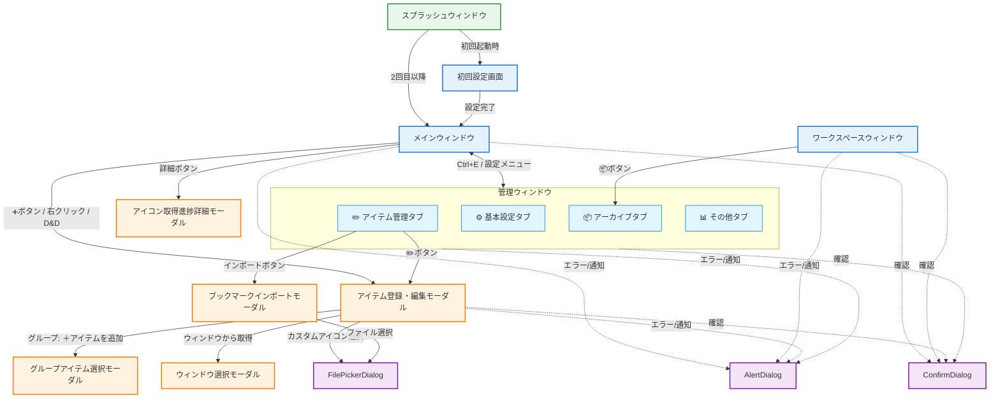

# 画面遷移図

QuickDashLauncherの全画面の遷移関係を示します。

## 画面遷移フロー

## 起動フロー

**アプリケーション起動時:**
1. **スプラッシュウィンドウ** を表示（起動中の初期化処理を実行）
2. 初期化完了後：
   - 初回起動時（`hotkey`が未設定）: **初回設定画面** を表示
   - 2回目以降: **メインウィンドウ** を表示

**初回設定完了後:**
- **初回設定画面** → **メインウィンドウ** へ遷移

## 画面遷移一覧

### ウィンドウ間の遷移

| 元画面 | 遷移先 | トリガー | 戻り方 | 備考 |
|--------|--------|----------|---------|------|
| **スプラッシュウィンドウ** | **初回設定画面** | 初回起動（hotkey未設定） | - | 自動遷移 |
| **スプラッシュウィンドウ** | **メインウィンドウ** | 2回目以降の起動 | - | 自動遷移 |
| **初回設定画面** | **メインウィンドウ** | 設定完了ボタン | - | 初回のみ |
| **メインウィンドウ** | **管理ウィンドウ** | `Ctrl+E` / 設定メニュー | `Ctrl+E` / 閉じるボタン | トグル操作、タブ切り替え可能 |
| **メインウィンドウ** | **ワークスペースウィンドウ** | `Ctrl+Alt+W` / トレイメニュー | `Ctrl+Alt+W` / 閉じるボタン | 独立ウィンドウ、同時表示可能 |
| **ワークスペースウィンドウ** | **管理ウィンドウ/アーカイブタブ** | 📦ボタン | 閉じるボタン | アーカイブタブが開く |

### メインウィンドウから開くモーダル・ダイアログ

| 元画面 | 遷移先 | トリガー | 戻り方 |
|--------|--------|----------|---------|
| **メインウィンドウ** | **アイテム登録・編集モーダル** | ➕ボタン / 右クリック「編集」 / D&D | キャンセル / 保存 |
| **メインウィンドウ** | **アイコン取得進捗詳細モーダル** | 詳細ボタン / 進捗バーをクリック | 閉じるボタン |
| **メインウィンドウ** | **AlertDialog** | エラー/通知発生時 | OKボタン |
| **メインウィンドウ** | **ConfirmDialog** | 確認が必要な操作時 | OK / キャンセル |

### 管理ウィンドウ - タブ間の遷移

| 元タブ | 遷移先タブ | トリガー | 戻り方 | 備考 |
|--------|-----------|----------|---------|------|
| **全タブ** | **各タブ** | タブボタンをクリック | タブボタンをクリック | 未保存変更確認あり（アイテム管理タブのみ） |

### 管理ウィンドウ/基本設定タブから開くモーダル・ダイアログ

| 元画面 | 遷移先 | トリガー | 戻り方 |
|--------|--------|----------|---------|
| **管理ウィンドウ/基本設定タブ** | **AlertDialog** | エラー/通知発生時 | OKボタン |
| **管理ウィンドウ/基本設定タブ** | **ConfirmDialog** | 確認が必要な操作時（リセット等） | OK / キャンセル |

### 管理ウィンドウ/アイテム管理タブから開くモーダル・ダイアログ

| 元画面 | 遷移先 | トリガー | 戻り方 |
|--------|--------|----------|---------|
| **管理ウィンドウ/アイテム管理タブ** | **アイテム登録・編集モーダル** | ✏️ボタン | キャンセル / 保存 |
| **管理ウィンドウ/アイテム管理タブ** | **ブックマークインポートモーダル** | インポートボタン | キャンセル / インポート |
| **管理ウィンドウ/アイテム管理タブ** | **AlertDialog** | エラー/通知発生時 | OKボタン |
| **管理ウィンドウ/アイテム管理タブ** | **ConfirmDialog** | 確認が必要な操作時 | OK / キャンセル |

### 管理ウィンドウ/アーカイブタブから開くモーダル・ダイアログ

| 元画面 | 遷移先 | トリガー | 戻り方 |
|--------|--------|----------|---------|
| **管理ウィンドウ/アーカイブタブ** | **AlertDialog** | エラー/通知発生時 | OKボタン |
| **管理ウィンドウ/アーカイブタブ** | **ConfirmDialog** | 確認が必要な操作時（削除等） | OK / キャンセル |

### 管理ウィンドウ/その他タブから開くモーダル・ダイアログ

| 元画面 | 遷移先 | トリガー | 戻り方 |
|--------|--------|----------|---------|
| **管理ウィンドウ/その他タブ** | **AlertDialog** | エラー/通知発生時 | OKボタン |
| **管理ウィンドウ/その他タブ** | **ConfirmDialog** | 確認が必要な操作時（終了等） | OK / キャンセル |

### ワークスペースウィンドウから開くモーダル・ダイアログ

| 元画面 | 遷移先 | トリガー | 戻り方 |
|--------|--------|----------|---------|
| **ワークスペースウィンドウ** | **AlertDialog** | エラー/通知発生時 | OKボタン |
| **ワークスペースウィンドウ** | **ConfirmDialog** | 確認が必要な操作時 | OK / キャンセル |

### アイテム登録・編集モーダルから開くモーダル・ダイアログ

| 元画面 | 遷移先 | トリガー | 戻り方 |
|--------|--------|----------|---------|
| **アイテム登録・編集モーダル** | **グループアイテム選択モーダル** | グループ: ＋アイテムを追加 | 戻るボタン / 選択 |
| **アイテム登録・編集モーダル** | **ウィンドウ選択モーダル** | ウィンドウから取得 | キャンセル / 選択 |
| **アイテム登録・編集モーダル** | **FilePickerDialog** | カスタムアイコン選択 | キャンセル / 選択 |
| **アイテム登録・編集モーダル** | **AlertDialog** | エラー/通知発生時 | OKボタン |
| **アイテム登録・編集モーダル** | **ConfirmDialog** | 確認が必要な操作時 | OK / キャンセル |

### ブックマークインポートモーダルから開くダイアログ

| 元画面 | 遷移先 | トリガー | 戻り方 |
|--------|--------|----------|---------|
| **ブックマークインポートモーダル** | **FilePickerDialog** | ファイル選択 | キャンセル / 選択 |
| **ブックマークインポートモーダル** | **AlertDialog** | エラー/通知発生時 | OKボタン |

## 画面の種類と特性

### ウィンドウ

| 画面名 | 特性 | 表示条件 |
|--------|------|----------|
| **スプラッシュウィンドウ** | 起動時の一時的なローディング画面 | アプリ起動時に自動表示 |
| **初回設定画面** | 初回起動時のみ表示される設定画面 | `hotkey`が未設定の場合 |
| **メインウィンドウ** | 主要なランチャー画面 | `Alt+Space`（デフォルト）で表示/非表示 |
| **管理ウィンドウ** | 設定・アイテム管理を行う画面 4つのタブで構成： - ⚙️ 基本設定タブ - ✏️ アイテム管理タブ - 📦 アーカイブタブ - 📊 その他タブ | `Ctrl+E` または設定メニューから |
| **ワークスペースウィンドウ** | よく使うアイテムを登録する専用ウィンドウ | `Ctrl+Alt+W` または トレイメニューから |

**特記事項:**
- **メインウィンドウ** と **ワークスペースウィンドウ** は独立したウィンドウで、同時に表示可能
- **管理ウィンドウ** は単一ウィンドウで、既に開いている場合は前面に表示。タブ切り替えで各機能にアクセス
- **スプラッシュウィンドウ** は起動時のみ表示され、初期化完了後に自動的に閉じる

### モーダル

| 画面名 | 特性 |
|--------|------|
| **アイテム登録・編集モーダル** | アイテムの新規登録・編集を行うモーダル |
| **ブックマークインポートモーダル** | ブラウザのブックマークをインポートするモーダル |
| **グループアイテム選択モーダル** | グループに追加するアイテムを選択するモーダル |
| **ウィンドウ選択モーダル** | 開いているウィンドウから選択するモーダル |
| **アイコン取得進捗詳細モーダル** | アイコン一括取得の結果を表示するモーダル |

**特記事項:**
- モーダルは親画面の上に表示され、閉じるまで親画面の操作は不可
- モーダル表示中はメインウィンドウが非表示にならない（モーダルモード）

### ダイアログ

| 画面名 | 特性 |
|--------|------|
| **AlertDialog** | エラー・警告・成功・情報メッセージの表示 |
| **ConfirmDialog** | ユーザー確認が必要な操作（削除、変更破棄など） |
| **FilePickerDialog** | ファイル選択（ブックマークインポート、カスタムアイコン選択） |

**特記事項:**
- ダイアログはすべての画面から呼び出される共通コンポーネント
- モーダルと同様に、表示中は親画面の操作は不可

## 関連ドキュメント

### ウィンドウ仕様書

- [初回設定画面仕様書](./first-launch-setup.md)
- [メインウィンドウ仕様書](./main-window.md)
- [管理ウィンドウ仕様書](./admin-window.md)
- [ワークスペースウィンドウ仕様書](./workspace-window.md)

### モーダル仕様書

- [アイテム登録・編集モーダル仕様書](./register-modal.md)
- [ブックマークインポートモーダル仕様書](./bookmark-import-modal.md)
- [グループアイテム選択モーダル仕様書](./group-item-selector-modal.md)
- [アイコン取得進捗詳細モーダル仕様書](./icon-progress-detail-modal.md)

### ダイアログ・コンポーネント仕様書

- [共通ダイアログ仕様書](./dialogs.md) - AlertDialog/ConfirmDialog/FilePickerDialog
- [右クリックメニュー仕様書](./context-menu.md)
- [フォルダ取込オプションエディタ仕様書](./dir-options-editor.md)
- [ホットキー入力仕様書](./hotkey-input.md)

### 機能ドキュメント

- [キーボードショートカット](../features/keyboard-shortcuts.md) - 全ショートカット一覧
- [ウィンドウ制御](../architecture/window-control.md) - ウィンドウの表示/非表示制御
