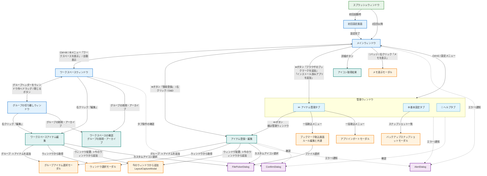

# 画面遷移図

QuickDashLauncherの全画面の遷移関係を示します。

## 画面遷移フロー

```mermaid
graph TD
    %% ウィンドウ
    Splash[スプラッシュウィンドウ]
    FirstLaunch[初回設定画面]
    Main[メインウィンドウ]
    Workspace[ワークスペースウィンドウ]
    Detached[グループの切り離しウィンドウ]

    %% 管理ウィンドウ（タブ別）
    subgraph AdminWindow[管理ウィンドウ]
        AdminSettings[⚙️ 基本設定タブ]
        AdminItems[✏️ アイテム管理タブ]
        AdminOther[📖 ヘルプタブ]
    end

    %% 子ウィンドウ
    Register[アイテム登録・編集]
    IconProgress[アイコン取得結果]
    WorkspaceItemEdit[ワークスペースアイテム編集]
    WorkspaceConfirm[ワークスペースの確認<br/>グループの削除・アーカイブ]

    %% モーダル
    BookmarkImport[ブックマーク取込画面<br/>ルール編集と共通]
    GroupSelect[グループアイテム選択モーダル]
    WindowSelect[ウィンドウ選択モーダル]
    AppImport[アプリインポートモーダル]
    BackupSnapshot[バックアップスナップショットモーダル]
    MemoView[メモ表示モーダル]
    LayoutCapture[今のウィンドウから追加<br/>LayoutCaptureModal]

    %% 共通ダイアログ
    FilePicker[FilePickerDialog]
    Alert[AlertDialog]
    Confirm[ConfirmDialog]

    %% 起動時の流れ
    Splash -->|初回起動時| FirstLaunch
    Splash -->|2回目以降| Main
    FirstLaunch -->|設定完了| Main

    %% メインウィンドウの遷移
    Main <-->|Ctrl+E / 設定メニュー| AdminWindow
    Main <-->|Ctrl+W / ⚙️メニュー「ワークスペースを表示」 / 自動表示| Workspace
    Main -->|➕ボタン「簡易登録」 / 右クリック / D&D| Register
    Main -->|➕ボタン「ブラウザのブックマークを追加」<br/>「インストール済みアプリを追加」| AdminItems
    Main -->|詳細ボタン| IconProgress
    Main -->|📝バッジ / 右クリック「メモを表示」| MemoView

    %% 管理ウィンドウの遷移
    AdminItems -->|✏️ボタン<br/>親は管理ウィンドウ| Register
    AdminItems -->|一括取込メニュー| BookmarkImport
    AdminItems -->|一括取込メニュー| AppImport
    AdminSettings -->|スナップショット一覧| BackupSnapshot

    %% ワークスペースウィンドウの遷移
    Workspace <-->|グループヘッダーをウィンドウ外へドラッグ / 閉じるボタン| Detached
    Workspace -->|右クリック「編集」| WorkspaceItemEdit
    Detached -->|右クリック「編集」| WorkspaceItemEdit
    Workspace -->|グループの削除・アーカイブ| WorkspaceConfirm
    Detached -->|グループの削除・アーカイブ| WorkspaceConfirm

    %% アイテム登録・編集の遷移
    Register -->|グループ: ＋アイテムを追加| GroupSelect
    Register -->|ウィンドウから取得| WindowSelect
    Register -->|ウィンドウ配置: ＋今のウィンドウから追加| LayoutCapture
    Register -->|カスタムアイコン選択| FilePicker

    %% ワークスペースアイテム編集の遷移
    WorkspaceItemEdit -->|グループ: ＋アイテムを追加| GroupSelect
    WorkspaceItemEdit -->|ウィンドウから取得| WindowSelect
    WorkspaceItemEdit -->|ウィンドウ配置: ＋今のウィンドウから追加| LayoutCapture
    WorkspaceItemEdit -->|カスタムアイコン選択| FilePicker

    %% ブックマーク取込画面の遷移
    BookmarkImport -->|ファイル選択| FilePicker

    %% 共通ダイアログの使用（破線で表示）
    Main -.->|エラー/通知| Alert
    AdminWindow -.->|エラー/通知| Alert
    AdminWindow -.->|確認| Confirm
    Workspace -.->|タブ操作の確認| Confirm
    Register -.->|エラー/通知| Alert
    Register -.->|確認| Confirm

    %% スタイル定義
    classDef window fill:#e3f2fd,stroke:#1976d2,stroke-width:2px
    classDef child fill:#e0f2f1,stroke:#00796b,stroke-width:2px
    classDef modal fill:#fff3e0,stroke:#f57c00,stroke-width:2px
    classDef dialog fill:#f3e5f5,stroke:#7b1fa2,stroke-width:2px
    classDef splash fill:#e8f5e9,stroke:#388e3c,stroke-width:2px
    classDef adminTab fill:#e1f5fe,stroke:#0277bd,stroke-width:1px

    class Splash splash
    class FirstLaunch,Main,Workspace,Detached window
    class AdminSettings,AdminItems,AdminOther adminTab
    class Register,IconProgress,WorkspaceItemEdit,WorkspaceConfirm child
    class BookmarkImport,GroupSelect,WindowSelect,AppImport,BackupSnapshot,MemoView,LayoutCapture modal
    class FilePicker,Alert,Confirm dialog
```

## 起動フロー

**アプリケーション起動時:**

1. **スプラッシュウィンドウ** を表示（起動中の初期化処理を実行）
2. 初期化完了後：
   - 初回起動時（`hotkey`が未設定）: **初回設定画面** を表示
   - 2回目以降: **メインウィンドウ** を表示

**初回設定完了後:**

- **初回設定画面** → **メインウィンドウ** へ遷移

## 画面遷移一覧

### ウィンドウ間の遷移

| 元画面                       | 遷移先                           | トリガー                                                                                                                                   | 戻り方                                               | 備考                                                           |
| ---------------------------- | -------------------------------- | ------------------------------------------------------------------------------------------------------------------------------------------ | ---------------------------------------------------- | -------------------------------------------------------------- |
| **スプラッシュウィンドウ**   | **初回設定画面**                 | 初回起動（hotkey未設定）                                                                                                                   | -                                                    | 自動遷移                                                       |
| **スプラッシュウィンドウ**   | **メインウィンドウ**             | 2回目以降の起動                                                                                                                            | -                                                    | 自動遷移                                                       |
| **初回設定画面**             | **メインウィンドウ**             | 設定完了ボタン                                                                                                                             | -                                                    | 初回のみ                                                       |
| **メインウィンドウ**         | **管理ウィンドウ**               | `Ctrl+E`（ランチャー内） / 設定メニュー                                                                                                    | 閉じるボタン（ランチャーで再度 `Ctrl+E` でも閉じる） | トグル操作、タブ切り替え可能                                   |
| **メインウィンドウ**         | **ワークスペースウィンドウ**     | `Ctrl+W`（ランチャー内） / ⚙️ メニュー「🗂️ ワークスペースを表示」 / 設定「メイン画面表示時にワークスペースを自動表示」が有効なとき自動表示 | 閉じるボタン（ランチャーで再度 `Ctrl+W` でも閉じる） | 独立ウィンドウ、同時表示可能                                   |
| **ワークスペースウィンドウ** | **グループの切り離しウィンドウ** | グループヘッダーをウィンドウの外へドラッグしてドロップ                                                                                     | 閉じるボタン                                         | 前回開いていたものはワークスペースウィンドウの初回表示時に復元 |

### メインウィンドウから開く子ウィンドウ・モーダル・ダイアログ

| 元画面               | 遷移先                                           | トリガー                                                                                 | 戻り方                             |
| -------------------- | ------------------------------------------------ | ---------------------------------------------------------------------------------------- | ---------------------------------- |
| **メインウィンドウ** | **アイテム登録・編集**（子ウィンドウ）           | ➕ボタンのドロップダウン「簡易登録」 / 右クリック「編集」 / D&D                          | キャンセル / 保存 / Escape         |
| **メインウィンドウ** | **管理ウィンドウ**（アイテム管理タブ）の取込画面 | ➕ボタンのドロップダウン「ブラウザのブックマークを追加」「インストール済みアプリを追加」 | 管理ウィンドウ側の取込画面を閉じる |
| **メインウィンドウ** | **メモ表示モーダル**                             | アイテム一覧の 📝 バッジのクリック / 右クリック「📝 メモを表示」                         | Escape                             |
| **メインウィンドウ** | **アイコン取得結果**（子ウィンドウ）             | 詳細ボタン                                                                               | 閉じるボタン / Escape              |
| **メインウィンドウ** | **AlertDialog**                                  | エラー/通知発生時                                                                        | OKボタン                           |

### 管理ウィンドウ - タブ間の遷移

| 元タブ     | 遷移先タブ | トリガー             | 戻り方               | 備考                                       |
| ---------- | ---------- | -------------------- | -------------------- | ------------------------------------------ |
| **全タブ** | **各タブ** | タブボタンをクリック | タブボタンをクリック | 未保存変更確認あり（アイテム管理タブのみ） |

### 管理ウィンドウ/基本設定タブから開くモーダル・ダイアログ

| 元画面                          | 遷移先                                   | トリガー                                       | 戻り方          |
| ------------------------------- | ---------------------------------------- | ---------------------------------------------- | --------------- |
| **管理ウィンドウ/基本設定タブ** | **AlertDialog**                          | エラー/通知発生時                              | OKボタン        |
| **管理ウィンドウ/基本設定タブ** | **ConfirmDialog**                        | 確認が必要な操作時（リセット等）               | OK / キャンセル |
| **管理ウィンドウ/基本設定タブ** | **バックアップスナップショットモーダル** | バックアップ欄の「スナップショット一覧」ボタン | Escape          |

### 管理ウィンドウ/アイテム管理タブから開くモーダル・ダイアログ

| 元画面                              | 遷移先                                                     | トリガー                                         | 戻り方                                              |
| ----------------------------------- | ---------------------------------------------------------- | ------------------------------------------------ | --------------------------------------------------- |
| **管理ウィンドウ/アイテム管理タブ** | **アイテム登録・編集**（子ウィンドウ。親は管理ウィンドウ） | ✏️ボタン                                         | キャンセル / 保存（保存せず未保存の変更として反映） |
| **管理ウィンドウ/アイテム管理タブ** | **ブックマーク取込画面**                                   | 一括取込メニュー「ブラウザのブックマークを追加」 | キャンセル / 今回だけ取り込む / ルールとして保存    |
| **管理ウィンドウ/アイテム管理タブ** | **アプリインポートモーダル**                               | 一括取込メニュー「インストール済みアプリを追加」 | 閉じるボタン                                        |
| **管理ウィンドウ/アイテム管理タブ** | **AlertDialog**                                            | エラー/通知発生時                                | OKボタン                                            |
| **管理ウィンドウ/アイテム管理タブ** | **ConfirmDialog**                                          | 確認が必要な操作時                               | OK / キャンセル                                     |

### 管理ウィンドウ/ヘルプタブから開くモーダル・ダイアログ

| 元画面                        | 遷移先            | トリガー                     | 戻り方          |
| ----------------------------- | ----------------- | ---------------------------- | --------------- |
| **管理ウィンドウ/ヘルプタブ** | **AlertDialog**   | エラー/通知発生時            | OKボタン        |
| **管理ウィンドウ/ヘルプタブ** | **ConfirmDialog** | 確認が必要な操作時（終了等） | OK / キャンセル |

### ワークスペースウィンドウから開く子ウィンドウ・ダイアログ

| 元画面                                            | 遷移先                                         | トリガー                                         | 戻り方                   |
| ------------------------------------------------- | ---------------------------------------------- | ------------------------------------------------ | ------------------------ |
| **ワークスペースウィンドウ / 切り離しウィンドウ** | **ワークスペースアイテム編集**（子ウィンドウ） | アイテムを右クリック「編集」                     | キャンセル / 保存        |
| **ワークスペースウィンドウ / 切り離しウィンドウ** | **ワークスペースの確認**（子ウィンドウ）       | グループの削除・アーカイブ                       | OK / キャンセル / Escape |
| **ワークスペースウィンドウ**                      | **ConfirmDialog**                              | タブ（ワークスペース）の削除など、タブ操作の確認 | OK / キャンセル          |

### アイテム登録・編集から開くモーダル・ダイアログ

| 元画面                 | 遷移先                                           | トリガー                                 | 戻り方                |
| ---------------------- | ------------------------------------------------ | ---------------------------------------- | --------------------- |
| **アイテム登録・編集** | **グループアイテム選択モーダル**                 | グループ: ＋アイテムを追加               | 戻るボタン / 選択     |
| **アイテム登録・編集** | **ウィンドウ選択モーダル**                       | ウィンドウから取得                       | キャンセル / 選択     |
| **アイテム登録・編集** | **今のウィンドウから追加（LayoutCaptureModal）** | ウィンドウ配置: ＋今のウィンドウから追加 | 閉じるボタン / Escape |
| **アイテム登録・編集** | **FilePickerDialog**                             | カスタムアイコン選択                     | キャンセル / 選択     |
| **アイテム登録・編集** | **AlertDialog**                                  | エラー/通知発生時                        | OKボタン              |
| **アイテム登録・編集** | **ConfirmDialog**                                | 確認が必要な操作時                       | OK / キャンセル       |

### ワークスペースアイテム編集から開くモーダル・ダイアログ

| 元画面                         | 遷移先                                           | トリガー                                 | 戻り方                |
| ------------------------------ | ------------------------------------------------ | ---------------------------------------- | --------------------- |
| **ワークスペースアイテム編集** | **グループアイテム選択モーダル**                 | グループ: ＋アイテムを追加               | 戻るボタン / 選択     |
| **ワークスペースアイテム編集** | **ウィンドウ選択モーダル**                       | ウィンドウから取得                       | キャンセル / 選択     |
| **ワークスペースアイテム編集** | **今のウィンドウから追加（LayoutCaptureModal）** | ウィンドウ配置: ＋今のウィンドウから追加 | 閉じるボタン / Escape |
| **ワークスペースアイテム編集** | **FilePickerDialog**                             | カスタムアイコン選択                     | キャンセル / 選択     |

### ブックマーク取込画面から開くダイアログ

| 元画面                   | 遷移先                           | トリガー                         | 戻り方                   |
| ------------------------ | -------------------------------- | -------------------------------- | ------------------------ |
| **ブックマーク取込画面** | **ファイル選択ダイアログ（OS）** | 取込元 HTML の「ファイルを選択」 | キャンセル / 選択        |
| **ブックマーク取込画面** | **設定/ブックマーク自動取込**    | 「自動取込の設定を開く」         | 「手動で取り込む」で戻る |

## 画面の種類と特性

区分は [画面一覧](./README.md#画面一覧) と同じ。

### ウィンドウ

| 画面名                           | 特性                                                                                                               | 表示条件                                                                                                         |
| -------------------------------- | ------------------------------------------------------------------------------------------------------------------ | ---------------------------------------------------------------------------------------------------------------- |
| **スプラッシュウィンドウ**       | 起動時の一時的なローディング画面                                                                                   | アプリ起動時に自動表示                                                                                           |
| **初回設定画面**                 | 初回起動時のみ表示される設定画面                                                                                   | `hotkey`が未設定の場合                                                                                           |
| **メインウィンドウ**             | 主要なランチャー画面                                                                                               | `Alt+Space`（デフォルト）で表示/非表示                                                                           |
| **管理ウィンドウ**               | 設定・アイテム管理を行う画面 3つのタブで構成： - ⚙️ 基本設定タブ - ✏️ アイテム管理タブ - 📖 ヘルプタブ | `Ctrl+E` または設定メニューから                                                                                  |
| **ワークスペースウィンドウ**     | よく使うアイテムを登録する専用ウィンドウ                                                                           | `Ctrl+W`（ランチャーウィンドウ内で有効） ⚙️ メニュー「🗂️ ワークスペースを表示」 設定で自動表示が有効なとき |
| **グループの切り離しウィンドウ** | ワークスペースのグループ 1 つを独立して表示するウィンドウ                                                          | グループヘッダーをウィンドウの外へドラッグ 前回分はワークスペースウィンドウの初回表示時に復元                 |

**特記事項:**

- **メインウィンドウ** と **ワークスペースウィンドウ** は独立したウィンドウで、同時に表示可能
- **管理ウィンドウ** は単一ウィンドウで、既に開いている場合は前面に表示。タブ切り替えで各機能にアクセス
- **メインウィンドウ**・**ワークスペースウィンドウ**・**グループの切り離しウィンドウ** とそれらの子ウィンドウの間でフォーカスが移っても、メインウィンドウは隠れない（管理ウィンドウへ移ると隠れる）
- **スプラッシュウィンドウ** は起動時のみ表示され、初期化完了後に自動的に閉じる

### 子ウィンドウ

開き元とは別のウィンドウとして開き、開き元のウィンドウのサイズ・位置は変えない。

| 画面名                         | 特性                                                                                 |
| ------------------------------ | ------------------------------------------------------------------------------------ |
| **アイテム登録・編集**         | アイテムの新規登録・編集。メインウィンドウか管理ウィンドウから開く                   |
| **アイコン取得結果**           | アイコン一括取得の結果（成功・エラー）を表示                                         |
| **ワークスペースアイテム編集** | ワークスペースのアイテムを編集。ワークスペースウィンドウか切り離しウィンドウから開く |
| **ワークスペースの確認**       | グループの削除・アーカイブを確認する。開いている間は開き元を操作できない             |

**特記事項:**

- メインウィンドウの子ウィンドウ（アイテム登録・編集、アイコン取得結果）を開いている間は、メインウィンドウが非表示にならない（モーダルモード）

### モーダル

開いている画面の上に重ねて表示し、閉じるまで下の画面は操作できない。

| 画面名                                           | 特性                                                                                                            |
| ------------------------------------------------ | --------------------------------------------------------------------------------------------------------------- |
| **ブックマーク取込画面**                         | ブラウザ／HTML のブックマークを条件で絞り込み、今回だけ取り込むかルールとして保存する（設定のルール編集と共通） |
| **アプリインポートモーダル**                     | インストール済みアプリを選んで取り込む                                                                          |
| **バックアップスナップショットモーダル**         | バックアップのスナップショット一覧を表示する                                                                    |
| **メモ表示モーダル**                             | アイテムのメモを表示する                                                                                        |
| **グループアイテム選択モーダル**                 | グループに追加するアイテムを選択する                                                                            |
| **ウィンドウ選択モーダル**                       | 開いているウィンドウから選択する                                                                                |
| **今のウィンドウから追加（LayoutCaptureModal）** | 開いているウィンドウの配置を取り込む                                                                            |

### 共通ダイアログ

| 画面名               | 特性                                                         |
| -------------------- | ------------------------------------------------------------ |
| **AlertDialog**      | エラー・警告・成功・情報メッセージの表示                     |
| **ConfirmDialog**    | ユーザー確認が必要な操作（削除、変更破棄など）               |
| **FilePickerDialog** | ファイル選択（ブックマークインポート、カスタムアイコン選択） |

**特記事項:**

- どの画面からも呼び出す共通の部品。モーダルと同じく、表示中は下の画面を操作できない

## 関連ドキュメント

### ウィンドウ仕様書

- [初回設定画面仕様書](./first-launch-setup.md)
- [メインウィンドウ仕様書](./main-window.md)
- [管理ウィンドウ仕様書](./admin-window.md)
- [ワークスペースウィンドウ仕様書](./workspace-window.md)（グループの切り離しウィンドウを含む）

### 子ウィンドウ仕様書

- [アイテム登録・編集仕様書](./register-modal.md)（ウィンドウ選択モーダルを含む）
- [アイコン取得結果仕様書](./icon-progress-detail-modal.md)

### モーダル仕様書

- [ブックマーク取込画面仕様書](./bookmark-import-modal.md)
- [グループアイテム選択モーダル仕様書](./group-item-selector-modal.md)

### 共通ダイアログ・部品の仕様書

- [共通ダイアログ仕様書](./dialogs.md) - AlertDialog/ConfirmDialog/FilePickerDialog
- [右クリックメニュー仕様書](./context-menu.md)
- [フォルダ取込オプションエディタ仕様書](./dir-options-editor.md)
- [ホットキー入力仕様書](./hotkey-input.md)

### 機能ドキュメント

- [キーボードショートカット](../features/keyboard-shortcuts.md) - 全ショートカット一覧
- [ウィンドウ制御](../architecture/window-control.md) - ウィンドウの表示/非表示制御
