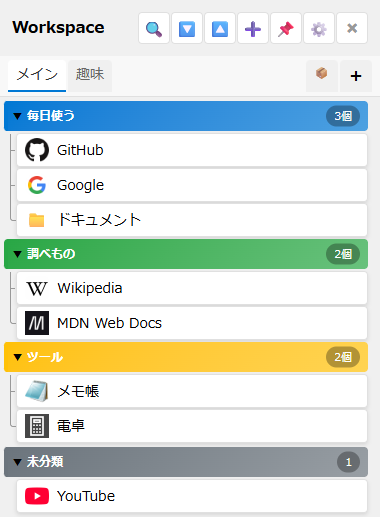

# ワークスペースウィンドウ 仕様書

## 関連ドキュメント

- [画面一覧](./README.md) - 全画面構成の概要
- [ワークスペース機能](../features/workspace.md) - 機能の使い方
- [ワークスペースファイル形式](../architecture/file-formats/workspace-format.md) - workspace.json形式
- [IPC通信](../architecture/ipc-channels.md) - ワークスペース関連のIPCチャンネル
- [ウィンドウ制御](../architecture/window-control.md) - ウィンドウの表示・位置・子ウィンドウの制御
- [キーボードショートカット](../features/keyboard-shortcuts.md) - 全ショートカット一覧
- [CSSデザインシステム](../architecture/css-design.md) - スタイルガイドライン

## 1. 概要

よく使うアイテムを登録して、画面右端の専用ウィンドウで素早くアクセスできる機能です。グループ化、名前変更、並び替えに対応します。

**キーボードショートカット**: `Ctrl+W` (表示/非表示切り替え)

### 主要機能

- **アイテム管理**: メイン画面からアイテムを追加・削除・名前変更
- **クリップボードペースト**: Ctrl+VでURL、ファイルパス、ファイル、テキスト・画像（クリップボードアイテム）を直接追加
- **グループ管理**: アイテムをグループに分類して整理
- **ドラッグ&ドロップ**: アイテムの並び替えやグループ間移動
- **キーワードフィルタ**: キーワード検索+スコープ選択（全て/グループ/アイテム）でアイテムを絞り込み
- **コンテキストメニュー**: 右クリックでグループ操作・アイテム操作
- **ウィンドウカスタマイズ**: 透過度調整、サイズ変更、ピン留め
- **アーカイブ**: グループ単位でアーカイブ・復元

### 画面イメージ



## 2. 基本情報

| 項目                 | 内容                                                                                                                                                                                      |
| -------------------- | ----------------------------------------------------------------------------------------------------------------------------------------------------------------------------------------- |
| **ファイル名**       | `src/renderer/WorkspaceApp.tsx`                                                                                                                                                           |
| **コンポーネント名** | `WorkspaceApp`                                                                                                                                                                            |
| **スタイル**         | `src/renderer/styles/components/WorkspaceWindow.css`                                                                                                                                      |
| **表示条件**         | メイン画面で`Ctrl+W`、メイン画面の ⚙️ メニュー「🗂️ ワークスペースを表示」、設定「メイン画面表示時にワークスペースを自動表示」が有効なときのメイン画面表示時（トレイメニューに項目はない） |
| **画面タイプ**       | ウィンドウ（AlwaysOnTop切り替え可能、フレームレス）                                                                                                                                       |
| **初期サイズ**       | 幅380px × 画面の高さに合わせて自動調整                                                                                                                                                    |
| **サイズ変更**       | 8方向のハンドルで自由にリサイズ可能（最小: 300x400px）                                                                                                                                    |
| **配置位置**         | 既定は画面右端。⚙️ メニューの「左端に寄せる」「右端に寄せる」で切り替え、ドラッグで移動可能                                                                                               |
| **透過機能**         | 0-100%の透過度調整、背景のみ透過モード                                                                                                                                                    |

## 3. 画面項目一覧

| エリア           | 項目名                                 | 内容・説明                                                                                                                                    | 表示条件                     | 機能詳細                                         |
| ---------------- | -------------------------------------- | --------------------------------------------------------------------------------------------------------------------------------------------- | ---------------------------- | ------------------------------------------------ |
| **タブバー**     | ワークスペースタブ                     | ワークスペース名を表示するタブ（クリックで切替、ダブルクリック/右クリックで名前変更、右クリックで削除）                                       | ワークスペース存在時（常時） | [5.17](#517-ワークスペースタブ操作)              |
| **タブバー**     | タブ追加ボタン（+）                    | 新しいワークスペースを作成                                                                                                                    | 常時表示                     | [5.17.2](#5172-タブを追加)                       |
| **ヘッダー**     | タイトル                               | 「Workspace」の表示                                                                                                                           | 常時表示                     | -                                                |
| **ヘッダー**     | フィルタボタン（🔍）                   | フィルタバーの表示/非表示を切り替え                                                                                                           | 常時表示                     | [5.0](#50-フィルタを変更)                        |
| **ヘッダー**     | 全て展開ボタン（🔽）                   | すべてのグループと未分類セクションを展開                                                                                                      | 常時表示                     | [5.1](#51-全て展開ボタンをクリック)              |
| **ヘッダー**     | 全て閉じるボタン（🔼）                 | すべてのグループと未分類セクションを折りたたむ                                                                                                | 常時表示                     | [5.2](#52-全て閉じるボタンをクリック)            |
| **ヘッダー**     | グループ追加ボタン（➕）               | 新しいグループを追加                                                                                                                          | 常時表示                     | [5.3](#53-グループ追加ボタンをクリック)          |
| **タブバー**     | アーカイブタブ（📦）                   | アーカイブ一覧に切り替え（並びはワークスペースタブ、📦、+ の順）                                                                              | 常時表示                     | [5.4](#54-アーカイブタブをクリック)              |
| **ヘッダー**     | ピン留めボタン（📌）                   | ウィンドウを最前面に固定                                                                                                                      | 常時表示                     | [5.5](#55-ピン留めボタンをクリック)              |
| **ヘッダー**     | 設定ボタン（⚙️）                       | メニューを表示（項目: 「⚙️ 基本設定」「左端に寄せる」「右端に寄せる」「切り離しウィンドウをすべて非表示」「切り離しウィンドウをすべて表示」） | 常時表示                     | -                                                |
| **ヘッダー**     | 閉じるボタン（×）                      | ウィンドウを非表示                                                                                                                            | 常時表示                     | [5.6](#56-閉じるボタンをクリック)                |
| **フィルタバー** | キーワード入力欄                       | フィルタテキストを入力（プレースホルダー: 「フィルタ...」）                                                                                   | フィルタバー表示時           | [5.0](#50-フィルタを変更)                        |
| **フィルタバー** | スコープ選択（全て/グループ/アイテム） | フィルタの適用範囲を選択                                                                                                                      | フィルタバー表示時           | [5.0](#50-フィルタを変更)                        |
| **フィルタバー** | フィルタ閉じるボタン（×）              | フィルタバーを閉じる                                                                                                                          | フィルタバー表示時           | [5.0](#50-フィルタを変更)                        |
| **グループ**     | グループヘッダー                       | グループ名・アイテム数バッジ（折りたたみ/展開、右クリックでコンテキストメニュー）                                                             | グループ存在時               | [5.7](#57-グループヘッダー操作)                  |
| **グループ**     | └ 折りたたみアイコン（▼）              | グループの折りたたみ/展開状態を表示                                                                                                           | グループ存在時               | [5.7.1](#571-折りたたみボタンをクリック)         |
| **グループ**     | └ グループ名                           | グループ名（右クリック→名前を変更で編集可能）                                                                                                 | グループ存在時               | [5.7.2](#572-グループを右クリックして名前を変更) |
| **グループ**     | └ アイテム数バッジ                     | グループ内のアイテム数を表示（例: 「3個」）                                                                                                   | グループ存在時               | -                                                |
| **グループ**     | アイテムカード                         | グループ内のアイテム一覧                                                                                                                      | グループ内にアイテム存在時   | [5.8](#58-アイテムカード操作)                    |
| **未分類**       | 未分類セクション                       | グループに所属していないアイテム                                                                                                              | 未分類アイテム存在時         | [5.9](#59-未分類セクション操作)                  |
| **全体**         | コンテキストメニュー                   | 右クリック時の操作メニュー（グループ操作・アイテム操作）                                                                                      | 右クリック時                 | [5.11](#511-コンテキストメニュー操作)            |
| **全体**         | ドラッグ&ドロップオーバーレイ          | ドラッグ中の視覚的フィードバック                                                                                                              | ドラッグ中                   | [5.12](#512-ドラッグドロップ操作)                |

## 4. アクション一覧

| No    | アクション名                    | トリガー                                          | 主な処理内容                                                    | 詳細                                                      |
| ----- | ------------------------------- | ------------------------------------------------- | --------------------------------------------------------------- | --------------------------------------------------------- |
| 5.0   | フィルタを変更                  | 🔍ボタンクリック → キーワード入力/スコープ選択    | キーワード+スコープでフィルタリング                             | [詳細](#50-フィルタを変更)                                |
| 5.1   | 全て展開ボタンをクリック        | 🔽ボタンクリック                                  | すべてのグループと未分類セクションを展開                        | [詳細](#51-全て展開ボタンをクリック)                      |
| 5.2   | 全て閉じるボタンをクリック      | 🔼ボタンクリック                                  | すべてのグループと未分類セクションを折りたたむ                  | [詳細](#52-全て閉じるボタンをクリック)                    |
| 5.3   | グループ追加ボタンをクリック    | ➕ボタンクリック                                  | 新しいグループを追加                                            | [詳細](#53-グループ追加ボタンをクリック)                  |
| 5.4   | アーカイブタブをクリック        | 📦タブクリック                                    | タブバーのアーカイブタブに切り替え                              | [詳細](#54-アーカイブタブをクリック)                      |
| 5.5   | ピン留めボタンをクリック        | 📌ボタンクリック                                  | ウィンドウを最前面に固定/解除                                   | [詳細](#55-ピン留めボタンをクリック)                      |
| 5.6   | 閉じるボタンをクリック          | ×ボタンクリック                                   | ウィンドウを非表示                                              | [詳細](#56-閉じるボタンをクリック)                        |
| 5.7   | グループヘッダー操作            | ヘッダークリック / 右クリックコンテキストメニュー | グループの折りたたみ、編集、色変更、アーカイブ、削除            | [詳細](#57-グループヘッダー操作)                          |
| 5.7.1 | グループヘッダーをクリック      | ヘッダークリック                                  | グループの折りたたみ/展開                                       | [詳細](#571-折りたたみボタンをクリック)                   |
| 5.7.2 | 右クリック→名前を変更           | 右クリック → 名前を変更                           | グループ名を編集モードに                                        | [詳細](#572-グループを右クリックして名前を変更)           |
| 5.7.3 | 右クリック→色を変更             | 右クリック → 色を変更                             | グループの色を変更                                              | [詳細](#573-グループを右クリックして色を変更)             |
| 5.7.4 | 右クリック→アーカイブ           | 右クリック → アーカイブ                           | グループとアイテムをアーカイブに移動                            | [詳細](#574-グループを右クリックしてアーカイブ)           |
| 5.7.5 | 右クリック→削除                 | 右クリック → 削除                                 | グループを削除（既定ではアイテムは未分類に移動）                | [詳細](#575-グループを右クリックして削除)                 |
| 5.7.6 | 右クリック→サブグループを追加   | 右クリック → サブグループを追加                   | 選択したグループの子としてサブグループを作成                    | [詳細](#576-グループを右クリックしてサブグループを追加)   |
| 5.7.7 | 右クリック→テキストでコピー     | 右クリック → テキストでコピー                     | グループとアイテムをテキスト形式でクリップボードにコピー        | [詳細](#577-グループを右クリックしてテキストでコピー)     |
| 5.7.8 | 右クリック→ワークスペースを移動 | 右クリック → ワークスペースを移動 → 移動先を選択  | グループと子孫サブグループ・アイテムを別ワークスペースへ移動    | [詳細](#578-グループを右クリックしてワークスペースを移動) |
| 5.8   | アイテムカード操作              | アイテムカードの各種操作                          | アイテムの起動、名前変更、削除                                  | [詳細](#58-アイテムカード操作)                            |
| 5.8.1 | アイテムをクリック              | アイテムクリック                                  | アイテムを起動                                                  | [詳細](#581-アイテムをクリック)                           |
| 5.8.2 | アイテム名をダブルクリック      | アイテム名ダブルクリック                          | アイテム名を編集モードに                                        | [詳細](#582-アイテム名をダブルクリック)                   |
| 5.8.3 | 削除ボタンをクリック            | ×ボタンクリック                                   | アイテムをワークスペースから削除                                | [詳細](#583-削除ボタンをクリック)                         |
| 5.8.4 | アイテムにマウスホバー          | アイテムにホバー                                  | ツールチップで詳細情報を表示                                    | [詳細](#584-アイテムにマウスホバー)                       |
| 5.9   | 未分類セクション操作            | 未分類セクションの各種操作                        | 未分類アイテムの折りたたみ/展開                                 | [詳細](#59-未分類セクション操作)                          |
| 5.11  | コンテキストメニュー操作        | 右クリック / メニュー項目選択                     | 右クリックメニューの表示と各種操作                              | [詳細](#511-コンテキストメニュー操作)                     |
| 5.12  | ドラッグ&ドロップ操作           | ドラッグ / ドロップ操作                           | アイテムの並び替え、グループ間移動、ネイティブファイル追加      | [詳細](#512-ドラッグドロップ操作)                         |
| 5.13  | Ctrl+Vでペースト                | Ctrl+Vキー押下                                    | クリップボードからファイル・フォルダ・URL・テキスト・画像を追加 | [詳細](#513-ctrlvでペースト)                              |
| 5.14  | グループ名を編集                | 編集モード時のテキスト入力 / Enterキー            | グループ名の変更を確定                                          | [詳細](#514-グループ名を編集)                             |
| 5.15  | アイテム名を編集                | 編集モード時のテキスト入力 / Enterキー            | アイテム名の変更を確定                                          | [詳細](#515-アイテム名を編集)                             |
| 5.16  | 編集モードでEscapeキー押下      | Escapeキー                                        | 編集をキャンセル                                                | [詳細](#516-編集モードでescapeキー押下)                   |
| 5.17  | ワークスペースタブ操作          | タブバーの各種操作                                | ワークスペースの切替・作成・名前変更・削除・並べ替え            | [詳細](#517-ワークスペースタブ操作)                       |

## 5. 機能詳細

### 5.0. フィルタを変更

#### アクション

- ヘッダーの「🔍」ボタンをクリックして（または`Ctrl+F`で）フィルタバーを表示し、キーワードを入力してアイテムを絞り込む

#### 処理フロー

1. ヘッダーの「🔍」ボタンをクリックするとフィルタバーが表示される（`Ctrl+F`でも表示され、入力欄にフォーカスする。切り離しウィンドウでは`Ctrl+F`は効かない）
2. フィルタバーのキーワード入力欄にテキストを入力（フォーカスは自動的に入力欄に移動）
3. スコープ選択ドロップダウンで検索対象を選択：
   - **全て**: グループ名・アイテム名の両方を検索
   - **グループ**: グループ名のみを検索
   - **アイテム**: アイテム名のみを検索
4. 入力したキーワードに一致するアイテム・グループが表示される
5. Escapeキーでキーワードをクリアしてフィルタバーを閉じる（1回の押下で両方行う）
6. フィルタバーの「×」ボタンでもキーワードをクリアしてフィルタバーを閉じる

#### 注意

- フィルタはグループ化されたアイテムと未分類アイテムの両方に適用される
- キーワードをクリアすると全アイテムが再表示される

### 5.1. 全て展開ボタンをクリック

#### アクション

- ヘッダーの「🔽」ボタンをクリック

#### 処理フロー

1. すべてのグループセクションを展開
2. 未分類セクションを展開
3. 各セクションのアイテムが表示される

### 5.2. 全て閉じるボタンをクリック

#### アクション

- ヘッダーの「🔼」ボタンをクリック

#### 処理フロー

1. すべてのグループセクションを折りたたむ
2. 未分類セクションを折りたたむ
3. 各セクションのアイテムが非表示になる

### 5.3. グループ追加ボタンをクリック

#### アクション

- ヘッダーの「➕」ボタンをクリック

#### 処理フロー

1. 新しいグループを作成
2. グループ名を「グループ {N}」（Nは現在のグループ数+1）にする（編集モードには入らない）
3. グループをリストの末尾に追加
4. データを保存

#### 表示条件

- ボタンは常時表示

### 5.4. アーカイブタブをクリック

#### アクション

- タブバーの「📦」タブをクリック

#### 処理フロー

1. タブバーのアーカイブタブに切り替え
2. アーカイブされたグループを一覧表示
3. 各グループのコンテキストメニュー（「📋 テキストでコピー」「📤 ワークスペースへ復元」「🗑️ アーカイブから削除」）から復元または完全削除が可能
4. アーカイブ表示中に効く操作はアイテムの起動とグループの折りたたみ/展開だけ。名前変更・アイテム削除・並べ替えなどの変更操作は効かない
5. 「🗑️ アーカイブから削除」は、グループが空でも必ず確認ウィンドウ「アーカイブから削除」を表示する。文面は「「{グループ名}」をアーカイブから完全に削除してもよろしいですか？」に続けて、含まれるサブグループ・アイテムの個数と「アイテムごと削除され、元に戻せません。」。ボタンは「削除」「キャンセル」で、チェックボックスはない

### 5.5. ピン留めボタンをクリック

#### アクション

- ヘッダーの「📌」ボタンをクリック

#### 処理フロー

1. ピン留め状態を切り替え
2. ピン留めON時：
   - ウィンドウを常に最前面に固定
   - ボタンが赤色の強調表示に変わる
   - ツールチップを「ピン留めを解除」に変更
3. ピン留めOFF時：
   - 通常の表示レイヤーに戻す
   - ボタンのスタイルを通常に戻す
   - ツールチップを「ピン留めして最前面に固定」に変更
4. 状態を保存

### 5.6. 閉じるボタンをクリック

#### アクション

- ヘッダーの「×」ボタンをクリック

#### 処理フロー

1. ウィンドウを非表示にする
2. ワークスペースデータは保持される

### 5.7. グループヘッダー操作

グループヘッダーに対する操作は以下の2つです：

- **ヘッダークリック**: グループの折りたたみ/展開を切り替え
- **右クリックコンテキストメニュー**: サブグループ追加・名前変更・色変更・テキストでコピー・ワークスペースを移動・アーカイブ・削除などの操作

> グループヘッダー上にインライン操作ボタン（✏️🎨📦🗑️）は表示されません。これらの操作はすべて右クリックコンテキストメニューから実行します。

#### 5.7.1. 折りたたみボタンをクリック

##### アクション

- グループヘッダーをクリック（折りたたみアイコン▼をクリック、またはヘッダー全体をクリック）

##### 処理フロー

1. グループの折りたたみ状態を切り替え
2. 折りたたみON時：
   - グループ内のアイテムを非表示
   - 折りたたみアイコン（▼）が回転して折りたたみ状態を表す
3. 折りたたみOFF時：
   - グループ内のアイテムを表示
   - 折りたたみアイコンが通常表示

#### 5.7.2. グループを右クリックして「名前を変更」

##### アクション

- グループヘッダーを右クリック → コンテキストメニューから「✏️ グループ名を変更」を選択

##### 処理フロー

1. グループ名の編集モードに入る
2. テキスト入力フィールドに変更
3. 現在のグループ名を選択状態で表示
4. フォーカスを入力フィールドに移動

#### 5.7.3. グループを右クリックして「色を変更」

##### アクション

- グループヘッダーを右クリック → コンテキストメニューから「🎨 カラーを変更」を選択

##### 処理フロー

1. カラーピッカー（モーダル）を表示。`Escape`キーまたはモーダルの外側のクリックで閉じる
2. 以下の色トークンから選択可能：
   - プライマリ（デフォルト）
   - サクセス
   - ダンジャー
   - ワーニング
   - インフォ
   - セカンダリ
   - パープル
   - ティール
   - ピンク
   - インディゴ
   - オレンジ
   - シアン
3. 色を選択するとモーダルが閉じる
4. グループヘッダーの背景色を変更
5. データを保存

#### 5.7.4. グループを右クリックして「アーカイブ」

##### アクション

- グループヘッダーを右クリック → コンテキストメニューから「📦 グループをアーカイブ」を選択

##### 処理フロー

1. 子ウィンドウ「グループのアーカイブ」を開いて確認する（このウィンドウは閉じるまで操作できない）。文面は「「{グループ名}」をアーカイブしてもよろしいですか？」に続けて「このグループには（サブグループ{M}個と、）{N}個のアイテムが含まれています。」「アーカイブしたグループは後で復元できます。」。ボタンは「アーカイブ」「キャンセル」
2. 「アーカイブ」の場合：
   - グループと子孫サブグループ、そのすべてのアイテムをアーカイブに移動
   - ワークスペースから削除
   - アーカイブデータを保存
3. 「キャンセル」の場合：処理を中止

#### 5.7.5. グループを右クリックして「削除」

##### アクション

- グループヘッダーを右クリック → コンテキストメニューから「🗑️ グループを削除」を選択

##### 処理フロー

1. グループが空（アイテムもサブグループもない）の場合は、確認なしでそのまま削除する
2. それ以外は子ウィンドウ「グループの削除」を開いて確認する（このウィンドウは閉じるまで操作できない）。文面は「「{グループ名}」を削除してもよろしいですか？」に続けて「このグループには（サブグループ{M}個と、）{N}個のアイテムが含まれています。」。ボタンは「削除」「キャンセル」で、チェックボックス「グループ内のアイテムも削除する」（既定はオフ）がある
3. 「削除」の場合：
   - グループと子孫サブグループを削除
   - チェックボックスがオンならグループ内のアイテムも削除、オフならアイテムを未分類に移動
   - データを保存
4. 「キャンセル」の場合：処理を中止

#### 5.7.6. グループを右クリックして「サブグループを追加」

##### アクション

- グループヘッダーを右クリック → コンテキストメニューから「📂 サブグループを追加」を選択

##### 処理フロー

1. 選択したグループの子として新しいサブグループを作成
2. サブグループ名を「サブグループ {N}」（Nは親グループ直下のサブグループ数+1）にする（編集モードには入らない）
3. データを保存

##### 表示条件

- 深さの上限（2階層）に達しているグループでは、このメニュー項目自体が表示されない

#### 5.7.7. グループを右クリックして「テキストでコピー」

##### アクション

- グループヘッダーを右クリック → コンテキストメニューから「📋 テキストでコピー」を選択

##### 処理フロー

1. グループ名とグループ内アイテムの一覧をテキスト形式に整形
2. クリップボードにコピー（成功通知は出ない）

#### 5.7.8. グループを右クリックして「ワークスペースを移動」

##### アクション

- グループヘッダーを右クリック → コンテキストメニューから「📁 ワークスペースを移動」→ サブメニューから移動先ワークスペースを選択

##### 処理フロー

1. 選択したグループとその子孫サブグループの所属ワークスペースを移動先に変える
2. 選択したグループがサブグループだった場合は、親グループから外して移動先の最上位に置く
3. グループ内のアイテムの所属ワークスペースも合わせて変える（データの項目は [ワークスペースファイル形式](../architecture/file-formats/workspace-format.md)）
4. アーカイブ済みのグループに対して実行した場合（メニュー名は「📤 ワークスペースへ復元」）は、復元しつつ指定したワークスペースに追加される
5. データを保存

##### 表示条件

- 他にワークスペースが存在するときだけメニュー項目が表示される（自ワークスペース1つのみの場合は非表示）

### 5.8. アイテムカード操作

アイテムカードには以下の機能があります：

- クリックで起動
- ダブルクリックで名前編集
- ×ボタンで削除
- マウスホバーで詳細表示

#### 5.8.1. アイテムをクリック

##### アクション

- アイテムカードをクリック

##### 処理フロー

1. アイテムを起動（開く）
2. アイテムの種別に応じて実行：
   - URL: デフォルトブラウザで開く
   - ファイル: 関連付けられたアプリで開く
   - フォルダ: エクスプローラーで開く
   - アプリケーション: 実行ファイルを起動

#### 5.8.2. アイテム名をダブルクリック

##### アクション

- アイテムカードのアイテム名をダブルクリック

##### 処理フロー

1. アイテム名の編集モードに入る
2. テキスト入力フィールドに変更
3. 現在のアイテム名を選択状態で表示
4. フォーカスを入力フィールドに移動

#### 5.8.3. 削除ボタンをクリック

##### アクション

- アイテムカードの「×」ボタンをクリック（ホバー時に表示）

##### 処理フロー

1. アイテムをワークスペースから削除
2. データを保存

#### 5.8.4. アイテムにマウスホバー

##### アクション

- アイテムカードにマウスカーソルをホバー

##### 処理フロー

1. ツールチップを表示
2. ツールチップには以下の情報を表示：
   - 1行目: 種別に応じた内容（通常アイテムはパス。ほかは「ウィンドウ操作: タイトル（プロセス名）」「グループ: N件」「クリップボード: プレビュー」「レイアウト: N件」）
   - 「リンク先: …」（通常アイテムでショートカットの場合）
   - 「引数: …」（通常アイテムで設定されている場合）
   - 「メモ: …」（設定されている場合）
   - 空行のあと「追加日時: …」（日本語表記の日付と時刻、秒なし）

##### ツールチップ表示例

**通常のアイテム:**

```
C:\Users\Desktop\myapp.exe

追加日時: 2025/12/18 10:30
```

**引数・メモ付きアイテム:**

```
C:\Program Files\Code\Code.exe
引数: --new-window
メモ: 作業用

追加日時: 2025/12/18 10:30
```

**ショートカットファイル:**

```
C:\Users\Desktop\app.lnk
リンク先: C:\Program Files\App\app.exe

追加日時: 2025/12/18 10:30
```

### 5.9. 未分類セクション操作

#### アクション

- 未分類セクションヘッダーをクリック

#### 処理フロー

1. 未分類セクションの折りたたみ状態を切り替え
2. 折りたたみON時：
   - 未分類アイテムを非表示
   - 折りたたみアイコン（▼）が回転して折りたたみ状態を表す
3. 折りたたみOFF時：
   - 未分類アイテムを表示
   - 折りたたみアイコン（▼）が元の向きに戻る

#### 表示条件

- 未分類アイテムが存在する場合のみ表示
- ヘッダーのバッジはアイテム数の数字だけ（グループのバッジは「3個」のように「個」が付く）

### 5.11. コンテキストメニュー操作

#### アクション

- アイテムを右クリック

#### 処理フロー

1. 右クリックした位置にOSのネイティブメニューを出す
2. アイテムの種類に応じてメニュー項目を出し分ける

#### メニュー項目

| メニュー項目                                | 説明                                               | 表示条件                               |
| ------------------------------------------- | -------------------------------------------------- | -------------------------------------- |
| **✏️ 表示名を変更**                         | アイテム名を編集モードに                           | 全アイテム                             |
| **▶️ 起動**                                 | アイテムを起動                                     | 全アイテム                             |
| **──────────────**                          | 区切り線                                           | 全アイテム                             |
| **📋 パスをコピー**                         | アイテムのパス（引数なし）をクリップボードにコピー | 通常アイテムのみ                       |
| **📋 親フォルダーのパスをコピー**           | 親フォルダーのパスをコピー                         | 通常アイテムで、URL・カスタムURI以外   |
| **📂 親フォルダーを開く**                   | 親フォルダーをエクスプローラーで開く               | 通常アイテムで、URL・カスタムURI以外   |
| **──────────────**                          | 区切り線                                           | ショートカットのリンク先があるときのみ |
| **📋 リンク先のパスをコピー**               | ショートカットのリンク先パスをコピー               | ショートカットのリンク先があるときのみ |
| **📋 リンク先の親フォルダーのパスをコピー** | リンク先の親フォルダーのパスをコピー               | ショートカットのリンク先があるときのみ |
| **📂 リンク先の親フォルダーを開く**         | リンク先の親フォルダーを開く                       | ショートカットのリンク先があるときのみ |
| **──────────────**                          | 区切り線                                           | 全アイテム                             |
| **🔧 編集**                                 | 独立した編集ウィンドウを開く                       | 全アイテム                             |
| **📁 ワークスペースを移動 ▶**               | サブメニューから移動先ワークスペースを選択         | 他にワークスペースがあるときのみ       |
| **📤 グループから削除**                     | グループから削除して未分類に移動                   | グループ所属アイテムのみ               |
| **──────────────**                          | 区切り線                                           | 全アイテム                             |
| **🗑️ ワークスペースから削除**               | ワークスペースから完全に削除                       | 全アイテム                             |

#### 各メニュー項目の処理

**表示名を変更:**

- アイテム名の編集モードに入る（5.8.2と同様）

**起動:**

- アイテムを起動（5.8.1と同様）

**パスをコピー:**

- アイテムのパス（引数は含まない）をクリップボードにコピー（成功通知は出ない）

**親フォルダーのパスをコピー:**

- 親ディレクトリパスをクリップボードにコピー（成功通知は出ない）

**親フォルダーを開く:**

- エクスプローラーで親フォルダーを開く（アイテムは選択しない）

**リンク先のパスをコピー (.lnkファイルのみ):**

- ショートカットのリンク先パスをクリップボードにコピー（成功通知は出ない）

**リンク先の親フォルダーのパスをコピー (.lnkファイルのみ):**

- リンク先の親ディレクトリパスをクリップボードにコピー（成功通知は出ない）

**リンク先の親フォルダーを開く (.lnkファイルのみ):**

- リンク先の親フォルダーをエクスプローラーで開く（リンク先は選択しない）

**編集:**

- 独立した編集ウィンドウを開き、表示名・パス・引数・ウィンドウ設定などを詳細編集する
- 編集ウィンドウは開き元（本体または切り離しウィンドウ）と同じディスプレイの中央に 850x800（作業領域で切り詰め）で開き、開き元に対してモーダル。**ワークスペースウィンドウのサイズ・位置は変わらない**（以前はウィンドウを広げて右端へ動かしていた）
- 「更新」で変更を保存して閉じ、ワークスペース側は保存を受けて表示を読み直す。「キャンセル」と Escape は閉じるだけ
- 詳細は [ウィンドウ制御](../architecture/window-control.md#アイテム編集ウィンドウ独立した子ウィンドウ)

**ワークスペースを移動:**

- サブメニューに他のワークスペース名が並び、選択したワークスペースへアイテムを移動する
- アイテムはグループから外れる（移動先ワークスペースには元のグループが存在しないため）
- アーカイブ済みのアイテムに対して実行した場合は、復元しつつ指定したワークスペースに追加される

**グループから削除:**

- アイテムをグループから外し、未分類セクションに移動
- データを保存

**ワークスペースから削除:**

- アイテムをワークスペースから完全に削除（5.8.3と同様）

### 5.12. ドラッグ&ドロップ操作

ワークスペースウィンドウでは以下のドラッグ&ドロップ操作が可能です：

- アイテムの並び替え（同じグループ内）
- アイテムのグループ間移動（`Ctrl`を押しながらドロップすると複製）
- グループの並び替え
- ネイティブファイル・フォルダ・URLの追加
- メイン画面からのアイテム追加（ウィンドウ検索結果を含む）

#### 5.12.1. アイテムの並び替え（同じグループ内）

##### アクション

- 同じグループ内でアイテムをドラッグ&ドロップ

##### 処理フロー

1. アイテムをドラッグ開始
2. ドラッグ中の視覚的フィードバックを表示
3. ドロップ先のアイテムにホバー時、挿入位置を表示
4. ドロップ時：
   - アイテムの順序を変更
   - データを保存
5. ドラッグを終了

##### 補足

- 別のグループのアイテムの位置にドロップすると、そのグループへ移動する（5.12.2を参照）
- `Ctrl`を押しながらドロップすると、移動ではなく複製を作る

#### 5.12.2. アイテムのグループ間移動

##### アクション

- アイテムを別のグループヘッダーまたはグループ内にドラッグ&ドロップ（`Ctrl`を押しながらドロップすると、移動せずに複製）

##### 処理フロー

1. アイテムをドラッグ開始
2. ドラッグ中の視覚的フィードバックを表示
3. ドロップ先のグループにホバー時、グループをハイライト表示
4. ドロップ時：
   - ドロップ先のグループにアイテムを移動
   - データを保存
5. ドラッグを終了

##### ドロップ先の種類

- **グループヘッダー**: ドロップした位置（ヘッダーの高さ方向）で挙動が変わる。上端付近はそのグループの前、中央はそのグループの中（グループ内へ移動）、下端付近はそのグループの後に置く（深さの上限でサブグループにできないグループは、上半分が前、下半分が後）
- **グループ内のアイテム**: そのアイテムの位置に挿入
- **未分類セクションヘッダー**: グループから外して未分類に移動

#### 5.12.3. グループの並び替え

##### アクション

- グループヘッダー（名前部分以外）をドラッグ&ドロップ

##### 処理フロー

1. グループヘッダーをドラッグ開始
2. ドラッグ中の視覚的フィードバックを表示
3. ドロップ先のグループにホバー時、挿入位置を表示
4. ドロップ時：
   - グループの順序を変更
   - データを保存
5. ドラッグを終了

##### 注意

- グループ名部分をドラッグすると編集モードに入る可能性があるため、グループ名以外の部分をドラッグしてください

#### 5.12.4. ネイティブファイル・フォルダ・URLの追加

##### アクション

- エクスプローラーからファイル・フォルダをドラッグ&ドロップ
- ブラウザからURLをドラッグ&ドロップ

##### 処理フロー

**ドラッグ中（ドロップ前）:**

1. ドラッグ状態を更新
2. 半透明オーバーレイを表示
3. ドラッグ中の視覚効果を適用

**ドロップ時:**

1. ドロップされたファイル・フォルダ・URLを取得
2. ドロップ先を判定：
   - グループヘッダーまたはグループ内：そのグループに追加
   - 未分類セクション：未分類に追加
   - その他：未分類に追加
3. パス・名前・追加日時を持つアイテムを作り、ドロップ先のグループ（あれば）に入れてワークスペースに追加
4. データを保存
5. ドラッグ状態を解除してオーバーレイを非表示

##### 対応形式

- **ファイル**: .exe, .lnk, .pdf, .docx, など全てのファイル
- **フォルダ**: ディレクトリ
- **URL**: http://, https:// で始まるもの（カスタムURIスキーマ（obsidian://, vscode://, など）はドロップでは追加できない。追加するには`Ctrl+V`でペーストする）

#### 5.12.5. メイン画面からのアイテム追加

##### アクション

- メイン画面のアイテム一覧のアイテムをワークスペースウィンドウのグループまたは未分類にドラッグ&ドロップ

##### 処理フロー

1. ドラッグしたアイテムを、ドロップ先のグループ（未分類ならグループなし）にコピーとして追加する（メイン画面側のアイテムはそのまま残る）
   - ウィンドウ検索結果は、ウィンドウ操作アイテム（タイトル＋プロセス名で探す）に変換して追加する
   - ウィンドウ検索結果を `Ctrl` を押しながらドロップしたときだけ、今の位置・サイズも記録する（既定は前面に出すだけ）
2. 追加したことをトーストで知らせる（位置・サイズを記録したときは「記録した位置に戻して前面に出します」と添える）。失敗したときはトーストで「ワークスペースへの追加に失敗しました」と表示する

##### 対応アイテム

- 通常アイテム・グループ・ウィンドウ操作・クリップボード・ウィンドウ配置（メイン画面のアイテム）
- ウィンドウ検索結果（開いているウィンドウ）。右クリックの「ワークスペースに追加」「位置・サイズも記録してワークスペースに追加」でも同じ結果になる

### 5.13. Ctrl+Vでペースト

#### アクション

- Ctrl+Vキーを押下（v0.5.1以降）

#### 処理フロー

1. クリップボードに入っている形式（テキスト・HTML・リッチテキスト・画像・ファイル）を確かめる
2. 中身で振り分ける：
   - **ファイル**（エクスプローラーでコピー）: コピーしたファイル・フォルダのパスでアイテムを追加
   - **テキスト**: 1 行で URL → URL アイテム（ファビコンを取得）／カスタム URI → カスタム URI のアイテム／Windows のパス → そのパスのアイテム／それ以外・複数行 → クリップボードアイテム
   - **画像・HTML・リッチテキストだけ**: クリップボードアイテム
3. クリップボードアイテムは、クリップボードの中身を保存してから追加する
4. アクティブなグループ（あれば）に追加し、追加したことをトーストで知らせる
5. 入力欄にフォーカスがあるときは何もしない（通常の貼り付けになる）

#### 対応形式

- **ファイル・フォルダ**: エクスプローラーでコピーしたファイル・フォルダ
- **URL / カスタム URI / Windows のパス**: テキスト形式
- **それ以外のテキスト・画像**: クリップボードアイテム（起動時にクリップボードへ書き戻す）

#### 制限

- パスの実在は確かめない（ネットワークパスの応答待ちを避ける）
- 画像のサムネイルはアイコンにしない（既定の 📋 アイコン）

### 5.14. グループ名を編集

#### アクション

- 編集モード時にテキストを入力し、Enterキーを押下

#### 処理フロー

1. 入力されたグループ名を取得
2. バリデーション：
   - 空文字列の場合は元の名前を保持
3. グループ名を更新
4. データを保存
5. 編集モードを終了

### 5.15. アイテム名を編集

#### アクション

- 編集モード時にテキストを入力し、Enterキーを押下

#### 処理フロー

1. 入力されたアイテム名（表示名）を取得
2. バリデーション：
   - 空文字列の場合は元の名前を保持
3. アイテムの表示名を更新
4. データを保存
5. 編集モードを終了

### 5.16. 編集モードでEscapeキー押下

#### アクション

- 編集モード時にEscapeキーを押下

#### 処理フロー

1. 入力内容を破棄
2. 編集モードを終了
3. 元の名前を表示

### 5.17. ワークスペースタブ操作

ウィンドウ上部のタブバーでワークスペース（タブ）を管理します。

#### 5.17.1. タブをクリック

##### アクション

- タブバーのタブをクリック

##### 処理フロー

1. クリックしたワークスペースをアクティブにする
2. そのワークスペースに属するグループ・アイテムを表示
3. アクティブなワークスペースを記憶し、次にワークスペースウィンドウを開いたときもそのタブを選ぶ（そのワークスペースが削除されていれば先頭のタブを選ぶ）

#### 5.17.2. タブを追加

##### アクション

- タブバー右端の「+」ボタンをクリック

##### 処理フロー

1. 「ワークスペース {N}」（Nは現在のワークスペース数+1）という名前で新しいワークスペースを作成
2. タブバーの末尾に追加

#### 5.17.3. タブの名前を変更

##### アクション

- タブをダブルクリック、または右クリック → コンテキストメニューから「名前を変更」を選択

##### 処理フロー

1. タブ名の編集モードに入る
2. テキスト入力フィールドに変更、現在の名前を選択状態で表示
3. Enterキーまたはフォーカスを外すと確定、Escapeキーでキャンセル

#### 5.17.4. タブを削除

##### アクション

- タブを右クリック → コンテキストメニューから「削除」を選択

##### 処理フロー

1. 確認ダイアログを表示：「ワークスペース「{ワークスペース名}」を削除しますか？所属するグループとアイテムも全て削除されます。」
2. OKの場合：
   - ワークスペースと、それに属するグループ・アイテムを全て削除
   - データを保存
3. キャンセルの場合：処理を中止

##### 表示条件

- ワークスペースが2つ以上あるときだけ、コンテキストメニューに「削除」が表示される（最後の1つは削除不可）

#### 5.17.5. タブを並べ替え

##### アクション

- タブをドラッグ&ドロップ

##### 処理フロー

1. タブのドラッグを開始
2. ドロップ先のタブの位置に応じて挿入位置を決定
3. ワークスペースの並び順を更新してデータを保存

#### 5.17.6. アーカイブタブとの関係

- タブバーの「📦」ボタン（ワークスペースタブの右、「+」の左）はワークスペースタブとは別枠で、アーカイブ一覧表示に切り替える（5.4を参照）
- アクティブなワークスペースタブとアーカイブ表示は排他（同時に選択状態にはならない）

## 6. キーボード操作

| キー     | 動作                                                                                                                              |
| -------- | --------------------------------------------------------------------------------------------------------------------------------- |
| `Ctrl+W` | メイン画面で押すと、ワークスペースウィンドウの表示/非表示を切り替える                                                             |
| `Ctrl+F` | フィルタバーを開き、入力欄にフォーカスする（切り離しウィンドウでは効かない）                                                      |
| `Ctrl+V` | クリップボードからファイル・フォルダ・URL・テキスト・画像をペーストして追加（v0.5.1以降。テキスト・画像はクリップボードアイテム） |
| `Enter`  | 編集モードで名前を確定                                                                                                            |
| `Escape` | フィルタバーの入力欄にフォーカスがあるとき: キーワードをクリアしてフィルタバーを閉じる。編集モード中: 編集をキャンセル            |

## 7. コンポーネント構成

ワークスペースウィンドウはカスタムフックとコンポーネント分離により、保守性と可読性を向上させています。

### 主要コンポーネント

| コンポーネント             | ファイル                                | 役割                                                                                     |
| -------------------------- | --------------------------------------- | ---------------------------------------------------------------------------------------- |
| **WorkspaceApp**           | `WorkspaceApp.tsx`                      | メインコンポーネント（データ・アクション・フィルタ・D&D の統合）                         |
| **WorkspaceTabBar**        | `components/WorkspaceTabBar.tsx`        | ワークスペースタブバー（切替・作成・名前変更・削除・並べ替え）                           |
| **WorkspaceHeader**        | `components/WorkspaceHeader.tsx`        | ヘッダー（タイトル、フィルタ、展開/折りたたみ、ピン留め、設定、アーカイブボタン）        |
| **WorkspaceFilterBar**     | `components/WorkspaceFilterBar.tsx`     | フィルタバー（キーワード入力・スコープ選択）                                             |
| **WorkspaceGroupedList**   | `components/WorkspaceGroupedList.tsx`   | グループ化アイテムリスト（グループ・未分類セクション管理）                               |
| **WorkspaceGroupHeader**   | `components/WorkspaceGroupHeader.tsx`   | グループヘッダー（折りたたみ・グループ名編集。操作は右クリックコンテキストメニュー経由） |
| **WorkspaceItemCard**      | `components/WorkspaceItemCard.tsx`      | ワークスペースアイテムカード                                                             |
| **WorkspaceItemEditModal** | `components/WorkspaceItemEditModal.tsx` | アイテム編集モーダル                                                                     |
| **WorkspaceItemEditPage**  | `components/WorkspaceItemEditPage.tsx`  | アイテム編集ウィンドウの中身（編集モーダルをページとして描画）                           |
| **WorkspaceConfirmPage**   | `components/WorkspaceConfirmPage.tsx`   | 確認ウィンドウの中身（グループの削除・アーカイブ）                                       |

### カスタムフック

| フック                       | ファイル                                      | 責務                                               |
| ---------------------------- | --------------------------------------------- | -------------------------------------------------- |
| **useWorkspaceData**         | `hooks/workspace/useWorkspaceData.ts`         | データ読み込みと状態管理                           |
| **useWorkspaceActions**      | `hooks/workspace/useWorkspaceActions.ts`      | アクション処理の統合                               |
| **useNativeDragDrop**        | `hooks/useNativeDragDrop.ts`                  | ネイティブドラッグ&ドロップ処理                    |
| **useClipboardPaste**        | `hooks/useClipboardPaste.ts`                  | クリップボードペースト処理（Ctrl+V）               |
| **useCollapsibleSections**   | `hooks/useCollapsibleSections.ts`             | 折りたたみ状態管理                                 |
| **useWorkspaceItemGroups**   | `hooks/workspace/useWorkspaceItemGroups.ts`   | アイテムグループ化ロジック                         |
| **useWorkspaceResize**       | `hooks/workspace/useWorkspaceResize.ts`       | ウィンドウのサイズ変更処理                         |
| **useWorkspaceAutoFit**      | `hooks/workspace/useWorkspaceAutoFit.ts`      | コンテンツの高さに合わせたウィンドウ高さの自動調整 |
| **useWorkspaceFilter**       | `hooks/useWorkspaceFilter.ts`                 | キーワード・スコープによる絞り込み                 |
| **useWorkspaceItemEditForm** | `hooks/workspace/useWorkspaceItemEditForm.ts` | アイテム編集フォーム                               |
| **useFileOperations**        | `hooks/useFileOperations.ts`                  | ファイルとURL操作の共通ユーティリティ              |

## 8. データ保存

ワークスペースのデータは以下のファイルに保存されます：

| ファイル                    | 内容                                                        |
| --------------------------- | ----------------------------------------------------------- |
| **workspace.json**          | ワークスペース（タブ）・グループ・アイテム                  |
| **workspace-archive.json**  | アーカイブされたグループとアイテム                          |
| **workspace-ui-state.json** | グループの折りたたみ状態・切り離しウィンドウの位置/ピン留め |

### 保存場所

```
%APPDATA%/quick-dash-launcher/config/
├── workspace.json
├── workspace-archive.json
└── workspace-ui-state.json
```

### データ形式

詳細なデータ形式は[ワークスペースファイル形式](../architecture/file-formats/workspace-format.md)を参照してください。

## 9. ウィンドウカスタマイズ機能

ウィンドウの表示・位置の制御の仕組みは [ウィンドウ制御](../architecture/window-control.md#ワークスペースウィンドウ制御) を参照してください。

### 透過機能

ワークスペースウィンドウの透過度を調整できます：

- **透過度**: 0-100%で調整（設定画面のスライダーで変更）
- **背景のみ透過**: チェックボックスで有効化すると、ウィンドウ背景のみが透過され、アイテムやボタンは不透明のまま表示
- **即座反映**: 設定変更は即座にワークスペースウィンドウに反映

### サイズ変更ハンドル

8方向のカスタムハンドルでウィンドウを自由にリサイズ：

| ハンドル位置 | 動作                  |
| ------------ | --------------------- |
| 左上         | 左辺+上辺を同時に移動 |
| 上           | 上辺を移動            |
| 右上         | 右辺+上辺を同時に移動 |
| 右           | 右辺を移動            |
| 右下         | 右辺+下辺を同時に移動 |
| 下           | 下辺を移動            |
| 左下         | 左辺+下辺を同時に移動 |
| 左           | 左辺を移動            |

**最小サイズ制約:**

- 幅: 300px
- 高さ: 400px
